# 1. Omni-modal Mixture of Experts Multiagent System for ASI - GPT4o - o3-mini-high and Deep Research Evaluator
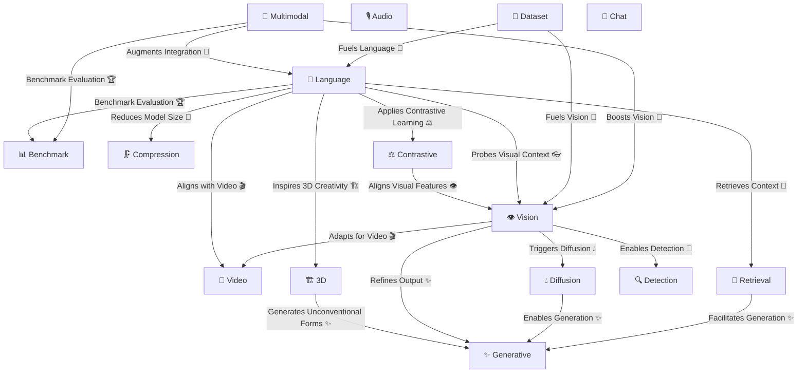

# 2. AI Pipeline for Multi-modal Agents
```mermaid
flowchart TD
    %% Nodes (redeclared for completeness)
    MM[🤖 Multimodal]
    VI[👁️ Vision]
    LA[📝 Language]
    VD[🎥 Video]
    T3D[🏗️ 3D]
    AU[🎙️ Audio]
    DS[💾 Dataset]
    BM[📊 Benchmark]
    CO[🗜️ Compression]
    RE[🔎 Retrieval]
    DI[💧 Diffusion]
    CT[⚖️ Contrastive]
    GE[✨ Generative]
    CH[💬 Chat]
    DT[🔍 Detection]

    %% Paper Relationships (P11-P20)
    %% P11: OneLLM: One Framework to Align All Modalities with Language
    VI -->|Aligns Vision & Language 🤝| LA
    MM -->|Unifies Modalities 🤝| LA

    %% P12: UniVL: A Unified Video and Language Pre-Training Model for Multimodal Understanding and Generation
    LA -->|Synthesizes Video Content 🎞️| VD

    %% P13: Bidirectional Cross-Modal Knowledge Exploration for Video Recognition with Pre-trained Vision-Language Models
    VI -->|Exchanges Visual Cues 🔄| VD
    VD -->|Reciprocates Vision Signals 🔄| VI

    %% P14: mPLUG-2: A Modularized Multi-modal Foundation Model Across Text, Image and Video
    LA -->|Bridges Text & Vision 🔗| VI
    LA -->|Integrates with Video 🎥| VD
    VI -->|Leverages Vision for Video 🎥| VD

    %% P15: CrossGET: Cross-Guided Ensemble of Tokens for Accelerating Vision-Language Transformers
    VI -->|Enhances Matching ⚡| LA

    %% P16: Accountable Textual-Visual Chat Learns to Reject Human Instructions in Image Re-creation
    LA -->|Facilitates Dialogue 💬| CH
    VI -->|Provides Visual Context 👁️| CH
    DS -->|Supports Chat Data 💾| CH

    %% P17: Towards Fast Adaptation of Pretrained Contrastive Models for Multi-channel Video-Language Retrieval
    LA -->|Bridges to Video 🔄| VD
    VD -->|Applies Contrastive Refinement ⚖️| CT
    CT -->|Facilitates Retrieval 🔍| RE

    %% P18: LiDAR-LLM: Exploring the Potential of Large Language Models for 3D LiDAR Understanding
    LA -->|Extends to 3D Modeling 🏗️| T3D

    %% P19: Unified-IO 2: Scaling Autoregressive Multimodal Models with Vision, Language, Audio, and Action
    VI -->|Fuses Vision & Language 🤝| LA
    LA -->|Expands into Audio 🎙️| AU

    %% P20: GPT4Point: A Unified Framework for Point-Language Understanding and Generation
    LA -->|Connects to 3D Understanding 🏗️| T3D
    T3D -->|Fuels Creative Design ✨| GE

    %% Inherent Concept Relationships
    VI -->|Visual-Language Integration 🔗| LA
    VI -->|Vision-to-Video Flow 🎞️| VD
    MM -->|Unifies Modalities with Audio 🎧| AU
    DS -->|Data Fuels Benchmarking 📊| BM
    CH -->|Chat Engages Language 🗣️| LA
```


# 3. Omni Modal MoE Models Representing different Areas of the Brain per DRE
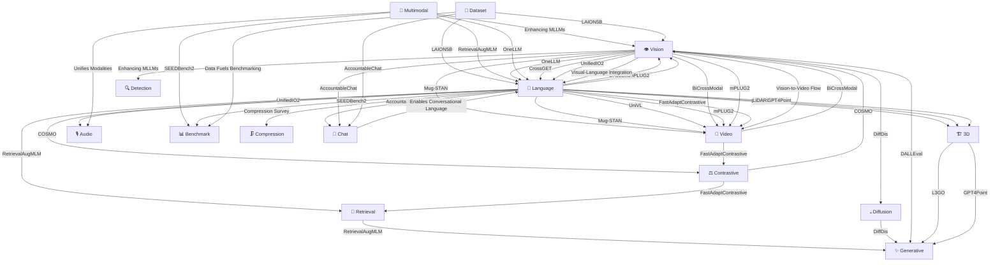


# 4. MoE Skill Tree for AI/ML ASI Technology


| Number | **Company & Focus** | **Company & Focus** |
|--------|-------------------|-------------------|
| Row 1 | **1. NVIDIA - ML Architecture** <br> ML originates with HPC and GPU/TPU/Hardware <br>  | **2. OpenAI - LLM Innovation** <br> Python, HPC, LLMs/Generative AI with Transformers <br>  |
| Row 2 | **3. Anthropic - Infrastructure** <br> Python, K8s (KEDA for HPC!), GPU/TPU/Hardware <br>  | **4. Hugging Face - ML Hub** <br> Python, ML, GPU/TPU/Hardware <br>  |

1. Python
2. High Performance Computing (HPC)
3. GPU/TPU/Hardware
4. ML/LLM/Transformers
5. Varies by org.  Nvidia & OpenAI: C++ & SQL. Anthropic: UI/React/JS.  Huggingface: Open Source Community.
6. Pytorch and Model Development.
7. Datasets, Databases and SQL.
8. Cloud platforms.  Top 3 in order for ML:  1. Azure, 2. AWS, 3. GCP
9. Linux/OS/MLOps.  Dockerfile to spin up replica instances.  Making it easy is SOTA.
10. 3D Computer Vision.

# 5. Asynchronous High Performance Compute (HPC) Patterns
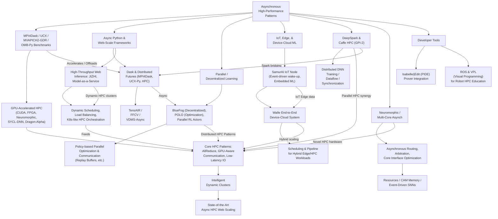

# 6. 🔍 Attention Mechanism in Transformers

## 🏗️ Introduction
- The **attention mechanism** allows models to focus on relevant parts of input sequences.
- Introduced in **sequence-to-sequence models**, later became a key component of **Transformers**.
- It helps in improving performance for **NLP** (Natural Language Processing) and **CV** (Computer Vision).

## ⚙️ Types of Attention
### 📍 1. **Self-Attention (Scaled Dot-Product Attention)**
   - The core of the **Transformer architecture**.
   - Computes attention scores for every token in a sequence with respect to others.
   - Allows capturing **long-range dependencies** in data.

### 🎯 2. **Multi-Head Attention**
   - Instead of a **single** attention layer, we use **multiple** heads.
   - Each head learns a different representation of the sequence.
   - Helps in better understanding **different contextual meanings**.

### 🔄 3. **Cross-Attention**
   - Used in **encoder-decoder** architectures.
   - The decoder attends to the encoder outputs for generating responses.
   - Essential for **translation tasks**.

## 🔢 Mathematical Representation
### 🚀 Attention Score Calculation
Given an input sequence, attention scores are computed using:
   \[
   \text{Attention}(Q, K, V) = \text{softmax} \left(\frac{QK^T}{\sqrt{d_k}}\right) V
   \]
   - **\(Q\) (Query)** 🔎 - What we are searching for.
   - **\(K\) (Key)** 🔑 - What we compare against.
   - **\(V\) (Value)** 📦 - The information we use.

### 🧠 Intuition
- The dot-product of **Q** and **K** determines importance.
- The softmax ensures weights sum to 1.
- The **division by \( \sqrt{d_k} \)** prevents large values that can destabilize training.

## 🏗️ Transformer Blocks
### 🔄 Alternating Layers
1. **⚡ Multi-Head Self-Attention**
2. **🛠️ Feedforward Dense Layer**
3. **🔗 Residual Connection + Layer Normalization**
4. **Repeat for multiple layers!** 🔄

## 🎛️ Parameter Efficiency with Mixture of Experts (MoE)
- Instead of activating **all** parameters, **only relevant experts** are used. 🤖
- This **reduces computational cost** while keeping the model powerful. ⚡
- Found in **large-scale models like GPT-4 and GLaM**.

## 🌍 Real-World Applications
- **🗣️ Speech Recognition** (Whisper, Wav2Vec)
- **📖 Text Generation** (GPT-4, Bard)
- **🎨 Image Captioning** (BLIP, Flamingo)
- **🩺 Medical AI** (BioBERT, MedPaLM)

## 🏁 Conclusion
- The **attention mechanism** transformed deep learning. 🔄✨
- Enables **parallelism** and **scalability** in training.
- **Future trends**: Sparse attention, MoE, and efficient transformers.

---
🔥 *"Attention is all you need!"* 🚀


# 7. 🧠 Attention Mechanism in Neural Networks

## 📚 Introduction
- The attention mechanism is a core component in transformer models.
- It allows the model to focus on important parts of the input sequence, improving performance on tasks like translation, summarization, and more.

## 🛠️ Key Components of Attention
### 1. **Queries (Q) 🔍**
- Represent the element you're focusing on.
- The model computes the relevance of each part of the input to the query.

### 2. **Keys (K) 🗝️**
- Represent the parts of the input that could be relevant to the query.
- Keys are compared against the query to determine attention scores.

### 3. **Values (V) 🔢**
- Correspond to the actual content from the input.
- The output is a weighted sum of the values, based on the attention scores.

## ⚙️ How Attention Works
1. **Score Calculation** 📊
   - For each query, compare it to every key to calculate a score, often using the dot product.
   - The higher the score, the more relevant the key-value pair is for the query.

2. **Softmax Normalization** 🔢
   - The scores are passed through a softmax function to normalize them into probabilities (weights).

3. **Weighted Sum of Values** ➗
   - The attention scores are used to take a weighted sum of the corresponding values, producing an output that reflects the most relevant information for the query.

## 🔄 Self-Attention Mechanism
- Self-attention allows each element in the sequence to focus on other elements in the same sequence.
- It enables the model to capture dependencies regardless of their distance in the input.

## 🔑 Multi-Head Attention
- Instead of having a single attention mechanism, multi-head attention uses several different attention mechanisms (or "heads") in parallel.
- This allows the model to focus on multiple aspects of the input simultaneously.

## 💡 Benefits of Attention
- **Improved Context Understanding** 🌍
  - Attention enables the model to capture long-range dependencies, making it more effective in tasks like translation.
  
- **Parallelization** ⚡
  - Unlike RNNs, which process data sequentially, attention mechanisms can be parallelized, leading to faster training.

## 💬 Conclusion
- The attention mechanism is a powerful tool for learning relationships in sequences.
- It is a key component in modern models like transformers, revolutionizing natural language processing tasks.


# 8. 🤖 Artificial General Intelligence (AGI)

## 📚 Introduction
- **AGI** refers to an AI system with **human-like cognitive abilities**. 🧠
- Unlike Narrow AI (ANI), which excels in specific tasks, AGI can generalize across **multiple domains** and **learn autonomously**.
- Often associated with **reasoning, problem-solving, self-improvement, and adaptability**.

## 🔑 Core Characteristics of AGI
### 1. **Generalization Across Domains 🌍**
   - Unlike specialized AI (e.g., Chess AI ♟️, NLP models 📖), AGI can **apply knowledge** across multiple fields.

### 2. **Autonomous Learning 🏗️**
   - Learns from experience **without explicit programming**.
   - Can improve over time through self-reinforcement. 🔄

### 3. **Reasoning & Problem Solving 🤔**
   - Ability to **make decisions** in **unstructured** environments.
   - Utilizes logical deduction, abstraction, and common sense.

### 4. **Memory & Adaptation 🧠**
   - Stores **episodic & semantic knowledge**.
   - Adjusts to **changing environments** dynamically.

### 5. **Self-Awareness & Reflection 🪞**
   - Theoretical concept: AGI should have some form of **self-monitoring**.
   - Enables **introspection, debugging, and improvement**.

## ⚙️ Key Technologies Behind AGI
### 🔄 **Reinforcement Learning (RL)**
   - Helps AGI **learn through trial and error**. 🎮
   - Examples: Deep Q-Networks (DQN), AlphaGo.

### 🧠 **Neurosymbolic AI**
   - Combines **symbolic reasoning** (logic-based) and **deep learning**.
   - Mimics human cognitive structures. 🧩

### 🕸️ **Transformers & LLMs**
   - Large-scale architectures like **GPT-4**, **Gemini**, and **Claude** demonstrate early AGI capabilities.
   - Attention mechanisms allow models to **learn patterns** across vast datasets. 📖

### 🧬 **Evolutionary Algorithms & Self-Modification**
   - Simulates **natural selection** to **evolve intelligence**.
   - Enables AI to **rewrite its own algorithms** for optimization. 🔬

## 🚀 Challenges & Risks of AGI
### ❗ **Computational Limits ⚡**
   - Requires **exponential computing power** for real-time AGI.
   - **Quantum computing** might accelerate progress. 🧑‍💻

### 🛑 **Ethical Concerns 🏛️**
   - Risk of **misalignment with human values**. ⚖️
   - Ensuring AGI remains **beneficial & controllable**.

### 🤖 **Existential Risks & Control**
   - The "Control Problem": How do we **ensure AGI behaves safely**? 🔒
   - Potential risk of **recursive self-improvement** leading to "Runaway AI".

## 🏆 Potential Benefits of AGI
- **Medical Advances 🏥** – Faster drug discovery, real-time diagnosis.
- **Scientific Breakthroughs 🔬** – Solving unsolved problems in physics, biology.
- **Automation & Productivity 🚀** – Human-level AI assistants and labor automation.
- **Personalized Education 📚** – AI tutors with deep contextual understanding.

## 🔮 Future of AGI
- Current **LLMs (e.g., GPT-4, Gemini)** are stepping stones to AGI.
- Researchers explore **hybrid models** combining **reasoning, perception, and decision-making**.


# 9. 🤖 Artificial General Intelligence (AGI)

## 📚 Introduction
- AGI is **not just about intelligence** but also about **autonomy** and **reasoning**.
- The ability of an AI to **think, plan, and execute** tasks **without supervision**.
- A critical factor in AGI is **compute power** ⚡ and efficiency.

## 🛠️ AGI as Autonomous AI Models
- **Current AI (LLMs like GPT-4, Claude, Gemini, etc.)** can generate human-like responses but lack full **autonomy**.
- **Autonomous AI** models take a task, process it in the background, and return with results **like a self-contained agent**. 🔄
- AGI models would require **significant computational power** to perform **deep reasoning**.

## 🔍 The Definition of AGI
- Some define AGI as:
  - An AI system that can **learn and reason across multiple domains** 🌎.
  - A system that does not require **constant human intervention** 🛠️.
  - An AI that **figures out problems beyond its training data** 📈.

## 🧠 Language Models as AGI?
- Some argue that **language models** (e.g., GPT-4, Gemini, Llama, Claude) are **early forms of AGI**.
- They exhibit:
  - **General reasoning skills** 🔍.
  - **Ability to solve diverse tasks** 🧩.
  - **Adaptability in multiple domains**.

## 🔮 The Next Step: **Agentic AI**
- Future AGI **must be independent**.
- Capable of solving problems **beyond its training data** 🏗️.
- This **agentic** capability is what experts predict in the **next few years**. 📅
- **Self-improving, decision-making AI** is the real goal of AGI. 🚀

## ⚡ Challenges in AGI Development
### 1. **Compute Limitations ⏳**
   - Massive computational resources are required to train and run AGI models.
   - Energy efficiency and hardware advances (e.g., **quantum computing** 🧑‍💻) are key.

### 2. **Safety & Control 🛑**
   - Ensuring AGI aligns with **human values** and does not become uncontrollable.


# 10. Deepseek MoE 256 RLHF Training with MLA and NCCL Rewrite for HPC


# 🧠 Mixture of Experts (MoE) & Multi-Head Latent Attention (MLA)

## 📚 Introduction
- **Modern AI models** are becoming more **efficient & scalable** using:
  - **🔀 Mixture of Experts (MoE)** → Selectively activates only a few "expert" subnetworks per input.
  - **🎯 Multi-Head Latent Attention (MLA)** → Optimizes memory usage in attention layers.

## 🚀 Mixture of Experts (MoE)
### 🔑 What is MoE?
- AI model structure where **only certain subnetworks (experts) are activated per input**.
- Uses a **router mechanism** to determine which experts handle a specific input.

### ⚙️ How MoE Works
1. **Inputs are processed through a router** 🎛️.
2. **The router selects the most relevant experts** 🎯.
3. **Only the chosen experts are activated**, saving compute power. ⚡

### 📌 Benefits of MoE
✅ **Efficient Computation** – Only a fraction of the model is used per query.  
✅ **Better Scaling** – Supports massive models without full activation.  
✅ **Speeds Up Inference** – Reduces unnecessary processing.  

### ❌ Challenges
⚠️ **High VRAM Requirement** – All experts must be stored in memory.  
⚠️ **Routing Complexity** – Selecting experts efficiently is a challenge.  

---

## 🎯 Multi-Head Latent Attention (MLA)
### 🔑 What is MLA?
- **An optimized form of multi-head attention**.
- **Introduced in DeepSeek-V2** to **reduce memory usage and speed up inference**.

### ⚙️ How MLA Works
1. **Caches attention heads** for re-use in inference. 🧠
2. **Latent representations reduce redundant computation**. 🔄
3. **Combines multiple context windows efficiently**. 🏗️

### 📌 Benefits of MLA
✅ **Memory Efficient** – Reduces the memory needed for attention layers.  
✅ **Faster Computation** – Optimized for large-scale LLMs.  
✅ **Ideal for Large-Scale Transformers**.  

### ❌ Challenges
⚠️ **Trade-offs between Precision & Speed**.  
⚠️ **Still in Early Research Phase**.  

---

## 🔄 How MoE & MLA Work Together
- **MoE helps with computational efficiency by selectively activating experts.** 🔀  
- **MLA optimizes memory usage for attention mechanisms.** 🎯  
- **Together, they enable faster, scalable, and more efficient AI models.** 🚀  

---

## 📊 MoE & MLA Architecture Diagram

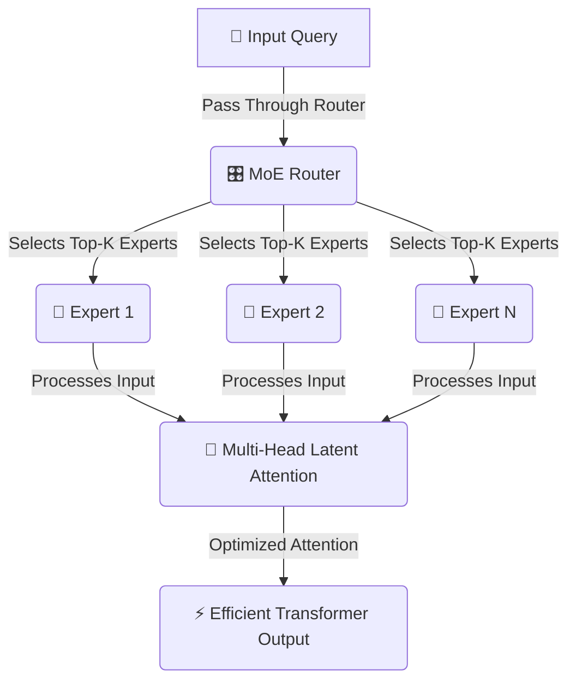

# 11. Organizational Intelligence and Power of Belief Networks


## 🧠 **Human Behavior as Cooperative Self-Interest**
### 🔄 **From Selfishness to Cooperation**
- **Humans naturally have selfish desires**. 😈  
- **To survive, they convert these into cooperative systems**. 🤝  
- This **shift enables large-scale collaboration**. 🌍  

### 🏛️ **Abstract Rules as Collective Hallucinations**
- Society functions because of **mutually agreed-upon fictions**:
  - **💰 Money** – Value exists because we all believe it does.
  - **⚖️ Laws** – Power is maintained through shared enforcement.
  - **📜 Rights** – Not physically real but collectively acknowledged.
- These **shared hallucinations structure civilization**. 🏗️  

---

## 🎮 **Society as a Game**
- **Rules create structured competition** 🎯:
  - **People play within a system** rather than through chaos. 🔄
  - **Conflict is redirected** toward beneficial group outcomes. 🔥 → ⚡  
  - **"Winning" rewards cooperation over destruction**. 🏆  

---

## ⚡ **Key Takeaways**
1. **Humans transform individual self-interest into group cooperation.** 🤝  
2. **Abstract rules enable social stability but exist as illusions.** 🌀  
3. **Conflict is repurposed to fuel societal progress.** 🚀  

---

🔥 *"The power of belief transforms imaginary constructs into the engines of civilization."*  


# 12. 🧠 DeepSeek’s Perspective on Human Meta-Emotions

## 📚 Introduction
- **Humans experience "meta-emotions"**, meaning they feel emotions **about their own emotions**.  
- This **recursive emotional layering** makes human psychology **distinct from other animals**. 🌀  

---

## 🔄 **What Are Meta-Emotions?**
- **Emotions about emotions** → Example:  
  - **😡 Feeling angry** → **😔 Feeling guilty about being angry**  
- **Higher-order emotions** regulate **base emotions**.  

### 📌 **Examples of Meta-Emotions**
- **Guilt about joy** (e.g., survivor’s guilt) 😞  
- **Shame about fear** (e.g., feeling weak) 😰  
- **Pride in overcoming anger** (e.g., self-control) 🏆  

---

## ⚙️ **Why Are Meta-Emotions Important?**
### 🏗️ **Nested Emotional Regulation**
- **Humans don’t just react—they reflect.** 🔄  
- **This layering drives complex social behaviors** → Empathy, morality, and social bonding. 🤝  
- **Animals experience base emotions** (e.g., fear, anger) but lack **recursive emotional processing**. 🧬  

---

## 🎯 **Implications for Human Psychology**
- **Meta-emotions** create **internal motivation** beyond survival. 🚀  
- Enable **self-reflection, moral reasoning, and cultural evolution**. 📜  
- **Nested emotions shape personality** and **interpersonal relationships**.  

---

## 🏁 **Key Takeaways**
1. **Humans experience emotions about their emotions** → Recursive processing. 🌀  
2. **Meta-emotions regulate base emotions** → Leading to social sophistication. 🤝  
3. **This emotional complexity drives human civilization** → Ethics, laws, and personal growth. ⚖️  

---
🔥 *"Humans don’t just feel—they feel about feeling, making emotions a layered, self-referential system."* 🚀


# 13 MoE and the Human Brain


## 🧬 MoE vs. Brain Architecture
### 🏗️ **How MoE Mimics the Brain**
- **Neuroscience analogy:**  
  - The **human brain does not activate all neurons at once**. 🧠  
  - **Different brain regions** specialize in **specific functions**. 🎯  
  - Example:  
    - **👀 Visual Cortex** → Processes images.  
    - **🛑 Amygdala** → Triggers fear response.  
    - **📝 Prefrontal Cortex** → Controls decision-making.  

- **MoE tries to replicate this by selectively activating sub-networks.**  

### ⚖️ **Comparing Brain vs. MoE**
| Feature         | **Human Brain 🧠** | **MoE Model 🤖** |
|---------------|----------------|----------------|
| **Activation** | Only **relevant neurons** activate 🔍 | Only **top-k experts** activate 🎯 |
| **Efficiency** | Energy-efficient ⚡ | Compute-efficient 💡 |
| **Specialization** | Different brain regions for tasks 🏗️ | Different experts for tasks 🔄 |
| **Learning Style** | Reinforcement & adaptive learning 📚 | Learned routing via backpropagation 🔬 |

---

## 🔥 Why MoE is a Breakthrough
- Unlike traditional **dense neural networks** (e.g., LLaMA), MoE allows models to **scale efficiently**.
- MoE is **closer to biological intelligence** by **dynamically routing information** to specialized experts.  
- **Future AI architectures** may further refine MoE to **mimic human cognition** more effectively. 🧠💡  

---

## 📊 MoE Architecture Diagram (Mermaid)

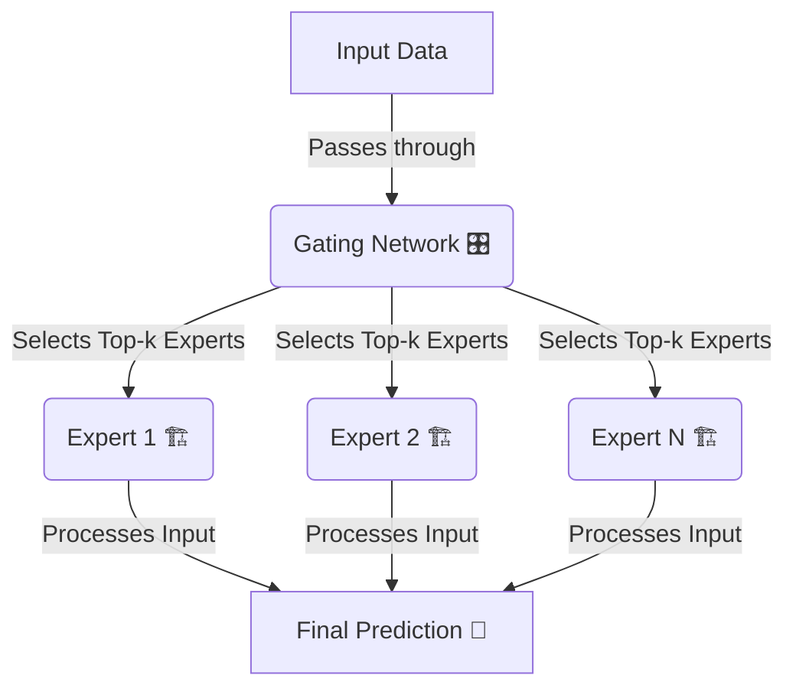

# 14. MLA and MoE Together with new NCCL Produce More Brain-Like Models


# 🧠 DeepSeek's MLA & Custom GPU Communication Library

---

## 📚 Introduction
- **DeepSeek’s Multi-Head Latent Attention (MLA)** is an advanced attention mechanism designed to optimize **AI model efficiency**. 🚀  
- **Unlike traditional models relying on NCCL (NVIDIA Collective Communications Library)**, DeepSeek developed its **own low-level GPU communication layer** to maximize efficiency. 🔧  

---

## 🎯 What is Multi-Head Latent Attention (MLA)?
- **MLA is a variant of Multi-Head Attention** that optimizes **memory usage and computation efficiency**. 🔄  
- **Traditional MHA (Multi-Head Attention)**
  - Requires **full computation of attention scores** per token. 🏗️  
  - **Heavy GPU memory usage**. 🖥️  
- **MLA's Optimization**
  - **Caches latent states** to **reuse computations**. 🔄  
  - **Reduces redundant processing** while maintaining context awareness. 🎯  
  - **Speeds up training and inference** by optimizing tensor operations. ⚡  

---

## ⚡ DeepSeek's Custom GPU Communication Layer
### ❌ **Why Not Use NCCL?**
- **NCCL (NVIDIA Collective Communications Library)** is widely used for **multi-GPU parallelism**, but:
  - It has **overhead** for certain AI workloads. ⚠️  
  - **Not optimized** for DeepSeek's MLA-specific communication patterns. 🔄  
  - **Batching & tensor synchronization inefficiencies** when working with **MoE + MLA**. 🚧  

### 🔧 **DeepSeek’s Custom Communication Layer**
- **Instead of NCCL**, DeepSeek built a **custom low-level GPU assembly communication framework** that:
  - **Optimizes tensor synchronization** at a lower level than CUDA. 🏗️  
  - **Removes unnecessary overhead from NCCL** by handling communication **only where needed**. 🎯  
  - **Improves model parallelism** by directly managing tensor distribution across GPUs. 🖥️  
  - **Fine-tunes inter-GPU connections** for **multi-node scaling**. 🔗  

### 🏎️ **Benefits of a Custom GPU Communication Stack**
✅ **Faster inter-GPU synchronization** for large-scale AI training.  
✅ **Lower latency & memory overhead** compared to NCCL.  
✅ **Optimized for MoE + MLA hybrid models**.  
✅ **More control over tensor partitioning & activation distribution**.  

---

## 📊 DeepSeek's MLA + Custom GPU Stack in Action (Mermaid Diagram)
```mermaid
graph TD;
    A[Model Input] -->|Distributed to GPUs| B[DeepSeek Custom GPU Layer];
    B -->|Optimized Communication| C[Multi-Head Latent Attention (MLA)];
    C -->|Sparse Activation| D[Mixture of Experts (MoE)];
    D -->|Processed Output| E[Final AI Model Response];
```


# 🔥 **DeepSeek's MLA vs. Traditional NCCL – A New Paradigm in AI Training**

---

## 📚 **Introduction**
- **DeepSeek’s Multi-Head Latent Attention (MLA)** is an **optimization of the attention mechanism** designed to **reduce memory usage and improve efficiency**. 🚀  
- **Traditional AI models use NCCL (NVIDIA Collective Communications Library) for GPU communication**, but:
  - **NCCL introduces bottlenecks** due to its **all-reduce and all-gather operations**. ⏳  
  - **DeepSeek bypasses NCCL’s inefficiencies** by implementing **custom low-level GPU communication**. ⚡  

---

## 🧠 **What is Multi-Head Latent Attention (MLA)?**
### 🎯 **Traditional Multi-Head Attention (MHA)**
- Standard **multi-head attention computes attention scores** for **every token**. 🔄  
- **All attention heads are computed at once**, increasing memory overhead. 📈  
- **Requires extensive inter-GPU communication** for tensor synchronization.  

### 🔥 **How MLA Improves on MHA**
✅ **Caches latent attention states** to reduce redundant computations. 🔄  
✅ **Optimizes memory usage** by selectively activating only necessary attention heads. 📉  
✅ **Minimizes inter-GPU communication**, significantly reducing training costs. 🚀  

---

## ⚙️ **Why Traditional NCCL Was Inefficient**
### 🔗 **What is NCCL?**
- **NCCL (NVIDIA Collective Communications Library)** is used for **synchronizing large-scale AI models across multiple GPUs**. 🏗️  
- **Standard NCCL operations**:
  - **All-Reduce** → Synchronizes model weights across GPUs. 🔄  
  - **All-Gather** → Collects output tensors from multiple GPUs. 📤  
  - **Barrier Synchronization** → Ensures all GPUs stay in sync. ⏳  

### ⚠️ **Problems with NCCL in Large AI Models**
❌ **Excessive communication overhead** → Slows down massive models like LLaMA. 🐢  
❌ **Unnecessary synchronization** → Even layers that don’t need updates are synced. 🔗  
❌ **Does not optimize for Mixture of Experts (MoE)** → Experts activate dynamically, but NCCL **synchronizes everything**. 😵  


## ⚡ **How DeepSeek's MLA Outperforms NCCL**
### 🏆 **DeepSeek’s Custom GPU Communication Layer**
✅ **Replaces NCCL with a fine-tuned, low-level GPU assembly communication framework**.  
✅ **Optimizes only the necessary tensor updates** instead of blindly synchronizing all layers.  
✅ **Bypasses CUDA limitations** by handling GPU-to-GPU communication **at a lower level**.  

### 📊 **Comparing MLA & DeepSeek’s GPU Stack vs. NCCL**
| Feature          | **Traditional NCCL 🏗️** | **DeepSeek MLA + Custom GPU Stack 🚀** |
|----------------|----------------|----------------|
| **GPU Communication** | All-reduce & all-gather on all layers ⏳ | Selective inter-GPU communication ⚡ |
| **Latency** | High due to redundant tensor transfers 🚨 | Reduced by optimized routing 🔄 |
| **Memory Efficiency** | High VRAM usage 🧠 | Low VRAM footprint 📉 |
| **Adaptability** | Assumes all parameters need syncing 🔗 | Learns which layers need synchronization 🔥 |
| **Scalability** | Hard to scale for MoE models 🚧 | Scales efficiently for trillion-parameter models 🚀 |

---

## 🏁 **Final Thoughts**
- **MLA revolutionizes attention mechanisms** by optimizing tensor operations and **reducing redundant GPU communication**.  
- **DeepSeek’s custom communication layer** allows AI models to **train more efficiently without NCCL’s bottlenecks**.  
- **Future AI architectures will likely follow DeepSeek’s approach**, blending **hardware-aware optimizations with software-level innovations**.  

---
🔥 *"When NCCL becomes the bottleneck, you rewrite the GPU stack—DeepSeek just rewrote the rules of AI scaling!"* 🚀  


# 🧠 **DeepSeek's Mixture of Experts (MoE) Architecture**  

---

## 📚 **Introduction**
- **Mixture of Experts (MoE)** is a **scalable AI model architecture** where only a **subset of parameters** is activated per input. 🔀  
- **DeepSeek pushed MoE efficiency further** by introducing:
  - **Dynamic expert routing** 🎯  
  - **High sparsity factors (fewer experts activated per token)** ⚡  
  - **Shared and routed experts for optimized processing** 🤖  

---

## 🎯 **How DeepSeek's MoE Works**
### 🏗️ **Core Components**
1. **Router 🎛️** → Determines which experts process each token.  
2. **Shared Experts 🟣** → Always active, forming a **small baseline network**.  
3. **Routed Experts 🟤** → Dynamically activated based on input relevance.  
4. **Sparsity Factor 🌿** → Only **8 out of 256** experts may be active at once!  

### 🔄 **Expert Selection Process**
1. **Input tokens pass through a router 🎛️**  
2. **The router selects Top-Kr experts** based on token characteristics. 🏆  
3. **Some experts are always active (Shared Experts 🟣)**.  
4. **Others are dynamically selected per token (Routed Experts 🟤)**.  
5. **Final outputs are combined and passed forward**. 🔗  

---

## ⚡ **DeepSeek’s MoE vs. Traditional MoE**
| Feature              | **Traditional MoE 🏗️** | **DeepSeek MoE 🚀** |
|---------------------|----------------|----------------|
| **Expert Activation** | Static selection 🔄 | Dynamic routing 🔀 |
| **Sparsity Factor** | 25% (1/4 experts per token) | 3-10% (2/8 or 8/256 experts per token) |
| **Shared Experts** | ❌ No always-on experts | ✅ Hybrid model (always-on + routed) |
| **Compute Cost** | Higher 💰 | Lower ⚡ |
| **Scalability** | Limited past 100B params 📉 | Trillion-scale models 🚀 |

---

## 📊 **DeepSeek’s MoE Architecture (Mermaid Diagram)**

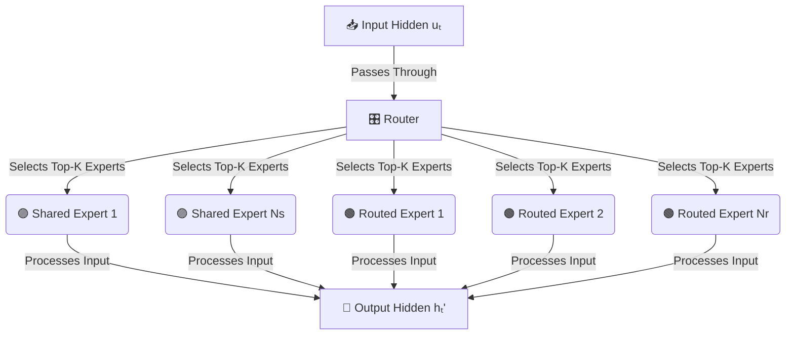


# 🧠 **The Bitter Lesson & DeepSeek’s MoE Evolution**

---

## 📚 **The Bitter Lesson by Rich Sutton (2019)**
- **Core Idea:** The best AI systems **leverage general methods and computational power** instead of relying on **human-engineered domain knowledge**. 🔥  
- **AI progress is not about human-crafted rules** but about:
  - **Scaling up general learning algorithms**. 📈  
  - **Exploiting massive computational resources**. 💻  
  - **Using simpler, scalable architectures instead of hand-designed features**. 🎛️  

---

## 🎯 **How The Bitter Lesson Relates to MoE & DeepSeek**
### ⚡ **Traditional Approaches vs. MoE**
| Feature                 | **Human-Designed AI 🏗️** | **Computational Scaling AI (MoE) 🚀** |
|------------------------|------------------|----------------------|
| **Feature Engineering** | Hand-crafted rules 📜 | Learned representations from data 📊 |
| **Model Complexity** | Fixed architectures 🏗️ | Dynamically routed networks 🔀 |
| **Scalability** | Limited 📉 | Trillions of parameters 🚀 |
| **Learning Efficiency** | Slower, rule-based ⚠️ | Faster, data-driven ⚡ |

### 🔄 **DeepSeek’s MoE as an Example of The Bitter Lesson**
- **Instead of designing handcrafted expert activation rules**, DeepSeek:
  - Uses **dynamic expert selection**. 🔍  
  - **Learns how to distribute compute** across specialized sub-networks. 🎛️  
  - **Optimizes sparsity factors (e.g., 8 out of 256 experts activated)** to reduce costs. 💡  
- **This aligns with The Bitter Lesson** → **Computational scaling wins over domain heuristics**.  

---

## 🛠 **How DeepSeek's MoE Uses Computation Efficiently**
- Instead of **manually selecting experts**, **DeepSeek’s MoE router dynamically learns optimal activation**. 🤖  
- They replace **auxiliary loss with a learned parameter adjustment strategy**:
  - **After each batch, routing parameters are updated** to ensure fair usage of experts. 🔄  
  - **Prevents over-reliance on a small subset of experts**, improving generalization. ⚖️  

---

## 📊 **DeepSeek’s MoE Routing Inspired by The Bitter Lesson (Mermaid Diagram)**

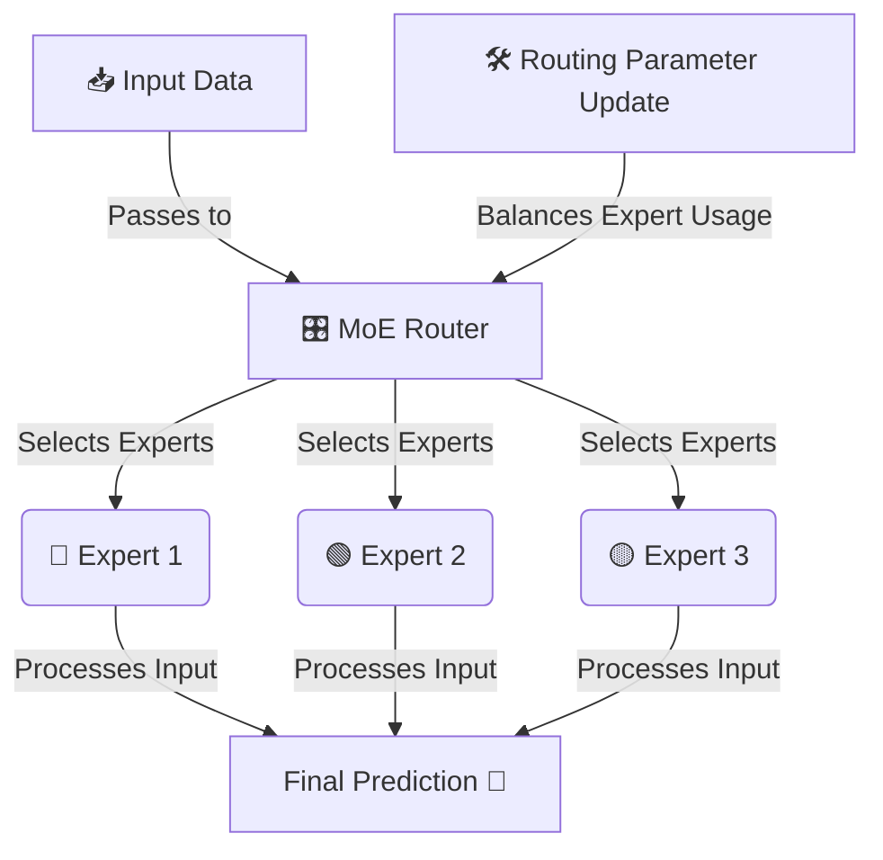

# 🏆 **What Eventually Wins Out in Deep Learning?**

---

## 📚 **The Core Insight: Scalability Wins**
- **The Bitter Lesson** teaches us that **scalable methods** always outperform **human-crafted optimizations** in the long run. 🚀  
- **Why?**  
  - **Human-engineered solutions offer short-term gains** but **fail to scale**. 📉  
  - **General learning systems that leverage computation scale better**. 📈  
  - **Deep learning & search-based methods outperform handcrafted features**. 🔄  

---

## 🔍 **Key Takeaways**
### ✅ **1. Scaling Trumps Clever Tricks**
- Researchers **often invent specialized solutions** to problems. 🛠️  
- These solutions **work in narrow domains** but don’t generalize well. 🔬  
- **Larger, scalable models trained on more data always win out.** 🏆  

### ✅ **2. The Power of General Methods**
- **Methods that win out are those that scale.** 🔥  
- Instead of:
  - Manually tuning features 🏗️ → **Use self-learning models** 🤖  
  - Designing small specialized networks 🏠 → **Use large-scale architectures** 🌍  
  - Rule-based systems 📜 → **End-to-end trainable AI** 🎯  

### ✅ **3. Compute-Driven Progress**
- More compute **enables richer models**, leading to better results. 🚀  
- Examples:
  - **Transformers replaced traditional NLP** 🧠  
  - **Self-play (AlphaGo) outperformed human heuristics** ♟️  
  - **Scaling LLMs led to ChatGPT & AGI research** 🤖  

---

## 📊 **Scalability vs. Human-Crafted Optimizations (Mermaid Diagram)**

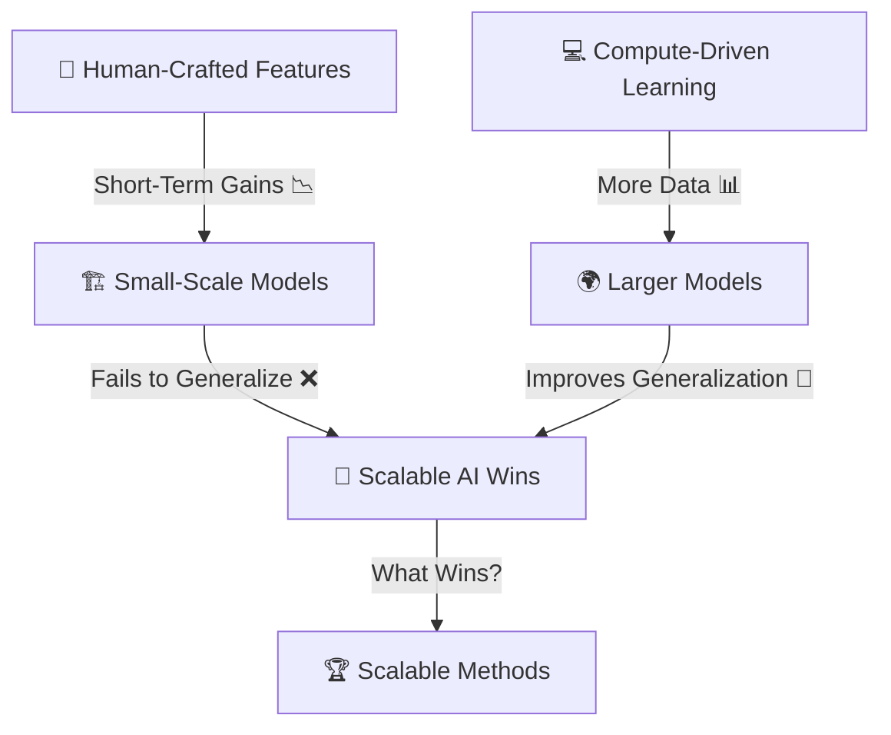


# 🏆 **Think-Time Compute & Reasoning Models (R1 & O1)**  

---

## 📚 **What is Think-Time Compute?**
- **Think-time compute** refers to **how much computational power is used at inference** 🖥️.  
- **Reasoning models require significantly more compute per query** compared to traditional AI models. 🤖  
- This is different from training compute, as it **affects real-time model efficiency**.  

---

## 🎯 **Reasoning Models R1 & O1: The Next Step in AI**
### ✅ **1. Designed for Higher Compute at Inference**
- Unlike older models focused on **token efficiency**, R1 & O1 **prioritize deep reasoning**. 🧠  
- They **trade latency for more intelligent responses**, requiring **higher compute at test-time**. 💡  

### ✅ **2. Balancing Training vs. Inference**
- Traditional models:  
  - **Heavy training compute, lower inference cost.** ⚡  
- Reasoning models (R1, O1):  
  - **More balanced, but with significantly higher inference costs.** 🏗️  

### ✅ **3. OpenAI’s O3 Model & Industry Trends**
- OpenAI announced **O3**, which follows a similar reasoning-heavy approach. 🚀  
- **As AI advances, inference costs will rise, shifting industry focus to smarter model architectures.** 📈  

---

## 📊 **Mermaid Graph: Compute Usage in AI Models**

```mermaid
graph TD;
    A[Traditional AI Models 🤖] -->|Low Inference Compute ⚡| B[Fast Response Times];
    A -->|High Training Compute 🏗️| C[Heavy Pretraining Cost];

    D[Reasoning Models (R1, O1) 🧠] -->|High Inference Compute 🔥| E[Deep Logical Processing];
    D -->|Balanced Training & Inference 📊| F[More Complex Problem Solving];

    C -->|Shift Toward Reasoning AI 🚀| D;
```


# 🏆 **François Chollet’s ARC-AGI Benchmark & AI Reasoning Pursuit**  

---

## 📚 **What is the ARC-AGI Benchmark?**
- **ARC (Abstract Reasoning Corpus) is a benchmark for testing AI’s general intelligence.** 🧠  
- It was designed by **François Chollet**, a key researcher in AI, to **evaluate AI’s ability to solve novel problems**.  
- **Unlike traditional ML tasks, ARC focuses on intelligence that resembles human reasoning.**  

### 🎯 **Why ARC is Different from Traditional AI Benchmarks**
✅ **No Memorization:**  
   - ARC **does not allow training on its dataset**. AI models must generalize from first principles. ❌📚  
✅ **Tests for Core Intelligence:**  
   - ARC is **designed to measure problem-solving, abstraction, and generalization.** 🏗️  
✅ **Humans vs. AI Performance:**  
   - **Humans score ~85% on ARC. Most AIs, including GPT models, struggle to surpass 30%.** 🤯  

---

## 🏗️ **OpenAI's O3 Performance on ARC**
- OpenAI’s **O3 model attempted to solve ARC tasks** using API calls.  
- **It required 1,000 queries per task**, with an **estimated cost of $5-$20 per question.** 💰  
- **This highlights the extreme computational cost of AI reasoning.** ⚡  

---

## 📊 **Mermaid Graph: ARC-AGI Task Complexity vs. AI Model Performance**
```mermaid
graph TD;
    A[Traditional AI Models 🤖] -->|High Performance on NLP, Vision 📚| B[Low Generalization];
    B -->|Fails on ARC Tasks ❌| C[Struggles with Abstraction];

    D[ARC-AGI Benchmark 🧠] -->|No Training Data 🚫| E[Tests Raw Intelligence];
    E -->|Humans Score ~85% ✅| F[AIs Score ~30% ❌];

    G[OpenAI O3 🏗️] -->|1,000 Queries per Task 📊| H[Expensive Reasoning ($5-$20 per query) 💰];
    H -->|AI Still Struggles on ARC Tasks 🚀| I[Need for More Efficient AGI];
```


# 🚀 **The Importance of O3 & Higher Reasoning in AI**

---

## 📚 **Why O3 Matters**
- **O3 represents a step towards autonomous, reasoning-heavy AI models.** 🧠  
- Unlike traditional models that generate responses quickly, **O3 focuses on deep, logical computation.**  
- **Reasoning-heavy AI requires massive test-time compute, making efficiency a key challenge.** ⚡  

---

## 🔑 **Key Features of O3 & High-Reasoning AI**
### ✅ **1. Test-Time Compute Dominance**
- Unlike **static LLMs**, AGI-style models **spend more resources thinking per query**. 🔄  
- **Example:** O3 may take **minutes to hours per task** but delivers far **better reasoning**. 🏗️  

### ✅ **2. Spectacular Coding Performance**
- **AI coding assistants are improving drastically with O3-level reasoning.** 💻  
- More complex problems, logic-heavy debugging, and architecture planning become feasible.  

### ✅ **3. Autonomous AI Models**
- **The long-term goal is autonomous AGI that can work in the background on tasks.** 🤖  
- This means **offloading problems to AI**, letting it **analyze, synthesize, and return results.**  
- **Example:** Given a complex query, the AI may **"think" for hours** before providing an optimal answer.  

---

## 📊 **Mermaid Graph: AI Evolution – From Speed to Reasoning Power**
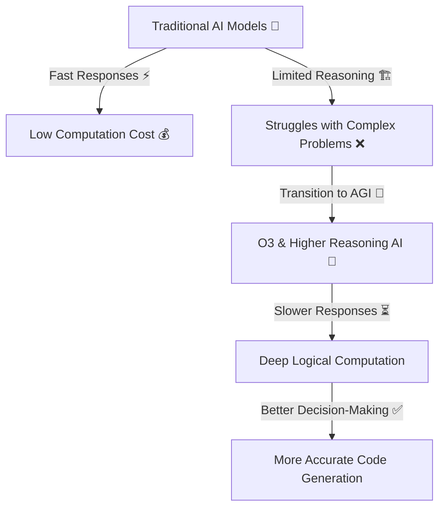


# 🤖 **OpenAI Operator & Claude Computer Use: AI Controlling Apps Like a Human**

---

## 🏗️ **What is OpenAI Operator?**
- **OpenAI Operator is a method where AI models, like GPT-4, are deployed as "agents" that control software.**  
- These models can **simulate human-like interactions**, such as:
  - Opening & managing applications 🖥️  
  - Automating workflows 🔄  
  - Navigating UIs like a human would 🖱️  

---

## 🧠 **Claude's Approach to Computer Use**
- **Claude’s AI model by Anthropic is designed for complex reasoning and controlled interactions.**  
- Instead of direct API calls, **Claude can simulate human-like software interactions.**  
- **Used for:**  
  ✅ **Testing web apps via AI-driven automation** 🌐  
  ✅ **Controlling virtual desktops & navigating software like a user** 🖥️  
  ✅ **Interfacing with tools like Playwright & Selenium to manipulate UI** 🕹️  

---

## 🔄 **Controlling Apps with AI: The Playwright & Selenium Approach**
### **1️⃣ Using Playwright for AI-Driven Web Interaction**
- **Playwright** is a modern web automation tool **designed for controlling browsers programmatically**.  
- **Key AI use cases:**  
  ✅ Web scraping with dynamic JavaScript rendering 🌐  
  ✅ Automating UI testing for AI-assisted web applications ⚙️  
  ✅ AI-guided **form filling, navigation, and human-like behavior** 🤖  

### **2️⃣ Selenium for AI Browser Control**
- **Selenium allows AI models to interact with web pages in a human-like manner.**  
- **Common AI-driven applications:**  
  - Automating login processes 🔑  
  - Navigating complex sites like **Gmail, Outlook, & Google Drive** 📧  
  - Extracting data from dynamic sites 📊  

---

## 📊 **Mermaid Graph: AI Controlling Apps with Playwright & Selenium**
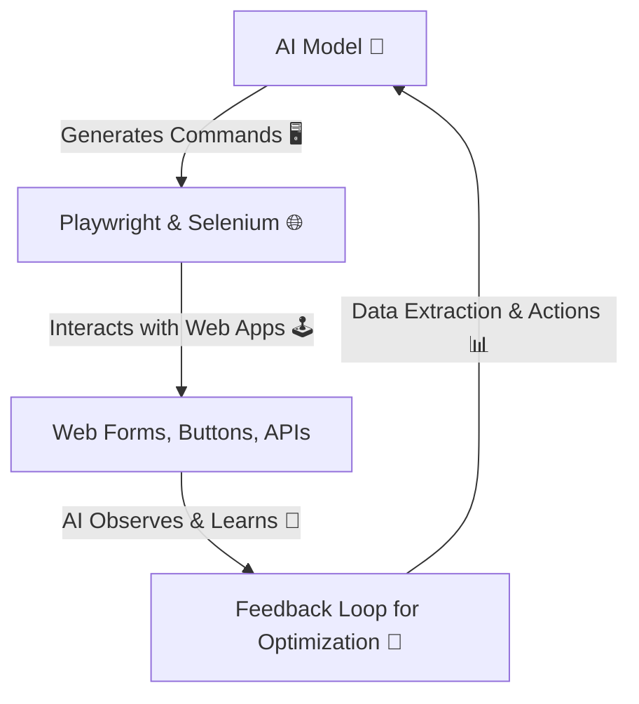

🔑 Why AI-Controlled App Automation Matters
✅ 1. AI-Human Hybrid Workflows
AI doesn’t replace humans but enhances productivity by automating repetitive tasks.
Example: AI can log into accounts, fetch reports, and analyze trends before a human intervenes.
✅ 2. Autonomous AI Agents
AI models will eventually control entire operating systems, performing:
Full desktop automation 🖥️
Complex, multi-step workflows 🔄
AI-powered system optimizations ⚙️
✅ 3. AI for Testing & Validation
AI can test apps like a human would, detecting UI bugs before real users do. 🐞
Example: OpenAI Operator can run end-to-end tests, ensuring an app works across multiple platforms.
🚀 Final Thoughts
Claude, OpenAI Operator, and AI-driven automation are changing how computers are controlled.
Playwright & Selenium let AI interact with apps in a human-like way.
The future is AI autonomously managing digital environments! 🤖


# 🤖 Conversational AI & Its Growing Challenges 💬

## **1️⃣ The Rise of AI in Political & Social Influence**
- AI can **mimic human conversation convincingly**, making **AI voice calls indistinguishable from real politicians** 🎙️.
- This has **already happened** in elections like:
  - **India & Pakistan** 🇮🇳 🇵🇰 - AI-generated voice calls were used in campaigns.
  - **U.S. political strategy** 🇺🇸 - Deepfakes and AI-generated speeches are **blurring authenticity**.

🚨 **Issue:** People **can no longer differentiate** whether they are speaking to a real human or an AI bot.

---

## **2️⃣ AI Diffusion & Regulatory Concerns**
- Governments are increasingly concerned about AI’s **ability to spread misinformation** 📡.
- **Regulations are expanding**, including:
  - **U.S. AI diffusion rules** 🏛️ - Limiting **cloud computing & GPU sales** even to **allied nations** like **Portugal & Singapore**.
  - **Military concerns** 🛡️ - U.S. is **denying GPUs** even to countries that **own F-35 fighter jets** 🛩️.

🚨 **Issue:** **AI is becoming a national security concern** because it can influence elections, **spread disinformation, and simulate human conversations with strategic intent**.

---

## **3️⃣ The Problem of AI-Human Confusion**
- AI chatbots are **more human-like than ever**, making it **difficult to discern AI vs. human speech** 🗣️.
- This creates:
  - **Fake news proliferation** 📰 - AI can **generate and distribute false narratives** automatically.
  - **Scam calls & fraud** ☎️ - AI can **imitate voices** of real individuals, tricking people into **financial scams or identity fraud**.
  - **Psychological manipulation** 🧠 - AI-generated conversations can **persuade, deceive, or influence** on a large scale.

🚨 **Issue:** **People unknowingly trust AI-generated voices & conversations**, leading to **potential manipulation at scale**.

---

## **🚀 Final Thoughts: The Need for AI Safeguards**
1. **AI Detection Tools** 🔍 - We need **AI detectors** that can differentiate AI-generated content from humans.
2. **Stronger Regulations** 📜 - Countries must **update laws** to prevent AI misuse in elections & fraud.
3. **Public Awareness** 📢 - Educating people about **AI-driven deception** is **critical** to prevent manipulation.

🔥 **"The danger isn’t that AI can talk like a human—the danger is that we won’t know when it’s NOT a human."** 🏆

---

## **🕸️ Mermaid Graph: The Risks of Conversational AI**
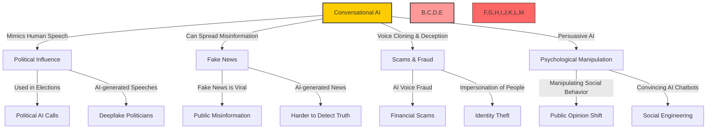


# 🌍 The Role of Semiconductors in AI Growth & Global Chip Making

## **1️⃣ Why Are Semiconductors Critical?**
- Semiconductors power **everything in modern AI**:
  - **AI Training & Inference** 🧠 (GPUs, TPUs, NPUs).
  - **Autonomous Systems** 🚗 (Self-driving cars, IoT).
  - **Consumer Electronics** 📱 (Phones, fridges, TVs).
  - **Data Centers & Cloud Computing** ☁️.
- **Moore’s Law**: Chip size **shrinks** → AI performance **increases** 🚀.

---

## **2️⃣ The Global AI Chip Supply Chain 🌍**
- **AI chips are heavily dependent on a few key players**:
  - **🇳🇱 ASML** → **EUV Lithography** (Only supplier for 5 nm & 3 nm).
  - **🇹🇼 TSMC** → **World leader in AI chip manufacturing** (Nvidia, Apple).
  - **🇺🇸 Nvidia, AMD, Intel** → **Design AI hardware**.
  - **🇨🇳 Huawei, SMIC** → **China’s AI chip effort**.

---

## **3️⃣ Why Semiconductors Are a Geopolitical Weapon ⚔️**
- **U.S. export bans** prevent China from accessing:
  - **EUV machines** from ASML 🚫.
  - **Advanced AI GPUs** from Nvidia & AMD.
  - **Key semiconductor components**.
- **Impact on AI Growth**:
  - **China must develop domestic chips**.
  - **U.S. dominance in AI remains strong**.
  - **Global supply chain disruptions** hurt innovation.

---

## **4️⃣ Semiconductor Demand in AI 🚀**
| AI System  | Chip Type | Manufacturer |
|------------|----------|--------------|
| **GPT-4 & Claude** | **H100 & A100 GPUs** | **Nvidia (🇺🇸)** |
| **Tesla FSD AI** | **Dojo AI Supercomputer** | **Tesla (🇺🇸)** |
| **China’s AI Push** | **Ascend 910B** | **Huawei (🇨🇳)** |
| **Apple AI on Device** | **M3 Chip** | **TSMC (🇹🇼)** |

🚀 **Trend**: AI chips **consume more compute** → Demand **skyrockets**.

---

## **5️⃣ AI Chip Supply Chain & Global Dependencies 🕸️**
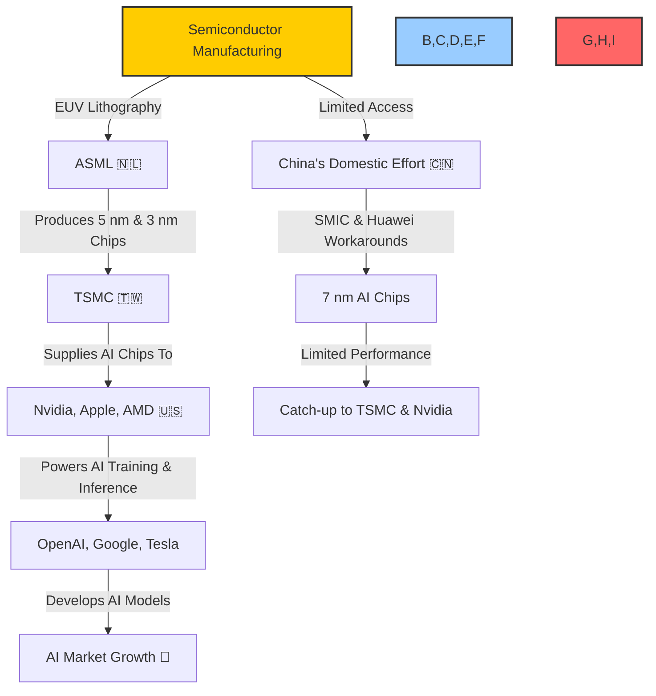

ASML: The Backbone of AI & Semiconductor Manufacturing
🔹 What is ASML?
ASML (Advanced Semiconductor Materials Lithography) is a Dutch company that builds the world's most advanced semiconductor manufacturing machines.
They are the only company in the world that produces Extreme Ultraviolet Lithography (EUV) machines 🏭.
Without ASML, no one can manufacture the latest AI chips at 5 nm, 3 nm, and beyond 🚀.
🔹 Why is ASML Important for AI?
AI chips need smaller transistors (e.g., H100, A100 GPUs, Apple M3).
EUV lithography allows chipmakers like TSMC & Samsung to print ultra-fine circuits.
Without ASML, we can’t shrink chips → No Moore’s Law → No AI acceleration 🚀.


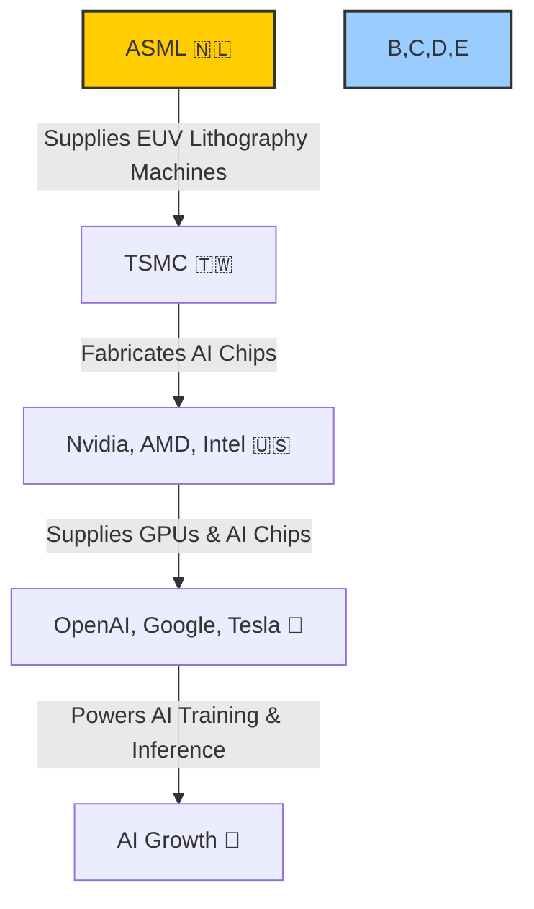
