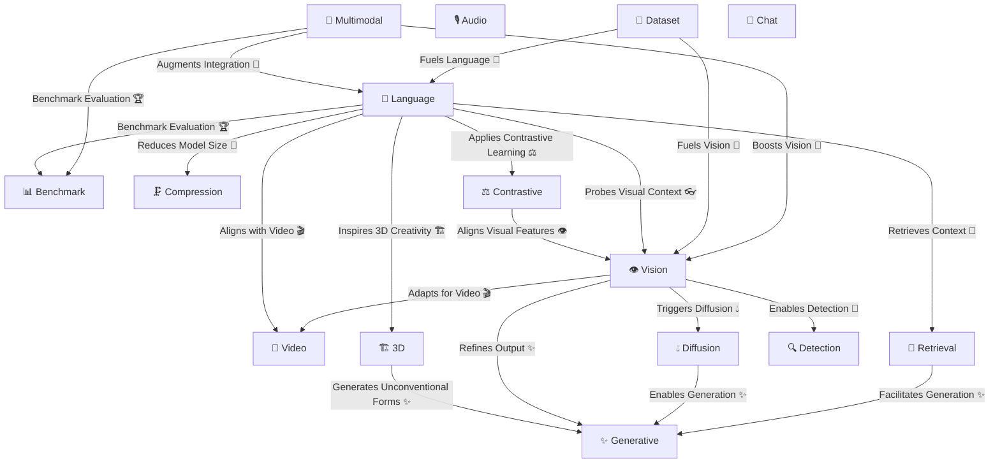

```mermaid
flowchart TD
    %% Nodes
    MM[🤖 Multimodal]
    VI[👁️ Vision]
    LA[📝 Language]
    VD[🎥 Video]
    T3D[🏗️ 3D]
    AU[🎙️ Audio]
    DS[💾 Dataset]
    BM[📊 Benchmark]
    CO[🗜️ Compression]
    RE[🔎 Retrieval]
    DI[💧 Diffusion]
    CT[⚖️ Contrastive]
    GE[✨ Generative]
    CH[💬 Chat]
    DT[🔍 Detection]

    %% Paper Relationships (P1-P10)
    %% P1: Enhancing Multimodal LLMs with Vision Detection Models
    MM -->|Boosts Vision 🚀| VI
    VI -->|Enables Detection 🔎| DT

    %% P2: Mug-STAN: Adapting Image-Language Pretrained Models for General Video Understanding
    VI -->|Adapts for Video 🎬| VD
    LA -->|Aligns with Video 🎬| VD

    %% P3: LAION-5B: An Open Large-Scale Dataset for Training Next Generation Image-Text Models
    DS -->|Fuels Vision 🔋| VI
    DS -->|Fuels Language 🔋| LA

    %% P4: SEED-Bench-2: Benchmarking Multimodal Large Language Models
    MM -->|Benchmark Evaluation 🏆| BM
    LA -->|Benchmark Evaluation 🏆| BM

    %% P5: Compression of Deep Learning Models for Text: A Survey
    LA -->|Reduces Model Size 🔽| CO

    %% P6: Retrieval-Augmented Multimodal Language Modeling
    MM -->|Augments Integration 🔗| LA
    LA -->|Retrieves Context 📡| RE
    RE -->|Facilitates Generation ✨| GE

    %% P7: DiffDis: Empowering Generative Diffusion Model with Cross-Modal Discrimination Capability
    VI -->|Triggers Diffusion 💧| DI
    DI -->|Enables Generation ✨| GE

    %% P8: DALL-Eval: Probing the Reasoning Skills and Social Biases of Text-to-Image Generation Models
    LA -->|Probes Visual Context 👓| VI
    VI -->|Refines Output ✨| GE

    %% P9: COSMO: Contrastive Streamlined Multimodal Model with Interleaved Pre-Training
    LA -->|Applies Contrastive Learning ⚖️| CT
    CT -->|Aligns Visual Features 👁️| VI

    %% P10: L3GO: Language Agents with Chain-of-3D-Thoughts for Generating Unconventional Objects
    LA -->|Inspires 3D Creativity 🏗️| T3D
    T3D -->|Generates Unconventional Forms ✨| GE
```
