# 1. Omni-modal Mixture of Experts Multiagent System for ASI - GPT4o - o3-mini-high and Deep Research Evaluator

# 2. AI Pipeline for Multi-modal Agents

```mermaid
flowchart TD
    %% Nodes (redeclared for completeness)
    MM[🤖 Multimodal]
    VI[👁️ Vision]
    LA[📝 Language]
    VD[🎥 Video]
    T3D[🏗️ 3D]
    AU[🎙️ Audio]
    DS[💾 Dataset]
    BM[📊 Benchmark]
    CO[🗜️ Compression]
    RE[🔎 Retrieval]
    DI[💧 Diffusion]
    CT[⚖️ Contrastive]
    GE[✨ Generative]
    CH[💬 Chat]
    DT[🔍 Detection]

    %% Paper Relationships (P11-P20)
    %% P11: OneLLM: One Framework to Align All Modalities with Language
    VI -->|Aligns Vision & Language 🤝| LA
    MM -->|Unifies Modalities 🤝| LA

    %% P12: UniVL: A Unified Video and Language Pre-Training Model for Multimodal Understanding and Generation
    LA -->|Synthesizes Video Content 🎞️| VD

    %% P13: Bidirectional Cross-Modal Knowledge Exploration for Video Recognition with Pre-trained Vision-Language Models
    VI -->|Exchanges Visual Cues 🔄| VD
    VD -->|Reciprocates Vision Signals 🔄| VI

    %% P14: mPLUG-2: A Modularized Multi-modal Foundation Model Across Text, Image and Video
    LA -->|Bridges Text & Vision 🔗| VI
    LA -->|Integrates with Video 🎥| VD
    VI -->|Leverages Vision for Video 🎥| VD

    %% P15: CrossGET: Cross-Guided Ensemble of Tokens for Accelerating Vision-Language Transformers
    VI -->|Enhances Matching ⚡| LA

    %% P16: Accountable Textual-Visual Chat Learns to Reject Human Instructions in Image Re-creation
    LA -->|Facilitates Dialogue 💬| CH
    VI -->|Provides Visual Context 👁️| CH
    DS -->|Supports Chat Data 💾| CH

    %% P17: Towards Fast Adaptation of Pretrained Contrastive Models for Multi-channel Video-Language Retrieval
    LA -->|Bridges to Video 🔄| VD
    VD -->|Applies Contrastive Refinement ⚖️| CT
    CT -->|Facilitates Retrieval 🔍| RE

    %% P18: LiDAR-LLM: Exploring the Potential of Large Language Models for 3D LiDAR Understanding
    LA -->|Extends to 3D Modeling 🏗️| T3D

    %% P19: Unified-IO 2: Scaling Autoregressive Multimodal Models with Vision, Language, Audio, and Action
    VI -->|Fuses Vision & Language 🤝| LA
    LA -->|Expands into Audio 🎙️| AU

    %% P20: GPT4Point: A Unified Framework for Point-Language Understanding and Generation
    LA -->|Connects to 3D Understanding 🏗️| T3D
    T3D -->|Fuels Creative Design ✨| GE

    %% Inherent Concept Relationships
    VI -->|Visual-Language Integration 🔗| LA
    VI -->|Vision-to-Video Flow 🎞️| VD
    MM -->|Unifies Modalities with Audio 🎧| AU
    DS -->|Data Fuels Benchmarking 📊| BM
    CH -->|Chat Engages Language 🗣️| LA
```

# 3. Omni Modal MoE Models Representing different Areas of the Brain per DRE

```mermaid
flowchart TD
    %% Nodes
    MM[🤖 Multimodal]
    VI[👁️ Vision]
    LA[📝 Language]
    VD[🎥 Video]
    T3D[🏗️ 3D]
    AU[🎙️ Audio]
    DS[💾 Dataset]
    BM[📊 Benchmark]
    CO[🗜️ Compression]
    RE[🔎 Retrieval]
    DI[💧 Diffusion]
    CT[⚖️ Contrastive]
    GE[✨ Generative]
    CH[💬 Chat]
    DT[🔍 Detection]

    %% Paper Relationships
    %% P1: Enhancing Multimodal LLMs with Vision Detection Models: "Enhancing MLLMs"
    MM -->|Enhancing MLLMs| VI
    VI -->|Enhancing MLLMs| DT

    %% P2: Mug-STAN: "Mug-STAN"
    VI -->|Mug-STAN| VD
    LA -->|Mug-STAN| VD

    %% P3: LAION-5B: "LAION5B"
    DS -->|LAION5B| VI
    DS -->|LAION5B| LA

    %% P4: SEED-Bench-2: "SEEDBench2"
    MM -->|SEEDBench2| BM
    LA -->|SEEDBench2| BM

    %% P5: Compression of Deep Learning Models for Text: "Compression Survey"
    LA -->|Compression Survey| CO

    %% P6: Retrieval-Augmented Multimodal Language Modeling: "RetrievalAugMLM"
    MM -->|RetrievalAugMLM| LA
    LA -->|RetrievalAugMLM| RE
    RE -->|RetrievalAugMLM| GE

    %% P7: DiffDis: "DiffDis"
    VI -->|DiffDis| DI
    DI -->|DiffDis| GE

    %% P8: DALL-Eval: "DALLEval"
    LA -->|DALLEval| VI
    VI -->|DALLEval| GE

    %% P9: COSMO: "COSMO"
    LA -->|COSMO| CT
    CT -->|COSMO| VI

    %% P10: L3GO: "L3GO"
    LA -->|L3GO| T3D
    T3D -->|L3GO| GE

    %% P11: OneLLM: "OneLLM"
    VI -->|OneLLM| LA
    MM -->|OneLLM| LA

    %% P12: UniVL: "UniVL"
    LA -->|UniVL| VD

    %% P13: Bidirectional Cross-Modal Knowledge Exploration: "BiCrossModal"
    VI -->|BiCrossModal| VD
    VD -->|BiCrossModal| VI

    %% P14: mPLUG-2: "mPLUG2"
    LA -->|mPLUG2| VI
    LA -->|mPLUG2| VD
    VI -->|mPLUG2| VD

    %% P15: CrossGET: "CrossGET"
    VI -->|CrossGET| LA

    %% P16: Accountable Textual-Visual Chat: "AccountableChat"
    LA -->|AccountableChat| CH
    VI -->|AccountableChat| CH
    DS -->|AccountableChat| CH

    %% P17: Towards Fast Adaptation of Contrastive Models: "FastAdaptContrastive"
    LA -->|FastAdaptContrastive| VD
    VD -->|FastAdaptContrastive| CT
    CT -->|FastAdaptContrastive| RE

    %% P18: LiDAR-LLM: "LiDARLLM"
    LA -->|LiDARLLM| T3D

    %% P19: Unified-IO 2: "UnifiedIO2"
    VI -->|UnifiedIO2| LA
    LA -->|UnifiedIO2| AU

    %% P20: GPT4Point: "GPT4Point"
    LA -->|GPT4Point| T3D
    T3D -->|GPT4Point| GE

    %% Inherent Concept Relationships
    VI -->|Visual-Language Integration| LA
    VI -->|Vision-to-Video Flow| VD
    MM -->|Unifies Modalities| AU
    DS -->|Data Fuels Benchmarking| BM
    CH -->|Enables Conversational Language| LA
```

# 4. MoE Skill Tree for AI/ML ASI Technology

| Number | **Company & Focus** | **Company & Focus** |
|--------|-------------------|-------------------|
| Row 1 | **1. NVIDIA - ML Architecture**   ML originates with HPC and GPU/TPU/Hardware    | **2. OpenAI - LLM Innovation**   Python, HPC, LLMs/Generative AI with Transformers    |
| Row 2 | **3. Anthropic - Infrastructure**   Python, K8s (KEDA for HPC!), GPU/TPU/Hardware    | **4. Hugging Face - ML Hub**   Python, ML, GPU/TPU/Hardware    |

1. Python
2. High Performance Computing (HPC)
3. GPU/TPU/Hardware
4. ML/LLM/Transformers
5. Varies by org.  Nvidia & OpenAI: C++ & SQL. Anthropic: UI/React/JS.  Huggingface: Open Source Community.
6. Pytorch and Model Development.
7. Datasets, Databases and SQL.
8. Cloud platforms.  Top 3 in order for ML:  1. Azure, 2. AWS, 3. GCP
9. Linux/OS/MLOps.  Dockerfile to spin up replica instances.  Making it easy is SOTA.
10. 3D Computer Vision.

# 5. Asynchronous High Performance Compute (HPC) Patterns

