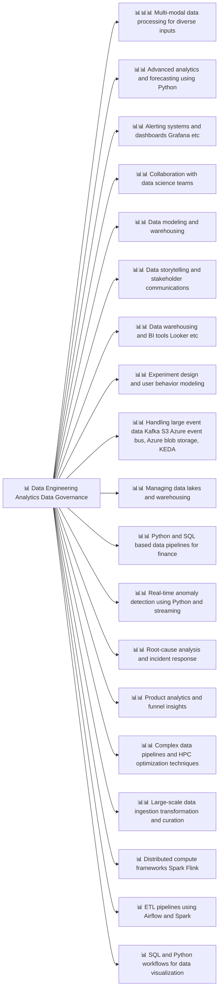
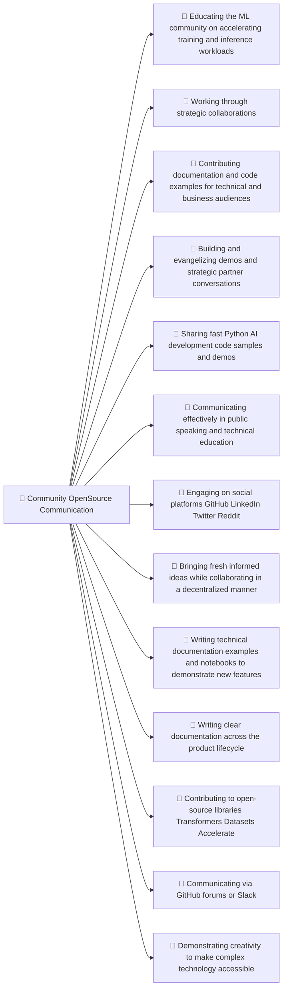

# Aaron Wacker - Curriculum Vitae (CV) MoE - Skills Research AI to Advance ML and Generative AI

# Mermaid Graph Models - ML State of Art

```mermaid
graph LR
    R[🔧 Systems Infrastructure LowLevel Engineering]
    R --> SILE2[🔧🔧 Linux or embedded systems experience]
    R --> SILE7[🔧🔧 Cross-layer performance tuning hardware plus software]
    R --> SILE8[🔧🔧 Data-center scale HPC or ML deployment]
    R --> SILE15[🔧🔧 HPC or large-batch evaluations]
    R --> SILE26[🔧🔧 Building and optimizing distributed backend systems]
    R --> SILE27[🔧🔧 Distributed system debugging and optimization]
    R --> SILE30[🔧🔧 Implementing quantitative models of system throughput]
    R --> SILE31[🔧🔧 Load balancing and high-availability design]
    R --> SILE34[🔧🔧 Python-driven distributed training pipelines]
    R --> SILE36[🔧🔧 Cross-team platform innovation and proactive ML based resolution]
    R --> SILE37[🔧🔧 Distributed systems design and scalable architectures]
    R --> SILE38[🔧🔧 Observability anomaly detection and automated triage AIOps Python Go]
    R --> SILE39[🔧🔧 ServiceNow expansions AIOps and AI automation]
    R --> SILE40[🔧🔧 User-centric IT workflows and design integration]
    R --> S1[🔧 Low-level system integrations compilers Cplusplus]
    R --> S3[🔧 Hardware acceleration]
    R --> S4[🔧 Accelerating ML training inference across AI hardware]
    R --> S5[🔧 CUDA kernels]
    R --> S6[🔧 Optimum integration for specialized AI hardware]
    R --> S9[🔧 GPU accelerator architecture and CUDA kernel optimization]
    R --> S10[🔧 GPU kernel design and HPC concurrency]
    R --> S11[🔧 GPU cluster configuration and job scheduling]
    R --> S12[🔧 HPC provisioning and GPU cluster orchestration]
    R --> S13[🔧 HPC training pipeline and multi-GPU scheduling]
    R --> S14[🔧 HPC scheduling and multi-node debugging]
    R --> S16[🔧 Hybrid on-premise and cloud HPC setups]
    R --> S17[🔧 Large-scale distributed computing and HPC performance]
    R --> S18[🔧 Low-level HPC code Cplusplus Triton and parallel programming]
    R --> S19[🔧 Low-level driver optimizations CUDA RDMA etc]
    R --> S20[🔧 Multi-GPU training and HPC acceleration]
    R --> S21[🔧 Overseeing HPC infrastructure for RL reasoning tasks]
    R --> S22[🔧 Performance modeling for large GPU fleets]
    R --> S23[🔧 Python and low-level matrix operations custom CUDA kernels]
    R --> S24[🔧 Python Cplusplus tooling for robust model tests]
    R --> S25[🔧 Stress-testing frontier LLMs and misuse detection]
    R --> S28[🔧 Distributed system design and MLOps best practices]
    R --> S29[🔧 High-performance optimization for ML training and inference]
    R --> S32[🔧 Optimizing system performance under heavy ML loads]
    R --> S33[🔧 Performance optimization for LLM inference]
    R --> S35[🔧 Throughput and performance optimization]
```

```mermaid
graph LR
    R[💻 Software Cloud MLOps Infrastructure]
    R --> SW1[💻💻 Python APIs and framework optimizations tokenizers datasets]
    R --> SW2[💻💻 Python programming]
    R --> SW4[💻💻 PyTorch and Keras development]
    R --> SW5[💻💻 TypeScript development]
    R --> SW7[💻💻 Kubernetes orchestration]
    R --> SW8[💻💻 Building secure and robust developer experiences and APIs]
    R --> SW9[💻💻 Full-stack development Nodejs Svelte AWS]
    R --> SW10[💻💻 Javascript TypeScript machine learning libraries transformersjs huggingfacejs]
    R --> SW11[💻💻 In-browser inference using WebGPU WASM ONNX]
    R --> SW12[💻💻 Integrating with major cloud platforms AWS GCP Azure]
    R --> SW13[💻💻 Containerization with Docker and MLOps pipelines]
    R --> SW14[💻💻 Distributed data processing]
    R --> SW15[💻💻 Building essential tooling for ML hubs]
    R --> SW16[💻💻 Cloud infrastructure provisioning Terraform Helm]
    R --> SW17[💻💻 Coordination of concurrency frameworks Kubernetes etc]
    R --> SW18[💻💻 Data pipeline tooling Spark Airflow]
    R --> SW19[💻💻 Deep learning systems performance profiling and tuning]
    R --> SW20[💻💻 End-to-end MLOps and DevOps practices]
    R --> SW21[💻💻 GPU-based microservices and DevOps]
    R --> SW22[💻💻 Infrastructure as Code Terraform Kubernetes]
    R --> SW23[💻💻 Managing GPU infrastructure at scale K8s orchestration]
    R --> SW27[💻💻 Reliability and performance scaling of infrastructure]
    R --> SW28[💻💻 System reliability and SRE best practices]
    R --> SW29[💻💻 Building observability and debugging tools for crawlers]
    R --> SW30[💻💻 Building scalable data pipelines for language model training]
    R --> SW31[💻💻 Cloud infrastructure optimization and integration AWS GCP Azure]
    R --> SW33[💻💻 Designing cloud-native architectures for AI services]
    R --> SW34[💻💻 Ensuring system resilience and scalability]
    R --> SW35[💻💻 High-availability and scalable system design]
    R --> SW39[💻💻 Python automation and container orchestration Kubernetes]
    R --> SW40[💻💻 Python for automation and infrastructure monitoring]
    R --> SW41[💻💻 Python scripting for deployment automation]
    R --> SW42[💻💻 Scalable system architecture]
    R --> SW43[💻💻 Enhancing reliability quality and time-to-market through performance optimization]
    R --> SW44[💻💻 Managing production environments using Azure VSCode Datadog Qualtrics ServiceNow]
    R --> SW45[💻💻 Building MLOps pipelines for containerizing models with Docker TypeScript Rust MongoDB Svelte TailwindCSS Kubernetes]
    R --> SW37[💻💻 Integration with ML frameworks]
    R --> SW36[💻 Infrastructure design for large-scale ML systems]
    R --> SW32[💻 Data quality assurance and validation systems]
    R --> SW3[💻 Rust programming]
    R --> SW6[💻 MongoDB integration]
    R --> SW24[💻 Model and pipeline parallel strategies]
    R --> SW25[💻 Python and Golang for infrastructure automation]
    R --> SW26[💻 Python-based distributed frameworks Ray Horovod]
    R --> SW38[💻 Python and distributed computing frameworks Spark]
```

```mermaid
graph LR
    R[🤖 Machine Learning AI Model Development]
    R --> ML25[🤖🤖🤖 Large-scale retrieval optimization RAG etc]
    R --> ML26[🤖🤖🤖 Managing large ML architectures using Transformers]
    R --> ML27[🤖🤖🤖 NLP pipelines using PyTorch and Transformers]
    R --> ML28[🤖🤖🤖 Python-based data pipelines for query handling]
    R --> ML32[🤖🤖🤖 Vector databases and semantic search FAISS etc]
    R --> ML34[🤖🤖🤖 Coordinating experimental design using Python]
    R --> ML36[🤖🤖🤖 Empirical AI research and reinforcement learning experiments]
    R --> ML37[🤖🤖🤖 Leveraging Python for ML experiment pipelines]
    R --> ML44[🤖🤖🤖 Developing agentic AI RAG and generative AI solutions LangChain AutoGen]
    R --> ML48[🤖🤖🤖 Large-language model inference and microservices design]
    R --> ML55[🤖🤖🤖 Python development for large-scale MLOps deployment]
    R --> ML57[🤖🤖🤖 System design for multi-agent AI workflows]
    R --> ML58[🤖🤖🤖 Developing generative AI solutions with Python Streamlit Gradio and Torch]
    R --> ML59[🤖🤖🤖 Developing Web AI solutions with Javascript TypeScript and HuggingFacejs]
    R --> ML60[🤖🤖🤖 Creating WebML applications for on-device model inference]
    R --> ML61[🤖🤖🤖 Building JSTS libraries for in-browser inference using ONNX and quantization with WebGPU WebNN and WASM]
    R --> ML63[🤖🤖🤖 Designing modern search solutions combining semantic and lexical search dense bi-encoder models SPLADE BM25]
    R --> ML64[🤖🤖🤖 Training neural sparse models with Sentence Transformers integration]
    R --> ML65[🤖🤖🤖 Leveraging chain-of-thought techniques in small models to outperform larger models]
    R --> ML62[🤖🤖 Driving forward quantization in the open-source ecosystem Accelerate PEFT Diffusers Bitsandbytes AWQ AutoGPTQ]
    R --> ML1[🤖🤖 Performance tuning for Transformers in NLP CV and Speech]
    R --> ML3[🤖🤖 Optimizing and scaling real-world ML services]
    R --> ML4[🤖🤖 Reliability and performance monitoring for ML systems]
    R --> ML5[🤖🤖 Ablation and training small models for data-quality analysis]
    R --> ML6[🤖🤖 Reducing model size and complexity via quantization]
    R --> ML7[🤖🤖 Neural sparse models and semantic dense retrieval SPLADE BM25]
    R --> ML8[🤖🤖 LLM usage and fine-tuning with chain-of-thought prompting]
    R --> ML10[🤖🤖 Post-training methods for LLMs RLHF PPO DPO instruction tuning]
    R --> ML11[🤖🤖 Building LLM agents with external tool usage]
    R --> ML12[🤖🤖 Creating LLM agents that control GUIs via screen recordings]
    R --> ML13[🤖🤖 Building web-scale high-quality LLM training datasets]
    R --> ML14[🤖🤖 LLM-based code suggestions in Gradio Playground]
    R --> ML15[🤖🤖 Speech-to-text text-to-speech and speaker diarization]
    R --> ML16[🤖🤖 Abuse detection and ML-based risk scoring]
    R --> ML17[🤖🤖 AI safety and alignment methodologies RLHF reward models]
    R --> ML18[🤖🤖 Building ML-driven products using Python and PyTorch]
    R --> ML19[🤖🤖 Building massive training sets for LLMs]
    R --> ML20[🤖🤖 Developing next-generation AI capabilities]
    R --> ML21[🤖🤖 Collaborative research on AI risk and safety]
    R --> ML22[🤖🤖 Distributed training frameworks for large models]
    R --> ML23[🤖🤖 Experimental large-model prototypes]
    R --> ML24[🤖🤖 Exploratory ML research with LLMs and RL]
    R --> ML29[🤖🤖 Python-based LLM experimentation]
    R --> ML30[🤖🤖 Transformer-based LLM development and fine-tuning]
    R --> ML31[🤖🤖 Transformer modeling and novel architecture prototyping GPTlike]
    R --> ML33[🤖🤖 Advanced distributed training techniques]
    R --> ML35[🤖🤖 Designing experiments to probe LLM inner workings]
    R --> ML38[🤖🤖 Reverse-engineering neural network mechanisms]
    R --> ML39[🤖🤖 Strategic roadmap for safe LLM development]
    R --> ML40[🤖🤖 Transformer-based LLM interpretability and fine-tuning]
    R --> ML41[🤖🤖 AI DL model productization using established frameworks]
    R --> ML42[🤖🤖 Utilizing AI frameworks PyTorch JAX TensorFlow TorchDynamo]
    R --> ML43[🤖🤖 Building AI inference APIs and MLOps solutions with Python]
    R --> ML45[🤖🤖 End-to-end AI lifecycle management and distributed team leadership]
    R --> ML47[🤖🤖 GPU kernel integration with CUDA TensorRT and roadmap alignment]
    R --> ML49[🤖🤖 LLM-based enterprise analytics systems]
    R --> ML50[🤖🤖 LLM diffusion-based product development]
    R --> ML51[🤖🤖 LLM alignment and RLHF pipelines for model safety]
    R --> ML53[🤖🤖 Optimizing open-source DL frameworks PyTorch TensorFlow]
    R --> ML54[🤖🤖 Parallel and distributed training architectures and reinforcement learning methods PPO SAC QLearning]
    R --> ML56[🤖🤖 Scaling AI inference on hundreds of GPUs]
    R --> ML9[🤖 Energy efficiency and carbon footprint analysis in ML]
    R --> ML2[🤖 Industrial-level ML for text generation inference]
    R --> ML46[🤖 Full-stack AI shipping with parallel and distributed training]
    R --> ML52[🤖 Mixed-precision and HPC algorithm development]
    R --> ML66[🤖 Addressing hardware acceleration and numerical precision challenges for scalable software]
```

```mermaid
graph LR
    R[🔒 Security Compliance Reliability]
    R --> SEC12[🔒🔒🔒 Coordinating with security and compliance teams]
    R --> SEC24[🔒🔒🔒 Data quality standards and compliance Informatica Collibra Alation]
    R --> SEC22[🔒🔒🔒 Risk management and compliance strategies]
    R --> SEC2[🔒🔒 Automation with Python and Bash]
    R --> SEC3[🔒🔒 Cross-team incident response orchestration]
    R --> SEC4[🔒🔒 IAM solutions AzureAD Okta Entra msal]
    R --> SEC5[🔒🔒 MacOS and iOS endpoint security frameworks]
    R --> SEC7[🔒🔒 Risk assessment and vulnerability management]
    R --> SEC8[🔒🔒 Security audits and penetration testing]
    R --> SEC9[🔒🔒 Security best practices for AI products appsec devsecops]
    R --> SEC10[🔒🔒 Secure architecture for HPC and ML pipelines]
    R --> SEC11[🔒🔒 Security privacy and compliance in data management]
    R --> SEC13[🔒🔒 Designing fault-tolerant high-availability LLM serving systems]
    R --> SEC14[🔒🔒 Designing resilient and scalable architectures]
    R --> SEC15[🔒🔒 Ensuring compliance and secure transactions]
    R --> SEC16[🔒🔒 Familiarity with technical operations tools for security]
    R --> SEC17[🔒🔒 Managing security processes for AI systems]
    R --> SEC18[🔒🔒 Performance tuning for LLM serving systems]
    R --> SEC19[🔒🔒 Process optimization and rapid troubleshooting for security]
    R --> SEC20[🔒🔒 Python for reliability monitoring and automation]
    R --> SEC21[🔒🔒 Python-based monitoring and fault-tolerance solutions]
    R --> SEC23[🔒🔒 Cost optimization and reliability in cloud environments]
    R --> SEC25[🔒🔒 Enterprise-wide data governance and policies for security]
    R --> SEC26[🔒🔒 Hybrid cloud integration for secure operations]
    R --> SEC27[🔒🔒 Identity management MFA ActiveDirectory AzureAD SSO ZeroTrust]
    R --> SEC28[🔒🔒 Scalable database security MySQL PostgreSQL MongoDB Oracle Azure Cosmos DB]
    R --> SEC29[🔒🔒 Security and operational excellence in IT and cloud]
    R --> SEC1[🔒 Attack simulations and detection pipelines]
    R --> SEC6[🔒 ML system vulnerability management]

```

```mermaid
graph LR
    R[👥 Leadership Management Collaboration]
    R --> L5[👥👥👥 Data-driven product management AB testing and analytics]
    R --> L12[👥👥👥 Balancing innovative research with product delivery]
    R --> L13[👥👥👥 Balancing rapid product delivery with AI safety standards]
    R --> L14[👥👥👥 Bridging customer requirements with technical development]
    R --> L19[👥👥👥 Cross-functional team coaching and agile processes]
    R --> L17[👥👥👥 Coordinating with security and compliance teams]
    R --> L21[👥👥👥 Cross-regional team alignment]
    R --> L23[👥👥👥 Data-driven growth strategies for AI products]
    R --> L24[👥👥👥 Data-driven strategy implementation]
    R --> L30[👥👥👥 Leading teams in ML interpretability research]
    R --> L31[👥👥👥 Overseeing Python-driven ML infrastructure]
    R --> L32[👥👥👥 Vendor and cross-team coordination]
    R --> L1[👥👥 Coordinating engineering design and research teams]
    R --> L2[👥👥 Cross-functional leadership for platform roadmaps]
    R --> L3[👥👥 Cross-functional leadership across finance and engineering]
    R --> L4[👥👥 Cross-team collaboration and project leadership]
    R --> L6[👥👥 Deep knowledge of AI frameworks and constraints]
    R --> L8[👥👥 People and team management for data teams]
    R --> L9[👥👥 Stakeholder management and vendor oversight]
    R --> L10[👥👥 Team-building and product strategy]
    R --> L11[👥👥 Team leadership and project delivery]
    R --> L15[👥👥 Collaboration across diverse technology teams]
    R --> L16[👥👥 Coordinating reinforcement learning experiments]
    R --> L18[👥👥 Cross-functional agile collaboration for ML scalability]
    R --> L22[👥👥 Cross-team collaboration for ML deployment]
    R --> L26[👥👥 Driving execution of global market entry strategies]
    R --> L27[👥👥 Leading high-impact zero-to-one ML development teams]
    R --> L28[👥👥 Leading interdisciplinary ML research initiatives]
    R --> L29[👥👥 Leading teams building reinforcement learning systems]
    R --> L33[👥👥 Facilitating cross-disciplinary innovation]
    R --> L25[👥 Detailed project planning and stakeholder coordination]
    R --> L7[👥 Driving cross-team alignment on HPC resources]
    R --> L20[👥 Cross-functional stakeholder management]
```

```mermaid
graph LR
    R[📱 FullStack UI Mobile Product Development]
    R --> M3[📱📱📱 Cloud-based microservices and REST GraphQL APIs]
    R --> M5[📱📱📱 Integrating AI chat features in mobile applications, msal, calendar and messaging integration]
    R --> M38[📱📱📱 Creating Python and Javascript HTML libraries for ML use cases]
    R --> M39[📱📱📱 Developing specialized software for healthcare ML use cases]
    R --> M40[📱📱📱 Utilizing library frameworks for scalable healthcare solutions]
    R --> M42[📱📱📱 Building AI solutions for healthcare with open-source libraries and Azure SaaS]
    R --> M43[📱📱📱 Designing and developing secure robust python JS apps and APIs using Streamlit and Gradio]
    R --> M12[📱📱📱 Python Node backend development for AI features]
    R --> M13[📱📱📱 Rapid prototyping of AI based internal apps]
    R --> M14[📱📱📱 React Nextjs with Python for web services]
    R --> M15[📱📱📱 React TypeScript front-end development]
    R --> M17[📱📱📱 TypeScript React and Python backend development]
    R --> M18[📱📱📱 Zero-touch deployment and patching]
    R --> M19[📱📱📱 Active engagement with open-source communities]
    R --> M21[📱📱📱 Bridging native mobile frontends with Python backends]
    R --> M22[📱📱📱 Bridging Python based ML models with frontend tooling]
    R --> M23[📱📱📱 Building internal tools to boost productivity in ML teams]
    R --> M24[📱📱📱 Building intuitive UIs integrated with Python backed ML]
    R --> M27[📱📱📱 Developer tools for prompt engineering and model testing]
    R --> M32[📱📱📱 Integrating robust UIs with backend ML models]
    R --> M1[📱📱 Building internal AI automation tools]
    R --> M2[📱📱 CI CD automation and testing frameworks]
    R --> M4[📱📱 GraphQL or REST based data fetching]
    R --> M6[📱📱 LLM integration for user support flows]
    R --> M9[📱📱 Native Android development Kotlin Java]
    R --> M10[📱📱 Observability and robust logging tracing]
    R --> M11[📱📱 Performance tuning and enhancing user experience for mobile]
    R --> M36[📱📱 Python based API and data pipeline creation]
    R --> M37[📱📱 Senior engineering for practical AI and ML solutions]
    R --> M41[📱📱 Writing apps using Python Rust CUDA Transformers Keras]
    R --> M44[📱📱 Expertise with tools like Transformers Diffusers Accelerate PEFT Datasets]
    R --> M45[📱📱 Leveraging deep learning frameworks PyTorch XLA and cloud platforms]
    R --> M16[📱📱 Integrating with GPT and other LLM endpoints]
    R --> M20[📱📱 API design for scalable LLM interactions]
    R --> M25[📱📱 Building robust developer infrastructure for ML products]
    R --> M26[📱📱 Crafting user-centric designs for AI interfaces]
    R --> M28[📱📱 End-to-end product delivery in software development]
    R --> M29[📱📱 Enhancing secure workflows and enterprise integrations]
    R --> M30[📱📱 Experimentation and iterative product development]
    R --> M31[📱📱 Full-stack development for ML driven products]
    R --> M33[📱📱 Iterative design based on user feedback]
    R --> M34[📱📱 Mobile app development incorporating AI features]
    R --> M35[📱 Optimizing TypeScript Node build systems]
    R --> M7[📱 MacOS iOS fleet management and security]
    R --> M8[📱 MDM solutions and iOS provisioning]
```

```mermaid
graph LR
    R[🎯 Specialized Domains Emerging Technologies]
    R --> SP1[🎯 3D computer vision and neural rendering radiance fields]
    R --> SP2[🎯 Advanced 3D reconstruction techniques Gaussian splatting NERF]
    R --> SP3[🎯 Graphics engines and deep learning for graphics Unreal Unity]
    R --> SP4[🎯 Low-level rendering pipelines DirectX Vulkan DX12]
    R --> SP5[🎯 Performance optimized computer vision algorithms real-time tracking relighting]
    R --> SP6[🎯 Semantic video search and 3D reconstruction services]
    R --> SP7[🎯 Agent frameworks and LLM pipelines LangChain AutoGen]
    R --> SP8[🎯 Concurrency in Cplusplus Python and vector database integration]
    R --> SP9[🎯 Cross-layer performance analysis and debugging techniques]
    R --> SP10[🎯 EDA and transistor-level performance modeling SPICE BSIM STA]
    R --> SP11[🎯 GPU and SoC modeling and SoC architecture SystemC TLM]
    R --> SP12[🎯 Next-generation hardware bringup and system simulation]
    R --> SP13[🎯 Parallel computing fundamentals and performance simulation]
    R --> SP14[🎯 Advanced development for programmable networks SDN SONiC P4]
    R --> SP15[🎯 System design for multi-agent AI workflows]
    R --> SP16[🎯 Advanced AI for self-driving software]
    R --> SP17[🎯 Autonomous vehicle data pipelines and debugging]
    R --> SP18[🎯 Car fleet software updates OTA and telemetry management]
    R --> SP19[🎯 Large-scale multi-sensor data operations and calibration]
    R --> SP20[🎯 Path planning and decision-making in robotics]
    R --> SP21[🎯 Real-time embedded systems for robotics Cplusplus Python]
    R --> SP22[🎯 Sensor fusion and HPC integration for perception systems]
    R --> SP23[🎯 Domain randomization and sim-to-real transfer for reinforcement learning]
    R --> SP24[🎯 GPU accelerated physics simulation Isaac Sim]
    R --> SP25[🎯 Large-scale reinforcement learning methods PPO SAC QLearning]
    R --> SP26[🎯 Policy optimization for robotics at scale]
    R --> SP27[🎯 Reinforcement learning orchestration and simulation based training]
    R --> SP28[🎯 Communication libraries NCCL NVSHMEM UCX]
    R --> SP29[🎯 HPC networking InfiniBand RoCE and distributed GPU programming]
    R --> SP30[🎯 GPU verification architecture techniques TLM SystemC modeling]
    R --> SP31[🎯 Hardware prototyping and verification SDN SONiC P4 programmable hardware]
    R --> SP32[🎯 GPU communications libraries management and performance tuning]
    R --> SP33[🎯 Senior software architecture for data centers EthernetIP design switch OS]
    R --> SP34[🎯 Developing Web AI solutions using Python Streamlit Gradio and Torch]
    R --> SP35[🎯 Developing Web AI solutions with Javascript TypeScript and HuggingFacejs]
    R --> SP36[🎯 Creating WebML applications for on-device model inference]
    R --> SP37[🎯 Building JSTS libraries for in-browser inference using ONNX and quantization with WebGPU WebNN and WASM]
    R --> SP38[🎯 Driving forward quantization in the open-source ecosystem Accelerate PEFT Diffusers Bitsandbytes AWQ AutoGPTQ]
    R --> SP39[🎯 Designing modern search solutions combining semantic and lexical search dense bi-encoder models SPLADE BM25]
    R --> SP40[🎯 Training neural sparse models with Sentence Transformers integration]
    R --> SP41[🎯 Leveraging chain-of-thought techniques in small models to outperform larger models]
    R --> SP42[🎯 Addressing hardware acceleration and numerical precision challenges for scalable software]
```



















# Code Listing

```python
import streamlit as st

# Set page configuration
st.set_page_config(page_title="Consolidated Skills Tree", layout="wide")

# Markdown Outline (every line starts with an emoji)
markdown_outline = r"""
🔧 **Systems, Infrastructure & Low-Level Engineering**

🔧 1. Low-level system integrations compilers Cplusplus  
🔧 2. Linux or embedded systems experience  
🔧 3. Hardware acceleration  
🔧 4. Accelerating ML training inference across AI hardware  
🔧 5. CUDA kernels  
🔧 6. Optimum integration for specialized AI hardware  
🔧 7. Cross-layer performance tuning hardware plus software  
🔧 8. Data-center scale HPC or ML deployment  
🔧 9. GPU accelerator architecture and CUDA kernel optimization  
🔧 10. GPU kernel design and HPC concurrency  
🔧 11. GPU cluster configuration and job scheduling  
🔧 12. HPC provisioning and GPU cluster orchestration  
🔧 13. HPC training pipeline and multi-GPU scheduling  
🔧 14. HPC scheduling and multi-node debugging  
🔧 15. HPC or large-batch evaluations  
🔧 16. Hybrid on-premise and cloud HPC setups  
🔧 17. Large-scale distributed computing and HPC performance  
🔧 18. Low-level HPC code Cplusplus Triton and parallel programming  
🔧 19. Low-level driver optimizations CUDA RDMA etc  
🔧 20. Multi-GPU training and HPC acceleration  
🔧 21. Overseeing HPC infrastructure for RL reasoning tasks  
🔧 22. Performance modeling for large GPU fleets  
🔧 23. Python and low-level matrix operations custom CUDA kernels  
🔧 24. Python Cplusplus tooling for robust model tests  
🔧 25. Stress-testing frontier LLMs and misuse detection  
🔧 26. Building and optimizing distributed backend systems  
🔧 27. Distributed system debugging and optimization  
🔧 28. Distributed system design and MLOps best practices  
🔧 29. High-performance optimization for ML training and inference  
🔧 30. Implementing quantitative models of system throughput  
🔧 31. Load balancing and high-availability design  
🔧 32. Optimizing system performance under heavy ML loads  
🔧 33. Performance optimization for LLM inference  
🔧 34. Python-driven distributed training pipelines  
🔧 35. Throughput and performance optimization  
🔧 36. Cross-team platform innovation and proactive ML based resolution  
🔧 37. Distributed systems design and scalable architectures  
🔧 38. Observability anomaly detection and automated triage AIOps Python Go  
🔧 39. ServiceNow expansions AIOps and AI automation  
🔧 40. User-centric IT workflows and design integration  

💻 **Software, Cloud, MLOps & Infrastructure**

💻 1. Python APIs and framework optimizations tokenizers datasets  
💻 2. Python programming  
💻 3. Rust programming  
💻 4. PyTorch and Keras development  
💻 5. TypeScript development  
💻 6. MongoDB integration  
💻 7. Kubernetes orchestration  
💻 8. Building secure and robust developer experiences and APIs  
💻 9. Full-stack development Nodejs Svelte AWS  
💻 10. Javascript TypeScript machine learning libraries transformersjs huggingfacejs  
💻 11. In-browser inference using WebGPU WASM ONNX  
💻 12. Integrating with major cloud platforms AWS GCP Azure  
💻 13. Containerization with Docker and MLOps pipelines  
💻 14. Distributed data processing  
💻 15. Building essential tooling for ML hubs  
💻 16. Cloud infrastructure provisioning Terraform Helm  
💻 17. Coordination of concurrency frameworks Kubernetes etc  
💻 18. Data pipeline tooling Spark Airflow  
💻 19. Deep learning systems performance profiling and tuning  
💻 20. End-to-end MLOps and DevOps practices  
💻 21. GPU-based microservices and DevOps  
💻 22. Infrastructure as Code Terraform Kubernetes  
💻 23. Managing GPU infrastructure at scale K8s orchestration  
💻 24. Model and pipeline parallel strategies  
💻 25. Python and Golang for infrastructure automation  
💻 26. Python-based distributed frameworks Ray Horovod  
💻 27. Reliability and performance scaling of infrastructure  
💻 28. System reliability and SRE best practices  
💻 29. Building observability and debugging tools for crawlers  
💻 30. Building scalable data pipelines for language model training  
💻 31. Cloud infrastructure optimization and integration AWS GCP  
💻 32. Data quality assurance and validation systems  
💻 33. Designing cloud-native architectures for AI services  
💻 34. Ensuring system resilience and scalability  
💻 35. High-availability and scalable system design  
💻 36. Infrastructure design for large-scale ML systems  
💻 37. Integration with ML frameworks  
💻 38. Python and distributed computing frameworks Spark  
💻 39. Python automation and container orchestration Kubernetes  
💻 40. Python for automation and infrastructure monitoring  
💻 41. Python scripting for deployment automation  
💻 42. Scalable system architecture  
💻 43. Enhancing reliability quality and time-to-market through performance optimization  
💻 44. Managing production environments using Azure VSCode Datadog Qualtrics ServiceNow  
💻 45. Building MLOps pipelines for containerizing models with Docker TypeScript Rust MongoDB Svelte TailwindCSS Kubernetes  

🤖 **Machine Learning, AI & Model Development**

🤖 1. Performance tuning for Transformers in NLP CV and Speech  
🤖 2. Industrial-level ML for text generation inference  
🤖 3. Optimizing and scaling real-world ML services  
🤖 4. Reliability and performance monitoring for ML systems  
🤖 5. Ablation and training small models for data-quality analysis  
🤖 6. Reducing model size and complexity via quantization  
🤖 7. Neural sparse models and semantic dense retrieval SPLADE BM25  
🤖 8. LLM usage and fine-tuning with chain-of-thought prompting  
🤖 9. Energy efficiency and carbon footprint analysis in ML  
🤖 10. Post-training methods for LLMs RLHF PPO DPO instruction tuning  
🤖 11. Building LLM agents with external tool usage  
🤖 12. Creating LLM agents that control GUIs via screen recordings  
🤖 13. Building web-scale high-quality LLM training datasets  
🤖 14. LLM-based code suggestions in Gradio Playground  
🤖 15. Speech-to-text text-to-speech and speaker diarization  
🤖 16. Abuse detection and ML-based risk scoring  
🤖 17. AI safety and alignment methodologies RLHF reward models  
🤖 18. Building ML-driven products using Python and PyTorch  
🤖 19. Building massive training sets for LLMs  
🤖 20. Developing next-generation AI capabilities  
🤖 21. Collaborative research on AI risk and safety  
🤖 22. Distributed training frameworks for large models  
🤖 23. Experimental large-model prototypes  
🤖 24. Exploratory ML research with LLMs and RL  
🤖 25. Large-scale retrieval optimization RAG etc  
🤖 26. Managing large ML architectures using Transformers  
🤖 27. NLP pipelines using PyTorch and Transformers  
🤖 28. Python-based data pipelines for query handling  
🤖 29. Python-based LLM experimentation  
🤖 30. Transformer-based LLM development and fine-tuning  
🤖 31. Transformer modeling and novel architecture prototyping GPTlike  
🤖 32. Vector databases and semantic search FAISS etc  
🤖 33. Advanced distributed training techniques  
🤖 34. Coordinating experimental design using Python  
🤖 35. Designing experiments to probe LLM inner workings  
🤖 36. Empirical AI research and reinforcement learning experiments  
🤖 37. Leveraging Python for ML experiment pipelines  
🤖 38. Reverse-engineering neural network mechanisms  
🤖 39. Strategic roadmap for safe LLM development  
🤖 40. Transformer-based LLM interpretability and fine-tuning  
🤖 41. AI DL model productization using established frameworks  
🤖 42. Utilizing AI frameworks PyTorch JAX TensorFlow TorchDynamo  
🤖 43. Building AI inference APIs and MLOps solutions with Python  
🤖 44. Developing agentic AI RAG and generative AI solutions LangChain AutoGen  
🤖 45. End-to-end AI lifecycle management and distributed team leadership  
🤖 46. Full-stack AI shipping with parallel and distributed training  
🤖 47. GPU kernel integration with CUDA TensorRT and roadmap alignment  
🤖 48. Large-language model inference and microservices design  
🤖 49. LLM-based enterprise analytics systems  
🤖 50. LLM diffusion-based product development  
🤖 51. LLM alignment and RLHF pipelines for model safety  
🤖 52. Mixed-precision and HPC algorithm development  
🤖 53. Optimizing open-source DL frameworks PyTorch TensorFlow  
🤖 54. Parallel and distributed training architectures and reinforcement learning methods PPO SAC QLearning  
🤖 55. Python development for large-scale MLOps deployment  
🤖 56. Scaling AI inference on hundreds of GPUs  
🤖 57. System design for multi-agent AI workflows  
🤖 58. Developing generative AI solutions with Python Streamlit Gradio and Torch  
🤖 59. Developing Web AI solutions with Javascript TypeScript and HuggingFacejs  
🤖 60. Creating WebML applications for on-device model inference  
🤖 61. Building JSTS libraries for in-browser inference using ONNX and quantization with WebGPU WebNN and WASM  
🤖 62. Driving forward quantization in the open-source ecosystem Accelerate PEFT Diffusers Bitsandbytes AWQ AutoGPTQ  
🤖 63. Designing modern search solutions combining semantic and lexical search dense bi-encoder models SPLADE BM25  
🤖 64. Training neural sparse models with Sentence Transformers integration  
🤖 65. Leveraging chain-of-thought techniques in small models to outperform larger models  
🤖 66. Addressing hardware acceleration and numerical precision challenges for scalable software  

📊 **Data Engineering, Analytics & Data Governance**

📊 1. Advanced analytics and forecasting using Python R  
📊 2. Alerting systems and dashboards Grafana etc  
📊 3. Collaboration with data science teams  
📊 4. Data modeling and warehousing  
📊 5. Data storytelling and stakeholder communications  
📊 6. Data warehousing and BI tools Looker etc  
📊 7. Distributed compute frameworks Spark Flink  
📊 8. ETL pipelines using Airflow and Spark  
📊 9. Experiment design and user behavior modeling  
📊 10. Handling large event data Kafka S3  
📊 11. Managing data lakes and warehousing  
📊 12. Python and SQL based data pipelines for finance  
📊 13. Real-time anomaly detection using Python and streaming  
📊 14. Root-cause analysis and incident response  
📊 15. SQL and Python workflows for data visualization  
📊 16. Product analytics and funnel insights  
📊 17. Complex data pipelines and HPC optimization techniques  
📊 18. Large-scale data ingestion transformation and curation  
📊 19. Multi-modal data processing for diverse inputs  

🔒 **Security, Compliance & Reliability**

🔒 1. Attack simulations and detection pipelines  
🔒 2. Automation with Python and Bash  
🔒 3. Cross-team incident response orchestration  
🔒 4. IAM solutions AzureAD Okta  
🔒 5. MacOS and iOS endpoint security frameworks  
🔒 6. ML system vulnerability management  
🔒 7. Risk assessment and vulnerability management  
🔒 8. Security audits and penetration testing  
🔒 9. Security best practices for AI products appsec devsecops  
🔒 10. Secure architecture for HPC and ML pipelines  
🔒 11. Security privacy and compliance in data management  
🔒 12. Coordinating with security and compliance teams  
🔒 13. Designing fault-tolerant high-availability LLM serving systems  
🔒 14. Designing resilient and scalable architectures  
🔒 15. Ensuring compliance and secure transactions  
🔒 16. Familiarity with technical operations tools for security  
🔒 17. Managing security processes for AI systems  
🔒 18. Performance tuning for LLM serving systems  
🔒 19. Process optimization and rapid troubleshooting for security  
🔒 20. Python for reliability monitoring and automation  
🔒 21. Python-based monitoring and fault-tolerance solutions  
🔒 22. Risk management and compliance strategies  
🔒 23. Cost optimization and reliability in cloud environments  
🔒 24. Data quality standards and compliance Informatica Collibra Alation  
🔒 25. Enterprise-wide data governance and policies for security  
🔒 26. Hybrid cloud integration for secure operations  
🔒 27. Identity management MFA ActiveDirectory AzureAD SSO ZeroTrust  
🔒 28. Scalable database security MySQL PostgreSQL MongoDB Oracle  
🔒 29. Security and operational excellence in IT and cloud  

👥 **Leadership, Management & Collaboration**

👥 1. Coordinating engineering design and research teams  
👥 2. Cross-functional leadership for platform roadmaps  
👥 3. Cross-functional leadership across finance and engineering  
👥 4. Cross-team collaboration and project leadership  
👥 5. Data-driven product management AB testing and analytics  
👥 6. Deep knowledge of AI frameworks and constraints  
👥 7. Driving cross-team alignment on HPC resources  
👥 8. People and team management for data teams  
👥 9. Stakeholder management and vendor oversight  
👥 10. Team-building and product strategy  
👥 11. Team leadership and project delivery  
👥 12. Balancing innovative research with product delivery  
👥 13. Balancing rapid product delivery with AI safety standards  
👥 14. Bridging customer requirements with technical development  
👥 15. Collaboration across diverse technology teams  
👥 16. Coordinating reinforcement learning experiments  
👥 17. Coordinating with security and compliance teams  
👥 18. Cross-functional agile collaboration for ML scalability  
👥 19. Cross-functional team coaching and agile processes  
👥 20. Cross-functional stakeholder management  
👥 21. Cross-regional team alignment  
👥 22. Cross-team collaboration for ML deployment  
👥 23. Data-driven growth strategies for AI products  
👥 24. Data-driven strategy implementation  
👥 25. Detailed project planning and stakeholder coordination  
👥 26. Driving execution of global market entry strategies  
👥 27. Leading high-impact zero-to-one ML development teams  
👥 28. Leading interdisciplinary ML research initiatives  
👥 29. Leading teams building reinforcement learning systems  
👥 30. Leading teams in ML interpretability research  
👥 31. Overseeing Python-driven ML infrastructure  
👥 32. Vendor and cross-team coordination  
👥 33. Facilitating cross-disciplinary innovation  

📱 **Full-Stack, UI, Mobile & Product Development**

📱 1. Building internal AI automation tools  
📱 2. CI CD automation and testing frameworks  
📱 3. Cloud-based microservices and REST GraphQL APIs  
📱 4. GraphQL or REST based data fetching  
📱 5. Integrating AI chat features in mobile applications  
📱 6. LLM integration for user support flows  
📱 7. MacOS iOS fleet management and security  
📱 8. MDM solutions and iOS provisioning  
📱 9. Native Android development Kotlin Java  
📱 10. Observability and robust logging tracing  
📱 11. Performance tuning and enhancing user experience for mobile  
📱 12. Python Node backend development for AI features  
📱 13. Rapid prototyping of AI based internal apps  
📱 14. React Nextjs with Python for web services  
📱 15. React TypeScript front-end development  
📱 16. Integrating with GPT and other LLM endpoints  
📱 17. TypeScript React and Python backend development  
📱 18. Zero-touch deployment and patching  
📱 19. Active engagement with open-source communities  
📱 20. API design for scalable LLM interactions  
📱 21. Bridging native mobile frontends with Python backends  
📱 22. Bridging Python based ML models with frontend tooling  
📱 23. Building internal tools to boost productivity in ML teams  
📱 24. Building intuitive UIs integrated with Python backed ML  
📱 25. Building robust developer infrastructure for ML products  
📱 26. Crafting user-centric designs for AI interfaces  
📱 27. Developer tools for prompt engineering and model testing  
📱 28. End-to-end product delivery in software development  
📱 29. Enhancing secure workflows and enterprise integrations  
📱 30. Experimentation and iterative product development  
📱 31. Full-stack development for ML driven products  
📱 32. Integrating robust UIs with backend ML models  
📱 33. Iterative design based on user feedback  
📱 34. Mobile app development incorporating AI features  
📱 35. Optimizing TypeScript Node build systems  
📱 36. Python based API and data pipeline creation  
📱 37. Senior engineering for practical AI and ML solutions  
📱 38. Creating Python and Javascript HTML libraries for ML use cases  
📱 39. Developing specialized software for healthcare ML use cases  
📱 40. Utilizing library frameworks for scalable healthcare solutions  
📱 41. Writing apps using Python Rust CUDA Transformers Keras  
📱 42. Building AI solutions for healthcare with open-source libraries and Azure SaaS  
📱 43. Designing and developing secure robust apps and APIs using Streamlit and Gradio  
📱 44. Expertise with tools like Transformers Diffusers Accelerate PEFT Datasets  
📱 45. Leveraging deep learning frameworks PyTorch XLA and cloud platforms  

🎯 **Specialized Domains & Emerging Technologies**

🎯 1. 3D computer vision and neural rendering radiance fields  
🎯 2. Advanced 3D reconstruction techniques Gaussian splatting NERF  
🎯 3. Graphics engines and deep learning for graphics Unreal Unity  
🎯 4. Low-level rendering pipelines DirectX Vulkan DX12  
🎯 5. Performance optimized computer vision algorithms real-time tracking relighting  
🎯 6. Semantic video search and 3D reconstruction services  
🎯 7. Agent frameworks and LLM pipelines LangChain AutoGen  
🎯 8. Concurrency in Cplusplus Python and vector database integration  
🎯 9. Cross-layer performance analysis and debugging techniques  
🎯 10. EDA and transistor-level performance modeling SPICE BSIM STA  
🎯 11. GPU and SoC modeling and SoC architecture SystemC TLM  
🎯 12. Next-generation hardware bringup and system simulation  
🎯 13. Parallel computing fundamentals and performance simulation  
🎯 14. Advanced development for programmable networks SDN SONiC P4  
🎯 15. System design for multi-agent AI workflows  
🎯 16. Advanced AI for self-driving software  
🎯 17. Autonomous vehicle data pipelines and debugging  
🎯 18. Car fleet software updates OTA and telemetry management  
🎯 19. Large-scale multi-sensor data operations and calibration  
🎯 20. Path planning and decision-making in robotics  
🎯 21. Real-time embedded systems for robotics Cplusplus Python  
🎯 22. Sensor fusion and HPC integration for perception systems  
🎯 23. Domain randomization and sim-to-real transfer for reinforcement learning  
🎯 24. GPU accelerated physics simulation Isaac Sim  
🎯 25. Large-scale reinforcement learning methods PPO SAC QLearning  
🎯 26. Policy optimization for robotics at scale  
🎯 27. Reinforcement learning orchestration and simulation based training  
🎯 28. Communication libraries NCCL NVSHMEM UCX  
🎯 29. HPC networking InfiniBand RoCE and distributed GPU programming  
🎯 30. GPU verification architecture techniques TLM SystemC modeling  
🎯 31. Hardware prototyping and verification SDN SONiC P4 programmable hardware  
🎯 32. GPU communications libraries management and performance tuning  
🎯 33. Senior software architecture for data centers EthernetIP design switch OS  
🎯 34. Developing Web AI solutions using Python Streamlit Gradio and Torch  
🎯 35. Developing Web AI solutions with Javascript TypeScript and HuggingFacejs  
🎯 36. Creating WebML applications for on-device model inference  
🎯 37. Building JSTS libraries for in-browser inference using ONNX and quantization with WebGPU WebNN and WASM  
🎯 38. Driving forward quantization in the open-source ecosystem Accelerate PEFT Diffusers Bitsandbytes AWQ AutoGPTQ  
🎯 39. Designing modern search solutions combining semantic and lexical search dense bi-encoder models SPLADE BM25  
🎯 40. Training neural sparse models with Sentence Transformers integration  
🎯 41. Leveraging chain-of-thought techniques in small models to outperform larger models  
🎯 42. Addressing hardware acceleration and numerical precision challenges for scalable software  

📢 **Community, Open-Source & Communication**

📢 1. Educating the ML community on accelerating training and inference workloads  
📢 2. Working through strategic collaborations  
📢 3. Contributing documentation and code examples for technical and business audiences  
📢 4. Building and evangelizing demos and strategic partner conversations  
📢 5. Sharing fast Python AI development code samples and demos  
📢 6. Communicating effectively in public speaking and technical education  
📢 7. Engaging on social platforms GitHub LinkedIn Twitter Reddit  
📢 8. Bringing fresh informed ideas while collaborating in a decentralized manner  
📢 9. Writing technical documentation examples and notebooks to demonstrate new features  
📢 10. Writing clear documentation across the product lifecycle  
📢 11. Contributing to open-source libraries Transformers Datasets Accelerate  
📢 12. Communicating via GitHub forums or Slack  
📢 13. Demonstrating creativity to make complex technology accessible
"""

# Define Mermaid graphs for each branch (each as a separate code block)

mermaid_branch1 = r"""


```


# 

# Consolidated Outline on ML Industry MoE

```python
🔧 **Systems, Infrastructure & Low-Level Engineering**

🔧 1. Low-level system integrations compilers Cplusplus
🔧 2. Linux or embedded systems experience
🔧 3. Hardware acceleration
🔧 4. Accelerating ML training inference across AI hardware
🔧 5. CUDA kernels
🔧 6. Optimum integration for specialized AI hardware
🔧 7. Cross-layer performance tuning hardware plus software
🔧 8. Data-center scale HPC or ML deployment
🔧 9. GPU accelerator architecture and CUDA kernel optimization
🔧 10. GPU kernel design and HPC concurrency
🔧 11. GPU cluster configuration and job scheduling
🔧 12. HPC provisioning and GPU cluster orchestration
🔧 13. HPC training pipeline and multi-GPU scheduling
🔧 14. HPC scheduling and multi-node debugging
🔧 15. HPC or large-batch evaluations
🔧 16. Hybrid on-premise and cloud HPC setups
🔧 17. Large-scale distributed computing and HPC performance
🔧 18. Low-level HPC code Cplusplus Triton and parallel programming
🔧 19. Low-level driver optimizations CUDA RDMA etc
🔧 20. Multi-GPU training and HPC acceleration
🔧 21. Overseeing HPC infrastructure for RL reasoning tasks
🔧 22. Performance modeling for large GPU fleets
🔧 23. Python and low-level matrix operations custom CUDA kernels
🔧 24. Python Cplusplus tooling for robust model tests
🔧 25. Stress-testing frontier LLMs and misuse detection
🔧 26. Building and optimizing distributed backend systems
🔧 27. Distributed system debugging and optimization
🔧 28. Distributed system design and MLOps best practices
🔧 29. High-performance optimization for ML training and inference
🔧 30. Implementing quantitative models of system throughput
🔧 31. Load balancing and high-availability design
🔧 32. Optimizing system performance under heavy ML loads
🔧 33. Performance optimization for LLM inference
🔧 34. Python-driven distributed training pipelines
🔧 35. Throughput and performance optimization
🔧 36. Cross-team platform innovation and proactive ML based resolution
🔧 37. Distributed systems design and scalable architectures
🔧 38. Observability anomaly detection and automated triage AIOps Python Go
🔧 39. ServiceNow expansions AIOps and AI automation
🔧 40. User-centric IT workflows and design integration

💻 **Software, Cloud, MLOps & Infrastructure**

💻 1. Python APIs and framework optimizations tokenizers datasets
💻 2. Python programming
💻 3. Rust programming
💻 4. PyTorch and Keras development
💻 5. TypeScript development
💻 6. MongoDB integration
💻 7. Kubernetes orchestration
💻 8. Building secure and robust developer experiences and APIs
💻 9. Full-stack development Nodejs Svelte AWS
💻 10. Javascript TypeScript machine learning libraries transformersjs huggingfacejs
💻 11. In-browser inference using WebGPU WASM ONNX
💻 12. Integrating with major cloud platforms AWS GCP Azure
💻 13. Containerization with Docker and MLOps pipelines
💻 14. Distributed data processing
💻 15. Building essential tooling for ML hubs
💻 16. Cloud infrastructure provisioning Terraform Helm
💻 17. Coordination of concurrency frameworks Kubernetes etc
💻 18. Data pipeline tooling Spark Airflow
💻 19. Deep learning systems performance profiling and tuning
💻 20. End-to-end MLOps and DevOps practices
💻 21. GPU-based microservices and DevOps
💻 22. Infrastructure as Code Terraform Kubernetes
💻 23. Managing GPU infrastructure at scale K8s orchestration
💻 24. Model and pipeline parallel strategies
💻 25. Python and Golang for infrastructure automation
💻 26. Python-based distributed frameworks Ray Horovod
💻 27. Reliability and performance scaling of infrastructure
💻 28. System reliability and SRE best practices
💻 29. Building observability and debugging tools for crawlers
💻 30. Building scalable data pipelines for language model training
💻 31. Cloud infrastructure optimization and integration AWS GCP
💻 32. Data quality assurance and validation systems
💻 33. Designing cloud-native architectures for AI services
💻 34. Ensuring system resilience and scalability
💻 35. High-availability and scalable system design
💻 36. Infrastructure design for large-scale ML systems
💻 37. Integration with ML frameworks
💻 38. Python and distributed computing frameworks Spark
💻 39. Python automation and container orchestration Kubernetes
💻 40. Python for automation and infrastructure monitoring
💻 41. Python scripting for deployment automation
💻 42. Scalable system architecture
💻 43. Enhancing reliability quality and time-to-market through performance optimization
💻 44. Managing production environments using Azure VSCode Datadog Qualtrics ServiceNow
💻 45. Building MLOps pipelines for containerizing models with Docker TypeScript Rust MongoDB Svelte TailwindCSS Kubernetes

🤖 **Machine Learning, AI & Model Development**

🤖 1. Performance tuning for Transformers in NLP CV and Speech
🤖 2. Industrial-level ML for text generation inference
🤖 3. Optimizing and scaling real-world ML services
🤖 4. Reliability and performance monitoring for ML systems
🤖 5. Ablation and training small models for data-quality analysis
🤖 6. Reducing model size and complexity via quantization
🤖 7. Neural sparse models and semantic dense retrieval SPLADE BM25
🤖 8. LLM usage and fine-tuning with chain-of-thought prompting
🤖 9. Energy efficiency and carbon footprint analysis in ML
🤖 10. Post-training methods for LLMs RLHF PPO DPO instruction tuning
🤖 11. Building LLM agents with external tool usage
🤖 12. Creating LLM agents that control GUIs via screen recordings
🤖 13. Building web-scale high-quality LLM training datasets
🤖 14. LLM-based code suggestions in Gradio Playground
🤖 15. Speech-to-text text-to-speech and speaker diarization
🤖 16. Abuse detection and ML-based risk scoring
🤖 17. AI safety and alignment methodologies RLHF reward models
🤖 18. Building ML-driven products using Python and PyTorch
🤖 19. Building massive training sets for LLMs
🤖 20. Developing next-generation AI capabilities
🤖 21. Collaborative research on AI risk and safety
🤖 22. Distributed training frameworks for large models
🤖 23. Experimental large-model prototypes
🤖 24. Exploratory ML research with LLMs and RL
🤖 25. Large-scale retrieval optimization RAG etc
🤖 26. Managing large ML architectures using Transformers
🤖 27. NLP pipelines using PyTorch and Transformers
🤖 28. Python-based data pipelines for query handling
🤖 29. Python-based LLM experimentation
🤖 30. Transformer-based LLM development and fine-tuning
🤖 31. Transformer modeling and novel architecture prototyping GPTlike
🤖 32. Vector databases and semantic search FAISS etc
🤖 33. Advanced distributed training techniques
🤖 34. Coordinating experimental design using Python
🤖 35. Designing experiments to probe LLM inner workings
🤖 36. Empirical AI research and reinforcement learning experiments
🤖 37. Leveraging Python for ML experiment pipelines
🤖 38. Reverse-engineering neural network mechanisms
🤖 39. Strategic roadmap for safe LLM development
🤖 40. Transformer-based LLM interpretability and fine-tuning
🤖 41. AI DL model productization using established frameworks
🤖 42. Utilizing AI frameworks PyTorch JAX TensorFlow TorchDynamo
🤖 43. Building AI inference APIs and MLOps solutions with Python
🤖 44. Developing agentic AI RAG and generative AI solutions LangChain AutoGen
🤖 45. End-to-end AI lifecycle management and distributed team leadership
🤖 46. Full-stack AI shipping with parallel and distributed training
🤖 47. GPU kernel integration with CUDA TensorRT and roadmap alignment
🤖 48. Large-language model inference and microservices design
🤖 49. LLM-based enterprise analytics systems
🤖 50. LLM diffusion-based product development
🤖 51. LLM alignment and RLHF pipelines for model safety
🤖 52. Mixed-precision and HPC algorithm development
🤖 53. Optimizing open-source DL frameworks PyTorch TensorFlow
🤖 54. Parallel and distributed training architectures and reinforcement learning methods PPO SAC QLearning
🤖 55. Python development for large-scale MLOps deployment
🤖 56. Scaling AI inference on hundreds of GPUs
🤖 57. System design for multi-agent AI workflows
🤖 58. Developing generative AI solutions with Python Streamlit Gradio and Torch
🤖 59. Developing Web AI solutions with Javascript TypeScript and HuggingFacejs
🤖 60. Creating WebML applications for on-device model inference
🤖 61. Building JSTS libraries for in-browser inference using ONNX and quantization with WebGPU WebNN and WASM
🤖 62. Driving forward quantization in the open-source ecosystem Accelerate PEFT Diffusers Bitsandbytes AWQ AutoGPTQ
🤖 63. Designing modern search solutions combining semantic and lexical search dense bi-encoder models SPLADE BM25
🤖 64. Training neural sparse models with Sentence Transformers integration
🤖 65. Leveraging chain-of-thought techniques in small models to outperform larger models
🤖 66. Addressing hardware acceleration and numerical precision challenges for scalable software

📊 **Data Engineering, Analytics & Data Governance**

📊 1. Advanced analytics and forecasting using Python R
📊 2. Alerting systems and dashboards Grafana etc
📊 3. Collaboration with data science teams
📊 4. Data modeling and warehousing
📊 5. Data storytelling and stakeholder communications
📊 6. Data warehousing and BI tools Looker etc
📊 7. Distributed compute frameworks Spark Flink
📊 8. ETL pipelines using Airflow and Spark
📊 9. Experiment design and user behavior modeling
📊 10. Handling large event data Kafka S3
📊 11. Managing data lakes and warehousing
📊 12. Python and SQL based data pipelines for finance
📊 13. Real-time anomaly detection using Python and streaming
📊 14. Root-cause analysis and incident response
📊 15. SQL and Python workflows for data visualization
📊 16. Product analytics and funnel insights
📊 17. Complex data pipelines and HPC optimization techniques
📊 18. Large-scale data ingestion transformation and curation
📊 19. Multi-modal data processing for diverse inputs

🔒 **Security, Compliance & Reliability**

🔒 1. Attack simulations and detection pipelines
🔒 2. Automation with Python and Bash
🔒 3. Cross-team incident response orchestration
🔒 4. IAM solutions AzureAD Okta
🔒 5. MacOS and iOS endpoint security frameworks
🔒 6. ML system vulnerability management
🔒 7. Risk assessment and vulnerability management
🔒 8. Security audits and penetration testing
🔒 9. Security best practices for AI products appsec devsecops
🔒 10. Secure architecture for HPC and ML pipelines
🔒 11. Security privacy and compliance in data management
🔒 12. Coordinating with security and compliance teams
🔒 13. Designing fault-tolerant high-availability LLM serving systems
🔒 14. Designing resilient and scalable architectures
🔒 15. Ensuring compliance and secure transactions
🔒 16. Familiarity with technical operations tools for security
🔒 17. Managing security processes for AI systems
🔒 18. Performance tuning for LLM serving systems
🔒 19. Process optimization and rapid troubleshooting for security
🔒 20. Python for reliability monitoring and automation
🔒 21. Python-based monitoring and fault-tolerance solutions
🔒 22. Risk management and compliance strategies
🔒 23. Cost optimization and reliability in cloud environments
🔒 24. Data quality standards and compliance Informatica Collibra Alation
🔒 25. Enterprise-wide data governance and policies for security
🔒 26. Hybrid cloud integration for secure operations
🔒 27. Identity management MFA ActiveDirectory AzureAD SSO ZeroTrust
🔒 28. Scalable database security MySQL PostgreSQL MongoDB Oracle
🔒 29. Security and operational excellence in IT and cloud

👥 **Leadership, Management & Collaboration**

👥 1. Coordinating engineering design and research teams
👥 2. Cross-functional leadership for platform roadmaps
👥 3. Cross-functional leadership across finance and engineering
👥 4. Cross-team collaboration and project leadership
👥 5. Data-driven product management AB testing and analytics
👥 6. Deep knowledge of AI frameworks and constraints
👥 7. Driving cross-team alignment on HPC resources
👥 8. People and team management for data teams
👥 9. Stakeholder management and vendor oversight
👥 10. Team-building and product strategy
👥 11. Team leadership and project delivery
👥 12. Balancing innovative research with product delivery
👥 13. Balancing rapid product delivery with AI safety standards
👥 14. Bridging customer requirements with technical development
👥 15. Collaboration across diverse technology teams
👥 16. Coordinating reinforcement learning experiments
👥 17. Coordinating with security and compliance teams
👥 18. Cross-functional agile collaboration for ML scalability
👥 19. Cross-functional team coaching and agile processes
👥 20. Cross-functional stakeholder management
👥 21. Cross-regional team alignment
👥 22. Cross-team collaboration for ML deployment
👥 23. Data-driven growth strategies for AI products
👥 24. Data-driven strategy implementation
👥 25. Detailed project planning and stakeholder coordination
👥 26. Driving execution of global market entry strategies
👥 27. Leading high-impact zero-to-one ML development teams
👥 28. Leading interdisciplinary ML research initiatives
👥 29. Leading teams building reinforcement learning systems
👥 30. Leading teams in ML interpretability research
👥 31. Overseeing Python-driven ML infrastructure
👥 32. Vendor and cross-team coordination
👥 33. Facilitating cross-disciplinary innovation

📱 **Full-Stack, UI, Mobile & Product Development**

📱 1. Building internal AI automation tools
📱 2. CI CD automation and testing frameworks
📱 3. Cloud-based microservices and REST GraphQL APIs
📱 4. GraphQL or REST based data fetching
📱 5. Integrating AI chat features in mobile applications
📱 6. LLM integration for user support flows
📱 7. MacOS iOS fleet management and security
📱 8. MDM solutions and iOS provisioning
📱 9. Native Android development Kotlin Java
📱 10. Observability and robust logging tracing
📱 11. Performance tuning and enhancing user experience for mobile
📱 12. Python Node backend development for AI features
📱 13. Rapid prototyping of AI based internal apps
📱 14. React Nextjs with Python for web services
📱 15. React TypeScript front-end development
📱 16. Integrating with GPT and other LLM endpoints
📱 17. TypeScript React and Python backend development
📱 18. Zero-touch deployment and patching
📱 19. Active engagement with open-source communities
📱 20. API design for scalable LLM interactions
📱 21. Bridging native mobile frontends with Python backends
📱 22. Bridging Python based ML models with frontend tooling
📱 23. Building internal tools to boost productivity in ML teams
📱 24. Building intuitive UIs integrated with Python backed ML
📱 25. Building robust developer infrastructure for ML products
📱 26. Crafting user-centric designs for AI interfaces
📱 27. Developer tools for prompt engineering and model testing
📱 28. End-to-end product delivery in software development
📱 29. Enhancing secure workflows and enterprise integrations
📱 30. Experimentation and iterative product development
📱 31. Full-stack development for ML driven products
📱 32. Integrating robust UIs with backend ML models
📱 33. Iterative design based on user feedback
📱 34. Mobile app development incorporating AI features
📱 35. Optimizing TypeScript Node build systems
📱 36. Python based API and data pipeline creation
📱 37. Senior engineering for practical AI and ML solutions
📱 38. Creating Python and Javascript HTML libraries for ML use cases
📱 39. Developing specialized software for healthcare ML use cases
📱 40. Utilizing library frameworks for scalable healthcare solutions
📱 41. Writing apps using Python Rust CUDA Transformers Keras
📱 42. Building AI solutions for healthcare with open-source libraries and Azure SaaS
📱 43. Designing and developing secure robust apps and APIs using Streamlit and Gradio
📱 44. Expertise with tools like Transformers Diffusers Accelerate PEFT Datasets
📱 45. Leveraging deep learning frameworks PyTorch XLA and cloud platforms

🎯 **Specialized Domains & Emerging Technologies**

🎯 1. 3D computer vision and neural rendering radiance fields
🎯 2. Advanced 3D reconstruction techniques Gaussian splatting NERF
🎯 3. Graphics engines and deep learning for graphics Unreal Unity
🎯 4. Low-level rendering pipelines DirectX Vulkan DX12
🎯 5. Performance optimized computer vision algorithms real-time tracking relighting
🎯 6. Semantic video search and 3D reconstruction services
🎯 7. Agent frameworks and LLM pipelines LangChain AutoGen
🎯 8. Concurrency in Cplusplus Python and vector database integration
🎯 9. Cross-layer performance analysis and debugging techniques
🎯 10. EDA and transistor-level performance modeling SPICE BSIM STA
🎯 11. GPU and SoC modeling and SoC architecture SystemC TLM
🎯 12. Next-generation hardware bringup and system simulation
🎯 13. Parallel computing fundamentals and performance simulation
🎯 14. Advanced development for programmable networks SDN SONiC P4
🎯 15. System design for multi-agent AI workflows
🎯 16. Advanced AI for self-driving software
🎯 17. Autonomous vehicle data pipelines and debugging
🎯 18. Car fleet software updates OTA and telemetry management
🎯 19. Large-scale multi-sensor data operations and calibration
🎯 20. Path planning and decision-making in robotics
🎯 21. Real-time embedded systems for robotics Cplusplus Python
🎯 22. Sensor fusion and HPC integration for perception systems
🎯 23. Domain randomization and sim-to-real transfer for reinforcement learning
🎯 24. GPU accelerated physics simulation Isaac Sim
🎯 25. Large-scale reinforcement learning methods PPO SAC QLearning
🎯 26. Policy optimization for robotics at scale
🎯 27. Reinforcement learning orchestration and simulation based training
🎯 28. Communication libraries NCCL NVSHMEM UCX
🎯 29. HPC networking InfiniBand RoCE and distributed GPU programming
🎯 30. GPU verification architecture techniques TLM SystemC modeling
🎯 31. Hardware prototyping and verification SDN SONiC P4 programmable hardware
🎯 32. GPU communications libraries management and performance tuning
🎯 33. Senior software architecture for data centers EthernetIP design switch OS
🎯 34. Developing Web AI solutions using Python Streamlit Gradio and Torch
🎯 35. Developing Web AI solutions with Javascript TypeScript and HuggingFacejs
🎯 36. Creating WebML applications for on-device model inference
🎯 37. Building JSTS libraries for in-browser inference using ONNX and quantization with WebGPU WebNN and WASM
🎯 38. Driving forward quantization in the open-source ecosystem Accelerate PEFT Diffusers Bitsandbytes AWQ AutoGPTQ
🎯 39. Designing modern search solutions combining semantic and lexical search dense bi-encoder models SPLADE BM25
🎯 40. Training neural sparse models with Sentence Transformers integration
🎯 41. Leveraging chain-of-thought techniques in small models to outperform larger models
🎯 42. Addressing hardware acceleration and numerical precision challenges for scalable software

📢 **Community, Open-Source & Communication**

📢 1. Educating the ML community on accelerating training and inference workloads
📢 2. Working through strategic collaborations
📢 3. Contributing documentation and code examples for technical and business audiences
📢 4. Building and evangelizing demos and strategic partner conversations
📢 5. Sharing fast Python AI development code samples and demos
📢 6. Communicating effectively in public speaking and technical education
📢 7. Engaging on social platforms GitHub LinkedIn Twitter Reddit
📢 8. Bringing fresh informed ideas while collaborating in a decentralized manner
📢 9. Writing technical documentation examples and notebooks to demonstrate new features
📢 10. Writing clear documentation across the product lifecycle
📢 11. Contributing to open-source libraries Transformers Datasets Accelerate
📢 12. Communicating via GitHub forums or Slack
📢 13. Demonstrating creativity to make complex technology accessible
```


# Next

```python
1. The outline should be valid markdown and every line needs to start with an emoji in the outline.  2. For sub numbering start at 1 everytime.  Dont do multipart naming - instead just use branches and consistent emojis for skill groups.  3. In mermaid model the () paranethesis characters are not allowed so it errors.  Make sure labels dont have non ascii letter characters yet have the best representative emoji at the front so easily to sight read fast.  4.  For the mermaid graph I expect that to be multi model, multi graph.  Maybe make one per branch and show each one with seperate mermaid blocks of markdown that begin with code block markers ```mermaid to start and ``` to stop on lines of their own.   Shown full code listing and include as code inside app.py of python streamlit app.py  5. Create a requirements.txt for every python library related to the skills even individual ones.  also use Usage comments like example I show below.     Make sure to add any python library for any skill mentioning a tool or technology which has one or more python libraries, and also sort them in requirements.txt   Here is a sample:  # requirements.txt

streamlit        # Core web app - st.write("Hello"), st.button("Click"), st.selectbox("Choose", opts)
Pillow          # Image tools - Image.open("pic.jpg"), img.resize((100,100)), img.save("out.png") 
plotly          # Plots - px.scatter(df, x="a", y="b"), px.line(df), fig.show()
opencv-python   # Vision - cv2.imread("img.jpg"), cv2.resize(img, (w,h)), cv2.imwrite("out.jpg", img)
moviepy         # Video - VideoFileClip("vid.mp4"), clip.resize(0.5), clip.write_videofile("out.mp4")
python-dotenv   # Env vars - load_dotenv(), os.getenv("KEY"), dotenv_values()
pytz            # Time - timezone('US/Pacific'), dt.astimezone(tz), utc.localize(dt)
requests        # HTTP - requests.get(url), r.json(), r.raise_for_status()
openai          # AI API - client.chat.complete(), client.images.create(), client.audio.transcribe()
beautifulsoup4  # HTML - BeautifulSoup(html), soup.find("div"), soup.find_all("p")
PyPDF2          # PDF - PdfReader("doc.pdf"), reader.pages[0].extract_text(), writer.write(f)
textract        # Extract - process("doc.pdf"), process("doc.docx"), process("text.txt")
gradio-client   # Gradio - client.predict(text), interface.launch(), client.submit(inputs)
huggingface-hub # Models - from_pretrained("model"), list_models(), push_to_hub()
audio-recorder-streamlit # Audio - audio_recorder(), get_audio_data(), save_recording()
xmltodict       # XML - parse(xml_str), unparse(dict_obj), parse(f.read())
mistune         # Markdown - markdown(text), escape(html), renderer.render(tokens)
python-docx     # Word - Document(), doc.add_paragraph(), doc.save("out.docx") 
faiss-cpu       # Vectors - IndexFlatL2(d), index.add(vecs), D,I = index.search(q,k)
scikit-learn    # ML - fit(X,y), predict(X), train_test_split(X,y)
langchain       # LLM - load_chain(), chain.run(input), memory.save_context()
tiktoken        # Tokens - encode(text), decode(tokens), num_tokens = len(tokens)  
anthropic       # Claude - client.messages.create(), client.complete()
edge-tts        # TTS - communicate.run(text), save_to_file(), stream_to_speaker()
streamlit-marquee # Scroll - streamlit_marquee(text), set_speed(), set_style()
extra-streamlit-components>=0.1.60  # Import stx; cookie_mgr=stx.CookieManager(); cookie_mgr.get()
nest_asyncio # allows nested async calls - this was a move 37

```


# Mermaid Graph - MoE of MoE's

```mermaid
graph TD
    A[🔧 Systems, Infrastructure & Low‑Level Engineering]
    B[💻 Software, Cloud, MLOps & Infrastructure]
    C[🤖 Machine Learning, AI & Model Development]
    D[📊 Data Engineering, Analytics & Data Governance]
    E[🔒 Security, Compliance & Reliability]
    F[👥 Leadership, Management & Collaboration]
    G[💻 Full‑Stack, UI, Mobile & Product Development]
    H[🎯 Specialized Domains & Emerging Technologies]
    I[📢 Community, Open‑Source & Communication]

    A --> A1[HuggingFace Systems]
    A --> A2[OpenAI HPC & Distributed]
    A --> A3[Anthropic Distributed Systems]
    A --> A4[NVIDIA IT Operations]

    B --> B1[HuggingFace Software Engineering]
    B --> B2[OpenAI Cloud & DevOps]
    B --> B3[Anthropic Cloud & Data Engineering]
    B --> B4[NVIDIA MLOps Infrastructure]

    C --> C1[HuggingFace ML & Optimization]
    C --> C2[OpenAI ML & LLM Development]
    C --> C3[Anthropic Research & Experimentation]
    C --> C4[NVIDIA AI Inference & DL Productization]
    C --> C5[NVIDIA Web AI/ML Innovations]

    D --> D1[OpenAI Data Engineering & Analytics]
    D --> D2[NVIDIA Data Pipelines]

    E --> E1[OpenAI Security & Compliance]
    E --> E2[Anthropic Security, Compliance & Reliability]
    E --> E3[NVIDIA Data Governance & Security]

    F --> F1[OpenAI Leadership & Collaboration]
    F --> F2[Anthropic Leadership & Collaboration]

    G --> G1[OpenAI Mobile & Full‑Stack]
    G --> G2[Anthropic Software Engineering, UI & Full‑Stack]
    G --> G3[NVIDIA AI/ML Product Development]

    H --> H1[🎥 Computer Vision, Graphics & Video]
    H --> H2[⚙️ Advanced System Design & Prototyping]
    H --> H3[🚗 Autonomous Vehicles & Robotics]
    H --> H4[🎮 Reinforcement Learning & Simulation]
    H --> H5[🌐 Networking & Hardware Verification]
    H --> H6[🌐 Web AI/ML Innovations]

    I --> I1[Community, Open‑Source & Communication]
```




# MoE of MoE's - Skill Tree for MVP MoE SuperAI

```python
1. 🔧 Systems, Infrastructure & Low-Level Engineering (40 skills)
   1.1. [HuggingFace Systems]
       1.1.1. Low‑level system integrations (compilers, C++)
       1.1.2. Linux or embedded systems experience
       1.1.3. Hardware acceleration
       1.1.4. Accelerating ML training/inference across AI hardware
       1.1.5. CUDA kernels
       1.1.6. Optimum integration for specialized AI hardware
   1.2. [OpenAI HPC & Distributed]
       1.2.1. Cross‑layer performance tuning (hardware + software)
       1.2.2. Data‑center scale HPC or ML deployment
       1.2.3. GPU accelerator architecture & CUDA kernel optimization
       1.2.4. GPU kernel design & HPC concurrency
       1.2.5. GPU cluster configuration & job scheduling
       1.2.6. HPC provisioning & GPU cluster orchestration
       1.2.7. HPC training pipeline & multi‑GPU scheduling
       1.2.8. HPC scheduling & multi‑node debugging
       1.2.9. HPC or large‑batch evaluations
       1.2.10. Hybrid on‑prem + cloud HPC setups
       1.2.11. Large‑scale distributed computing & HPC performance
       1.2.12. Low‑level HPC code (C++/Triton) & parallel programming
       1.2.13. Low‑level driver optimizations (CUDA, RDMA, etc.)
       1.2.14. Multi‑GPU training & HPC acceleration
       1.2.15. Overseeing HPC infrastructure for RL/reasoning tasks
       1.2.16. Performance modeling for large GPU fleets
       1.2.17. Python + low‑level matrix ops / custom CUDA kernels
       1.2.18. Python/C++ tooling for robust model tests
       1.2.19. Stress‑testing frontier LLMs & misuse detection
   1.3. [Anthropic Distributed Systems]
       1.3.1. Building and optimizing distributed backend systems
       1.3.2. Distributed system debugging & optimization
       1.3.3. Distributed system design and MLOps best practices
       1.3.4. High‑performance optimization for ML training and inference
       1.3.5. Implementing quantitative models of system throughput
       1.3.6. Load balancing and high‑availability design
       1.3.7. Optimizing system performance under heavy ML loads
       1.3.8. Performance optimization for LLM inference
       1.3.9. Python‑driven distributed training pipelines
       1.3.10. Throughput and performance optimization
   1.4. [NVIDIA IT Operations & Distributed Systems]
       1.4.1. Cross‑team platform innovation & proactive ML‑based resolution
       1.4.2. Distributed systems design & scalable architectures
       1.4.3. Observability, anomaly detection & automated triage (AIOps; Python/Go)
       1.4.4. ServiceNow expansions, AIOps & AI automation
       1.4.5. User‑centric IT workflows & design integration

2. 💻 Software, Cloud, MLOps & Infrastructure (45 skills)
   2.1. [HuggingFace Software Engineering]
       2.1.1. Python APIs and framework optimizations (tokenizers, datasets)
       2.1.2. Python
       2.1.3. Rust
       2.1.4. PyTorch/Keras
       2.1.5. TypeScript, MongoDB, Kubernetes
       2.1.6. Building secure, robust developer experiences & APIs
       2.1.7. Full‑stack development (Node.js, Svelte, MongoDB, AWS)
       2.1.8. JavaScript/TypeScript ML: transformers.js, huggingface.js
       2.1.9. In‑browser inference via WebGPU, WASM, ONNX
       2.1.10. Integrating Hugging Face with major cloud platforms
       2.1.11. AWS, GCP, Azure, containerizing (Docker), MLOps pipelines
       2.1.12. Distributed data processing
       2.1.13. Building essential tooling for the Hugging Face ML Hub
   2.2. [OpenAI Cloud Infrastructure & DevOps]
       2.2.1. Cloud infrastructure provisioning (Terraform, Helm)
       2.2.2. Coordination of concurrency frameworks (Kubernetes, etc.)
       2.2.3. Data pipeline tooling (Spark, Airflow)
       2.2.4. Deep learning systems performance (profiling, tuning)
       2.2.5. End‑to‑end MLOps & DevOps
       2.2.6. GPU‑based microservices & DevOps
       2.2.7. Infrastructure as Code (Terraform, Kubernetes)
       2.2.8. Managing GPU infrastructure at large scale (K8s, orchestration)
       2.2.9. Model parallel & pipeline parallel strategies
       2.2.10. Python & Golang for infrastructure automation
       2.2.11. Python‑based distributed frameworks (Ray, Horovod)
       2.2.12. Reliability & performance scaling of infrastructure
       2.2.13. System reliability & SRE best practices
   2.3. [Anthropic Cloud & Data Engineering]
       2.3.1. Building observability and debugging tools for crawlers
       2.3.2. Building scalable data pipelines for language model training
       2.3.3. Cloud‑based infrastructure (AWS/GCP)
       2.3.4. Cloud infrastructure optimization
       2.3.5. Cloud services integration (AWS/GCP)
       2.3.6. Data quality assurance and validation systems
       2.3.7. Designing cloud‑native architectures for AI services
       2.3.8. Ensuring system resilience and scalability
       2.3.9. High‑availability and scalable system design
       2.3.10. Infrastructure design for large‑scale ML systems
       2.3.11. Integration with ML frameworks
       2.3.12. Python and distributed computing frameworks (e.g. Spark)
       2.3.13. Python automation and container orchestration (Kubernetes)
       2.3.14. Python for automation and infrastructure monitoring
       2.3.15. Python scripting for deployment automation
       2.3.16. Scalable system architecture
   2.4. [NVIDIA MLOps & Production Infrastructure]
       2.4.1. Enhancing reliability, quality, and time‑to‑market by measuring and optimizing performance
       2.4.2. Managing production environments using Azure, VSCode, Datadog, Qualtrics, ServiceNow, etc.
       2.4.3. Building MLOps pipelines for containerizing models with Docker, TypeScript, Rust, MongoDB, Svelte, TailwindCSS, and Kubernetes

3. 🤖 Machine Learning, AI & Model Development (66 skills)
   3.1. [HuggingFace ML & Optimization]
       3.1.1. Performance tuning for Transformers (NLP, CV, Speech)
       3.1.2. Industrial‑level ML with text‑generation‑inference focus
       3.1.3. Optimizing and scaling real‑world ML services
       3.1.4. Reliability & performance monitoring
       3.1.5. Ablation & training small models for data‑quality analysis
       3.1.6. Reducing model size & complexity (quantization)
       3.1.7. Neural sparse models (SPLADE, BM25), semantic/dense retrieval
       3.1.8. LLM usage & fine‑tuning, chain‑of‑thought prompting
       3.1.9. Energy efficiency & carbon footprint analysis
       3.1.10. Post‑training for LLMs (RLHF, PPO, DPO, instruction tuning)
       3.1.11. Building LLM “agents” with external tool usage
       3.1.12. Creating LLM agents that control GUIs via screen recordings
       3.1.13. Building web‑scale, high‑quality LLM training datasets
       3.1.14. LLM‑based code suggestions in Gradio Playground
       3.1.15. Speech‑to‑text, text‑to‑speech, speaker diarization
   3.2. [OpenAI ML & LLM Development]
       3.2.1. Abuse detection & ML‑based risk scoring
       3.2.2. AI safety & alignment methodologies (RLHF, reward models)
       3.2.3. Building ML‑driven products (Python, PyTorch)
       3.2.4. Building massive training sets for LLMs
       3.2.5. Building next‑gen AI capabilities
       3.2.6. Collaborative research on AI risk & safety
       3.2.7. Distributed training frameworks (PyTorch, etc.)
       3.2.8. Experimental large‑model prototypes
       3.2.9. Exploratory ML research with LLMs or RL
       3.2.10. Large‑scale retrieval optimization (RAG, etc.)
       3.2.11. Managing large ML architecture at scale (transformers)
       3.2.12. NLP pipelines (PyTorch/Transformers)
       3.2.13. Python‑based data pipelines for query handling
       3.2.14. Python‑based LLM experimentation
       3.2.15. Transformer‑based LLM development & fine‑tuning
       3.2.16. Transformer modeling (GPT‑like) & novel arch prototyping
       3.2.17. Vector databases & semantic search (FAISS, etc.)
   3.3. [Anthropic Research & Experimentation]
       3.3.1. Advanced distributed training techniques
       3.3.2. Coordinating experimental design using Python
       3.3.3. Designing experiments to probe LLM inner‑workings
       3.3.4. Empirical AI research & reinforcement learning experiments
       3.3.5. Leveraging Python for ML experiment pipelines
       3.3.6. Reverse‑engineering neural network mechanisms
       3.3.7. Strategic roadmap for safe LLM development
       3.3.8. Transformer‑based LLM interpretability and fine‑tuning
   3.4. [NVIDIA AI Inference & DL Productization]
       3.4.1. AI/DL model productization (using established frameworks/libraries)
       3.4.2. AI frameworks (PyTorch, JAX, TensorFlow, TorchDynamo)
       3.4.3. AI Inference APIs, MLOps & Python development (🐍)
       3.4.4. Agentic AI, RAG & generative AI solutions (incorporating LangChain, AutoGen)
       3.4.5. End‑to‑end AI lifecycle management & distributed team leadership
       3.4.6. Full‑stack AI shipping with parallel & distributed training
       3.4.7. GPU kernel integration (CUDA/TensorRT) & roadmap alignment
       3.4.8. Large‑language model inference & microservices
       3.4.9. LLM‑based enterprise analytics systems
       3.4.10. LLM/diffusion‑based product development (🧠)
       3.4.11. LLM alignment & RLHF pipelines for model safety
       3.4.12. Mixed‑precision & HPC algorithm development (💻)
       3.4.13. Optimizing open‑source DL frameworks (PyTorch, TensorFlow)
       3.4.14. Parallel/distributed training architectures & reinforcement learning methods (PPO, SAC, Q‑Learning)
       3.4.15. Python development (🐍) & large‑scale MLOps deployment
       3.4.16. Scaling AI inference on hundreds of GPUs
       3.4.17. System design for multi‑agent AI workflows
   3.5. [NVIDIA Web AI/ML Innovations]
       3.5.1. At the forefront of Generative AI using Python, Streamlit, Gradio, Torch, and Transformers open source
       3.5.2. Developing Web AI solutions with JavaScript/TypeScript, transformers.js, and huggingface.js
       3.5.3. Creating WebML applications that run models locally in the browser via on‑device ML APIs
       3.5.4. Building JS/TS machine learning libraries for in‑browser inference (ONNX, quantization) with WebGPU, WebNN, and WASM
       3.5.5. Driving forward quantization in the open‑source ecosystem with techniques using Transformers, Accelerate, PEFT, Diffusers, Bitsandbytes, AWQ, AutoGPTQ, and benchmarks
       3.5.6. Designing modern search solutions that combine semantic search via dense bi‑encoder models with lexical search using sparse models (SPLADE, BM25)
       3.5.7. Training or fine‑tuning neural sparse models with architectures integrated into the Sentence Transformers library
       3.5.8. Leveraging chain‑of‑thought techniques in small models to outperform larger models
       3.5.9. Addressing hardware acceleration, numerical precision challenges, and writing scalable software

4. 📊 Data Engineering, Analytics & Data Governance (19 skills)
   4.1. [OpenAI Data Engineering & Analytics]
       4.1.1. Advanced analytics & forecasting (Python/R)
       4.1.2. Alerting systems & dashboards (Grafana, etc.)
       4.1.3. Collaboration with data science teams
       4.1.4. Data modeling & warehousing
       4.1.5. Data storytelling & stakeholder communications
       4.1.6. Data warehousing & BI tools (Looker, etc.)
       4.1.7. Distributed compute frameworks (Spark, Flink)
       4.1.8. ETL pipelines (Airflow, Spark)
       4.1.9. Experiment design & user behavior modeling
       4.1.10. Handling large event data (Kafka, S3)
       4.1.11. Managing data lakes & warehousing
       4.1.12. Python, SQL, data pipelines for finance
       4.1.13. Real‑time anomaly detection (Python, streaming)
       4.1.14. Root‑cause analysis & incident response
       4.1.15. SQL + Python workflows, data visualization
       4.1.16. Product analytics & funnel insights
   4.2. [NVIDIA Data Pipelines]
       4.2.1. Complex data pipelines & HPC optimization techniques
       4.2.2. Large‑scale data ingestion, transformation & curation
       4.2.3. Multi‑modal data processing for diverse inputs

5. 🔒 Security, Compliance & Reliability (29 skills)
   5.1. [OpenAI Security & Compliance]
       5.1.1. Attack simulations & detection pipelines
       5.1.2. Automation with Python/Bash
       5.1.3. Cross‑team incident response orchestration
       5.1.4. IAM solutions (AzureAD, Okta)
       5.1.5. MacOS/iOS endpoint security frameworks
       5.1.6. ML system vulnerabilities (model‑level)
       5.1.7. Risk assessment & vulnerability management
       5.1.8. Security audits & penetration testing
       5.1.9. Security best practices for AI products (appsec, devsecops)
       5.1.10. Secure architecture for HPC & ML pipelines
       5.1.11. Security, privacy, and compliance in people data
   5.2. [Anthropic Security, Compliance & Reliability]
       5.2.1. Coordinating with security and compliance teams
       5.2.2. Designing fault‑tolerant, high‑availability LLM serving systems
       5.2.3. Designing resilient and scalable architectures
       5.2.4. Ensuring compliance and secure transactions
       5.2.5. Familiarity with technical operations tools
       5.2.6. Managing security processes for AI systems
       5.2.7. Performance tuning for LLM serving
       5.2.8. Process optimization and rapid troubleshooting
       5.2.9. Python for reliability monitoring and automation
       5.2.10. Python‑based monitoring and fault‑tolerance solutions
       5.2.11. Risk management and compliance
   5.3. [NVIDIA Data Governance & Security]
       5.3.1. Cost optimization & reliability in cloud environments
       5.3.2. Data quality standards & compliance (Informatica, Collibra, Alation)
       5.3.3. Enterprise‑wide data governance & policies
       5.3.4. Hybrid cloud integration for secure operations
       5.3.5. Identity management: MFA, Active Directory (AD), Azure AD, SSO, Zero Trust, privileged account management
       5.3.6. Scalable databases (MySQL, PostgreSQL, MongoDB, Oracle)
       5.3.7. Security & operational excellence in IT and cloud

6. 👥 Leadership, Management & Collaboration (33 skills)
   6.1. [OpenAI Leadership & Collaboration]
       6.1.1. Coordinating engineering, design, and research squads
       6.1.2. Cross‑functional leadership for platform roadmaps
       6.1.3. Cross‑functional leadership (finance + engineering)
       6.1.4. Cross‑team collaboration & project leadership
       6.1.5. Data‑driven product management (A/B testing, analytics)
       6.1.6. Deep knowledge of AI frameworks & constraints
       6.1.7. Driving cross‑team alignment on HPC resources
       6.1.8. People/team management for data teams
       6.1.9. Stakeholder management & vendor oversight
       6.1.10. Team‑building & product strategy
       6.1.11. Team leadership & project delivery
   6.2. [Anthropic Leadership & Collaboration]
       6.2.1. Balancing innovative research with product delivery
       6.2.2. Balancing rapid product delivery with AI safety standards
       6.2.3. Bridging customer requirements with technical development
       6.2.4. Collaboration across diverse technology teams
       6.2.5. Coordinating reinforcement learning experiments
       6.2.6. Coordinating with security and compliance teams
       6.2.7. Cross‑functional collaboration and agile delivery
       6.2.8. Cross‑functional collaboration for ML scalability
       6.2.9. Cross‑functional team coaching and agile processes
       6.2.10. Cross‑functional stakeholder management
       6.2.11. Cross‑regional team alignment
       6.2.12. Cross‑team collaboration for ML deployment
       6.2.13. Data‑driven growth strategies for AI products
       6.2.14. Data‑driven strategy implementation
       6.2.15. Detailed project planning and stakeholder coordination
       6.2.16. Driving execution of global market entry strategies
       6.2.17. Leading high‑impact 0‑to‑1 ML development teams
       6.2.18. Leading interdisciplinary ML research initiatives
       6.2.19. Leading teams building reinforcement learning systems
       6.2.20. Leading teams in ML interpretability research
       6.2.21. Overseeing Python‑driven ML infrastructure
       6.2.22. Vendor and cross‑team coordination

7. 💻 Full‑Stack, UI, Mobile & Product Development (47 skills)
   7.1. [OpenAI Mobile & Full‑Stack]
       7.1.1. Building internal AI automation tools
       7.1.2. CI/CD automation & testing frameworks
       7.1.3. Cloud‑based microservices, REST/GraphQL APIs
       7.1.4. GraphQL or REST‑based data fetching
       7.1.5. Integrating AI/chat features in mobile applications
       7.1.6. LLM integration for user support flows
       7.1.7. MacOS/iOS fleet management & security
       7.1.8. MDM solutions (Jamf, iOS provisioning)
       7.1.9. Native Android development (Kotlin, Java)
       7.1.10. Observability & robust logging/tracing
       7.1.11. Performance tuning & user experience for mobile
       7.1.12. Python/Node back‑end for AI features
       7.1.13. Rapid prototyping of AI‑based internal apps
       7.1.14. React/Next.js + Python for web services
       7.1.15. React/TypeScript front‑end development
       7.1.16. Tying into GPT or other LLM endpoints
       7.1.17. TypeScript/React & Python backend development
       7.1.18. Zero‑touch deployment & patching
   7.2. [Anthropic Software Engineering, UI & Full‑Stack]
       7.2.1. Active engagement with open‑source communities
       7.2.2. API design for LLM interactions
       7.2.3. API design that supports scalable LLM interactions
       7.2.4. Bridging native mobile frontends with Python back‑ends
       7.2.5. Bridging Python‑based ML models with frontend tooling
       7.2.6. Building internal tools to boost productivity in ML teams
       7.2.7. Building intuitive UIs integrated with Python‑backed ML
       7.2.8. Building robust developer infrastructure for ML products
       7.2.9. CI/CD automation and scalable testing frameworks
       7.2.10. Crafting user‑centric designs for AI interfaces
       7.2.11. Developer tools for prompt engineering and model testing
       7.2.12. End‑to‑end product delivery
       7.2.13. Enhancing secure workflows and enterprise integrations
       7.2.14. Engaging with open‑source developer communities
       7.2.15. Experimentation and iterative product development
       7.2.16. Full‑stack development for ML‑driven products
       7.2.17. Integrating robust UIs with backend ML models
       7.2.18. Iterative design based on user feedback
       7.2.19. Mobile app development incorporating AI features
       7.2.20. Optimizing TypeScript/Node.js build systems
       7.2.21. Python‑based API and data pipeline creation
   7.3. [NVIDIA AI/ML Engineering & Product Development]
       7.3.1. Senior principal engineer designing AI & ML solutions for practical applications
       7.3.2. Creating great Python and JavaScript/HTML libraries for ML use cases
       7.3.3. Developing specialized software for specific ML use cases in healthcare
       7.3.4. Utilizing existing library frameworks to create scalable software solutions for healthcare
       7.3.5. Writing apps using Python, Rust, CUDA, Transformers, Keras, and other libraries
       7.3.6. Building AI and ML solutions for healthcare workers with open‑source libraries and Azure‑based SaaS
       7.3.7. Designing and developing secure, robust apps & APIs using Streamlit, Gradio, MSAL, etc.
       7.3.8. Expertise with tools: Transformers, Diffusers, Accelerate, PEFT, Datasets, Deep Learning Frameworks, PyTorch, XLA, and cloud platforms

8. 🎯 Specialized Domains & Emerging Technologies (42 skills)
   8.1. [🎥 Computer Vision, Graphics & Video Services]
       8.1.1. 3D computer vision & neural rendering (including radiance fields)
       8.1.2. Advanced 3D reconstruction techniques (Gaussian splatting, NERF)
       8.1.3. Graphics engines & deep learning for graphics (Unreal, Unity)
       8.1.4. Low‑level rendering pipelines (DirectX, Vulkan, DX12)
       8.1.5. Performance‑optimized CV algorithms (real‑time tracking, relighting)
       8.1.6. Semantic video search & 3D reconstruction services
   8.2. [⚙️ Advanced System Design, Concurrency, EDA & Prototyping]
       8.2.1. Agent frameworks & LLM pipelines (LangChain, AutoGen)
       8.2.2. Concurrency in C++/Python (🐍) & vector database integration
       8.2.3. Cross‑layer performance analysis & debugging techniques
       8.2.4. EDA & transistor‑level performance modeling (SPICE, BSIM, STA)
       8.2.5. GPU/SoC modeling & SoC architecture (SystemC, TLM; includes SoC‑level design)
       8.2.6. Next‑gen hardware bringup & system simulation
       8.2.7. Parallel computing fundamentals & performance simulation
       8.2.8. Software advanced development for programmable networks (SDN, SONiC, P4)
       8.2.9. System design for multi‑agent AI workflows
   8.3. [🚗 Autonomous Vehicles, Sensor Fusion & Robotics]
       8.3.1. Advanced AI for self‑driving software
       8.3.2. Autonomous vehicle data pipelines & debugging
       8.3.3. Car fleet software updates (OTA) & telemetry management
       8.3.4. Large‑scale multi‑sensor data operations & calibration
       8.3.5. Path planning & decision‑making in robotics
       8.3.6. Real‑time embedded systems (C++/Python) for robotics
       8.3.7. Sensor fusion & HPC integration for perception systems
   8.4. [🎮 Reinforcement Learning, Simulation & Timing Analysis]
       8.4.1. Domain randomization & sim‑to‑real transfer for RL
       8.4.2. GPU‑accelerated physics simulation (Isaac Sim)
       8.4.3. Large‑scale RL methods (PPO, SAC, Q‑Learning)
       8.4.4. Policy optimization for robotics at scale
       8.4.5. Reinforcement learning orchestration & simulation‑based training
   8.5. [🌐 Networking, Hardware Verification & Communications]
       8.5.1. Communication libraries (NCCL, NVSHMEM, UCX)
       8.5.2. HPC networking (InfiniBand, RoCE) & distributed GPU programming
       8.5.3. GPU Verification Architect techniques (TLM/SystemC modeling)
       8.5.4. Hardware prototyping & verification (SDN, SONiC, P4, programmable hardware)
       8.5.5. GPU communications libraries management & performance tuning
       8.5.6. Senior Software Architecture for data centers (Ethernet/IP design, switch OS)
   8.6. [🌐 Web AI/ML Innovations]
       8.6.1. At the forefront of Generative AI using Python, Streamlit, Gradio, Torch, and Transformers open source
       8.6.2. Developing Web AI solutions with JavaScript/TypeScript, transformers.js, and huggingface.js
       8.6.3. Creating WebML applications that run models locally in the browser via on‑device ML APIs
       8.6.4. Building JS/TS machine learning libraries for in‑browser inference (ONNX, quantization) with WebGPU, WebNN, and WASM
       8.6.5. Driving forward quantization in the open‑source ecosystem with techniques using Transformers, Accelerate, PEFT, Diffusers, Bitsandbytes, AWQ, AutoGPTQ, and benchmarks
       8.6.6. Designing modern search solutions that combine semantic search via dense bi‑encoder models with lexical search using sparse models (SPLADE, BM25)
       8.6.7. Training or fine‑tuning neural sparse models with architectures integrated into the Sentence Transformers library
       8.6.8. Leveraging chain‑of‑thought techniques in small models to outperform larger models
       8.6.9. Addressing hardware acceleration, numerical precision challenges, and common ML caveats
       
9. 📢 Community, Open‑Source & Communication (13 skills)
   9.1. Educating the community of ML practitioners on accelerating training and inference workloads
   9.2. Working through strategic collaborations
   9.3. Contributing documentation and code examples; speaking to business and technical audiences
   9.4. Building and evangelizing demos; leading strategic partner conversations
   9.5. Sharing fast Python AI development code samples and demos
   9.6. Being a great communicator and educator, comfortable with public speaking to technical audiences
   9.7. Engaging on social platforms (GitHub, LinkedIn, Twitter, Reddit) and other communication channels
   9.8. Bringing fresh ideas and a unique, informed viewpoint while collaborating in a decentralized manner
   9.9. Writing technical documentation, examples, and notebooks to demonstrate new features
   9.10. Writing clear documentation, examples, and definitions across the product lifecycle
   9.11. Contributing to open‑source libraries such as Transformers, Datasets, or Accelerate
   9.12. Communicating via GitHub, forums, or Slack
   9.13. Demonstrating creativity to make complex technology accessible

**Total Skills Count: 334**
#

```


# 1. Skills MoE For HuggingFace

markdown_outline = """
## 1. Unique List of Skills

1. **🔧 Systems & Low-Level Engineering**  
   1. 🔧 *Low-level system integrations (compilers, C++)*  
   2. 🔧 *Linux or embedded systems experience*  
   3. 🔧 *Hardware acceleration*  
   4. 🔧 *Accelerating ML training/inference across AI hardware*  
   5. 🔧 *CUDA kernels*  
   6. 🔧 *Optimum integration for specialized AI hardware*  

2. **💻 Software Engineering, Cloud & Infrastructure**  
   1. 💻 *Python APIs and framework optimizations (tokenizers, datasets)*  
   2. 💻 *Python*  
   3. 💻 *Rust*  
   4. 💻 *PyTorch/Keras*  
   5. 💻 *TypeScript, MongoDB, Kubernetes*  
   6. 💻 *Building secure, robust developer experiences & APIs*  
   7. 💻 *Full-stack development (Node.js, Svelte, MongoDB, AWS)*  
   8. 💻 *JavaScript/TypeScript ML: transformers.js, huggingface.js*  
   9. 💻 *In-browser inference via WebGPU, WASM, ONNX*  
   10. 💻 *Integrating Hugging Face with major cloud platforms*  
   11. 💻 *AWS, GCP, Azure, containerizing (Docker), MLOps pipelines*  
   12. 💻 *Distributed data processing*  
   13. 💻 *Building essential tooling for the Hugging Face ML Hub*  

3. **🤖 Machine Learning, Model Development & Optimization**  
   1. 🤖 *Performance tuning for Transformers (NLP, CV, Speech)*  
   2. 🤖 *Industrial-level ML with text-generation-inference focus*  
   3. 🤖 *Optimizing and scaling real-world ML services*  
   4. 🤖 *Reliability & performance monitoring*  
   5. 🤖 *Ablation & training small models for data-quality analysis*  
   6. 🤖 *Reducing model size & complexity (quantization)*  
   7. 🤖 *Neural sparse models (SPLADE, BM25), semantic/dense retrieval*  
   8. 🤖 *LLM usage & fine-tuning, chain-of-thought prompting*  
   9. 🤖 *Energy efficiency & carbon footprint analysis*  
   10. 🤖 *Post-training for LLMs (RLHF, PPO, DPO, instruction tuning)*  
   11. 🤖 *Building LLM “agents” with external tool usage*  
   12. 🤖 *Creating LLM agents that control GUIs via screen recordings*  
   13. 🤖 *Building web-scale, high-quality LLM training datasets*  
   14. 🤖 *LLM-based code suggestions in Gradio Playground*  
   15. 🤖 *Speech-to-text, text-to-speech, speaker diarization*  

4. **📢 Community, Open Source & Outreach**  
   1. 📢 *Technical blogging, demos, community evangelism*  
   2. 📢 *Speaking at conferences, building & showcasing ML solutions*  
   3. 📢 *Open‑source libraries (Transformers, Diffusers)*  
   4. 📢 *Contributing to open‑source projects like Transformers, Datasets, Accelerate*  
   5. 📢 *Fostering an active ML community*  
   6. 📢 *Brainstorming unique ML/AI talents*  
   7. 📢 *Collaborating with researchers in non‑AI scientific fields*  

---

## 2. Consolidated Similar Skills

1. **🔧 Systems & Low-Level Engineering**  
   1. 🔧 *GPU/TPU/Hardware*  
      - (Hardware acceleration, GPU/TPU/Hardware, Accelerating ML training/inference across AI hardware, Optimum integration for specialized AI hardware)  
   2. 🔧 *Linux/OS*  
      - (Linux or embedded systems experience)  
   3. 🔧 *CUDA/Low-level*  
      - (Low‑level system integrations, CUDA kernels)  

2. **💻 Software Engineering, Cloud & Infrastructure**  
   1. 💻 *Python*  
      - (Python APIs, Python, transformers.js, huggingface.js)  
   2. 💻 *Kubernetes/K8s*  
      - (Kubernetes)  
   3. 💻 *React/TypeScript/JS*  
      - (React/TypeScript/JS, JavaScript/TypeScript ML)  
   4. 💻 *AWS/GCP*  
      - (AWS, GCP, Azure)  
   5. 💻 *PyTorch*  
      - (PyTorch/Keras)  
   6. 💻 *Distributed Systems*  
      - (Distributed data processing, Distributed training)  
   7. 💻 *MLOps*  
      - (MLOps pipelines, ML Ops)  

3. **🤖 Machine Learning, Model Development & Optimization**  
   1. 🤖 *Machine Learning*  
      - (Machine Learning, Industrial‑level ML, LLM usage & fine‑tuning, Energy efficiency & carbon footprint analysis)  
   2. 🤖 *Performance Optimization*  
      - (Performance tuning for Transformers, Reliability & performance monitoring, Optimizing and scaling real‑world ML services)  
   3. 🤖 *Model Development*  
      - (Ablation & training small models, Building LLM “agents”, Creating LLM agents)  

4. **📢 Community, Open Source & Outreach**  
   1. 📢 *Open‑source Contributions*  
      - (Open‑source libraries, Contributing to open‑source projects, Fostering an active ML community)  
   2. 📢 *Community Engagement*  
      - (Technical blogging, demos, community evangelism, Speaking at conferences, building & showcasing ML solutions)  
"""

print(markdown_outline)

# 2. Skills MoE For OpenAI


markdown_outline = """
# Unique Skills List

## 1. 🖥️ HPC, Distributed Systems & Low-Level Engineering
1. 🔧 Cross-layer performance tuning (hardware + software)  
2. 🔧 Data-center scale HPC or ML deployment  
3. 🔧 GPU accelerator architecture & CUDA kernel optimization  
4. 🔧 GPU kernel design & HPC concurrency  
5. 🔧 GPU cluster configuration & job scheduling  
6. 🔧 HPC provisioning & GPU cluster orchestration  
7. 🔧 HPC training pipeline & multi-GPU scheduling  
8. 🔧 HPC scheduling & multi-node debugging  
9. 🔧 HPC or large-batch evaluations  
10. 🔧 Hybrid on-prem + cloud HPC setups  
11. 🔧 Large-scale distributed computing & HPC performance  
12. 🔧 Low-level HPC code (C++/Triton) & parallel programming  
13. 🔧 Low-level driver optimizations (CUDA, RDMA, etc.)  
14. 🔧 Multi-GPU training & HPC acceleration  
15. 🔧 Overseeing HPC infrastructure for RL/reasoning tasks  
16. 🔧 Performance modeling for large GPU fleets  
17. 🔧 Python + low-level matrix ops / custom CUDA kernels  
18. 🔧 Python/C++ tooling for robust model tests  
19. 🔧 Stress-testing frontier LLMs & misuse detection  

## 2. 🤖 Machine Learning, AI & LLM Development
1. 🤖 Abuse detection & ML-based risk scoring  
2. 🤖 AI safety & alignment methodologies (RLHF, reward models)  
3. 🤖 Building ML-driven products (Python, PyTorch)  
4. 🤖 Building massive training sets for LLMs  
5. 🤖 Building next-gen AI capabilities  
6. 🤖 Collaborative research on AI risk & safety  
7. 🤖 Distributed training frameworks (PyTorch, etc.)  
8. 🤖 Experimental large-model prototypes  
9. 🤖 Exploratory ML research with LLMs or RL  
10. 🤖 Large-scale retrieval optimization (RAG, etc.)  
11. 🤖 Managing large ML architecture at scale (transformers)  
12. 🤖 NLP pipelines (PyTorch/Transformers)  
13. 🤖 Python-based data pipelines for query handling  
14. 🤖 Python-based LLM experimentation  
15. 🤖 Transformer-based LLM development & fine-tuning  
16. 🤖 Transformer modeling (GPT-like) & novel arch prototyping  
17. 🤖 Vector databases & semantic search (FAISS, etc.)  

## 3. ☁️ Cloud Infrastructure, DevOps & MLOps
1. ☁️ Cloud infrastructure provisioning (Terraform, Helm)  
2. ☁️ Coordination of concurrency frameworks (Kubernetes, etc.)  
3. ☁️ Data pipeline tooling (Spark, Airflow)  
4. ☁️ Deep learning systems performance (profiling, tuning)  
5. ☁️ End-to-end MLOps & DevOps  
6. ☁️ GPU-based microservices & DevOps  
7. ☁️ HPC knowledge (network fabric, provisioning)  
8. ☁️ Infrastructure as Code (Terraform, Kubernetes)  
9. ☁️ Managing GPU infrastructure at large scale (K8s, orchestration)  
10. ☁️ Model parallel & pipeline parallel strategies  
11. ☁️ Python & Golang for infrastructure automation  
12. ☁️ Python-based distributed frameworks (Ray, Horovod)  
13. ☁️ Reliability & performance scaling of infrastructure  
14. ☁️ System reliability & SRE best practices  

## 4. 📊 Data Engineering & Analytics
1. 📊 Advanced analytics & forecasting (Python/R)  
2. 📊 Alerting systems & dashboards (Grafana, etc.)  
3. 📊 Collaboration with data science teams  
4. 📊 Data modeling & warehousing  
5. 📊 Data storytelling & stakeholder communications  
6. 📊 Data warehousing & BI tools (Looker, etc.)  
7. 📊 Distributed compute frameworks (Spark, Flink)  
8. 📊 ETL pipelines (Airflow, Spark)  
9. 📊 Experiment design & user behavior modeling  
10. 📊 Handling large event data (Kafka, S3)  
11. 📊 Managing data lakes & warehousing  
12. 📊 Python, SQL, data pipelines for finance  
13. 📊 Real-time anomaly detection (Python, streaming)  
14. 📊 Root-cause analysis & incident response  
15. 📊 SQL + Python workflows, data visualization  
16. 📊 Product analytics & funnel insights  

## 5. 🔒 Security & Compliance
1. 🔒 Attack simulations & detection pipelines  
2. 🔒 Automation with Python/Bash  
3. 🔒 Cross-team incident response orchestration  
4. 🔒 IAM solutions (AzureAD, Okta)  
5. 🔒 MacOS/iOS endpoint security frameworks  
6. 🔒 ML system vulnerabilities (model-level)  
7. 🔒 Risk assessment & vulnerability management  
8. 🔒 Security audits & penetration testing  
9. 🔒 Security best practices for AI products (appsec, devsecops)  
10. 🔒 Secure architecture for HPC & ML pipelines  
11. 🔒 Security, privacy, and compliance in people data  

## 6. 👥 Leadership, Management & Collaboration
1. 👥 Coordinating engineering, design, and research squads  
2. 👥 Cross-functional leadership for platform roadmaps  
3. 👥 Cross-functional leadership (finance + engineering)  
4. 👥 Cross-team collaboration & project leadership  
5. 👥 Data-driven product management (A/B testing, analytics)  
6. 👥 Deep knowledge of AI frameworks & constraints  
7. 👥 Driving cross-team alignment on HPC resources  
8. 👥 People/team management for data teams  
9. 👥 Stakeholder management & vendor oversight  
10. 👥 Team-building & product strategy  
11. 👥 Team leadership & project delivery  

## 7. 💻 Mobile, Front-End & Full-Stack Development
1. 💻 Building internal AI automation tools  
2. 💻 CI/CD automation & testing frameworks  
3. 💻 Cloud-based microservices, REST/GraphQL APIs  
4. 💻 GraphQL or REST-based data fetching  
5. 💻 Integrating AI/chat features in mobile applications  
6. 💻 LLM integration for user support flows  
7. 💻 MacOS/iOS fleet management & security  
8. 💻 MDM solutions (Jamf, iOS provisioning)  
9. 💻 Native Android development (Kotlin, Java)  
10. 💻 Observability & robust logging/tracing  
11. 💻 Performance tuning & user experience for mobile  
12. 💻 Python/Node back end for AI features  
13. 💻 Rapid prototyping of AI-based internal apps  
14. 💻 React/Next.js + Python for web services  
15. 💻 React/TypeScript front end development  
16. 💻 Tying into GPT or other LLM endpoints  
17. 💻 TypeScript/React & Python backend development  
18. 💻 Zero‑touch deployment & patching  

## 8. 🎯 Specialized & Miscellaneous
1. 🎯 Data flows & automations across HR platforms  
2. 🎯 Fintech automation, back‑end infrastructure (APIs, scaling)  
3. 🎯 HRIS/Workday customization & integrations  
"""
print(markdown_outline)


# 3. Skills MoE For Anthropic

markdown_outline = """
# Unique Skills List 

## 1. 🤖 Research, ML & LLM Development
1. 🤖 Advanced distributed training techniques  
2. 🤖 Coordinating experimental design using Python  
3. 🤖 Designing experiments to probe LLM inner‑workings  
4. 🤖 Empirical AI research & reinforcement learning experiments  
5. 🤖 Leveraging Python for ML experiment pipelines  
6. 🤖 Reverse‑engineering neural network mechanisms  
7. 🤖 Strategic roadmap for safe LLM development  
8. 🤖 Transformer‑based LLM interpretability and fine‑tuning  

## 2. 🖥️ Distributed Systems, MLOps & Infrastructure Optimization
1. 🖥️ Building and optimizing distributed backend systems  
2. 🖥️ Distributed system debugging & optimization  
3. 🖥️ Distributed system design and MLOps best practices  
4. 🖥️ High‑performance optimization for ML training and inference  
5. 🖥️ Implementing quantitative models of system throughput  
6. 🖥️ Load balancing and high‑availability design  
7. 🖥️ Optimizing system performance under heavy ML loads  
8. 🖥️ Performance optimization for LLM inference  
9. 🖥️ Python‑driven distributed training pipelines  
10. 🖥️ Throughput and performance optimization  

## 3. ☁️ Cloud Infrastructure, DevOps & Data Engineering
1. ☁️ Building observability and debugging tools for crawlers  
2. ☁️ Building scalable data pipelines for language model training  
3. ☁️ Cloud‑based infrastructure (AWS/GCP)  
4. ☁️ Cloud infrastructure optimization  
5. ☁️ Cloud services integration (AWS/GCP)  
6. ☁️ Data quality assurance and validation systems  
7. ☁️ Designing cloud‑native architectures for AI services  
8. ☁️ Ensuring system resilience and scalability  
9. ☁️ High‑availability and scalable system design  
10. ☁️ Infrastructure design for large‑scale ML systems  
11. ☁️ Integration with ML frameworks  
12. ☁️ Python and distributed computing frameworks (e.g. Spark)  
13. ☁️ Python automation and container orchestration (Kubernetes)  
14. ☁️ Python for automation and infrastructure monitoring  
15. ☁️ Python scripting for deployment automation  
16. ☁️ Scalable system architecture  

## 4. 👥 Leadership, Management & Collaboration
1. 👥 Balancing innovative research with product delivery  
2. 👥 Balancing rapid product delivery with AI safety standards  
3. 👥 Bridging customer requirements with technical development  
4. 👥 Collaboration across diverse technology teams  
5. 👥 Coordinating reinforcement learning experiments  
6. 👥 Coordinating with security and compliance teams  
7. 👥 Cross‑functional collaboration and agile delivery  
8. 👥 Cross‑functional collaboration for ML scalability  
9. 👥 Cross‑functional team coaching and agile processes  
10. 👥 Cross‑functional stakeholder management  
11. 👥 Cross‑regional team alignment  
12. 👥 Cross‑team collaboration for ML deployment  
13. 👥 Data‑driven growth strategies for AI products  
14. 👥 Data‑driven strategy implementation  
15. 👥 Detailed project planning and stakeholder coordination  
16. 👥 Driving execution of global market entry strategies  
17. 👥 Leading high‑impact 0‑to‑1 ML development teams  
18. 👥 Leading interdisciplinary ML research initiatives  
19. 👥 Leading teams building reinforcement learning systems  
20. 👥 Leading teams in ML interpretability research  
21. 👥 Overseeing Python‑driven ML infrastructure  
22. 👥 Vendor and cross‑team coordination  

## 5. 💻 Software Engineering, UI & Full-Stack Product Delivery
1. 💻 Active engagement with open‑source communities  
2. 💻 API design for LLM interactions  
3. 💻 API design that supports scalable LLM interactions  
4. 💻 Bridging native mobile frontends with Python backends  
5. 💻 Bridging Python‑based ML models with frontend tooling  
6. 💻 Building internal tools to boost productivity in ML teams  
7. 💻 Building intuitive UIs integrated with Python‑backed ML  
8. 💻 Building robust developer infrastructure for ML products  
9. 💻 CI/CD automation and scalable testing frameworks  
10. 💻 Crafting user‑centric designs for AI interfaces  
11. 💻 Developer tools for prompt engineering and model testing  
12. 💻 End‑to‑end product delivery  
13. 💻 Enhancing secure workflows and enterprise integrations  
14. 💻 Engaging with open‑source developer communities  
15. 💻 Experimentation and iterative product development  
16. 💻 Full‑stack development for ML‑driven products  
17. 💻 Integrating robust UIs with backend ML models  
18. 💻 Iterative design based on user feedback  
19. 💻 Mobile app development incorporating AI features  
20. 💻 Optimizing TypeScript/Node.js build systems  
21. 💻 Python‑based API and data pipeline creation  

## 6. 🔒 Security, Compliance & Reliability Engineering
1. 🔒 Coordinating with security and compliance teams  
2. 🔒 Designing fault‑tolerant, high‑availability LLM serving systems  
3. 🔒 Designing resilient and scalable architectures  
4. 🔒 Ensuring compliance and secure transactions  
5. 🔒 Familiarity with technical operations tools  
6. 🔒 Managing security processes for AI systems  
7. 🔒 Performance tuning for LLM serving  
8. 🔒 Process optimization and rapid troubleshooting  
9. 🔒 Python for reliability monitoring and automation  
10. 🔒 Python‑based monitoring and fault‑tolerance solutions  
11. 🔒 Risk management and compliance  

"""
print(markdown_outline)


# 4. Skills MoE For NVIDIA

markdown_outline = """
# Unique Skills List for MoE Training of Skill Agents

## 1. 🎥 3D Computer Vision, Graphics & Video Services
1. 🎥 **3D computer vision** & **neural rendering** (including radiance fields)
2. 🎥 **Advanced 3D reconstruction techniques** (Gaussian splatting, NERF)
3. 🎥 **Graphics engines & deep learning for graphics** (Unreal, Unity)
4. 🎥 **Low‑level rendering pipelines** (DirectX, Vulkan, DX12)
5. 🎥 **Performance‑optimized CV algorithms** (real‑time tracking, relighting)
6. 🎥 **Semantic video search** & **3D reconstruction** services

## 2. ☁️ Cloud, Containers & Multi‑cloud Infrastructure
1. ☁️ **Automation & reliability** in cloud environments (cost optimization, security)
2. ☁️ **Cloud‑based microservices** using Helm & Kubernetes
3. ☁️ **Containerized cloud‑native software** (Kubernetes, Docker)
4. ☁️ **Hybrid cloud environment integration** for secure operations
5. ☁️ **Kubernetes orchestration** with integrated DevOps & containerization
6. ☁️ **Multi‑cloud platform build & modernization** initiatives

## 3. 🤖 AI Inference, LLM, Deep Learning & Generative AI Productization
1. 🤖 **AI/DL model productization** (using established frameworks/libraries)
2. 🤖 **AI frameworks** (PyTorch, JAX, TensorFlow, TorchDynamo)
3. 🤖 **AI Inference APIs, MLOps & Python development** (🐍)
4. 🤖 **Agentic AI, RAG & generative AI solutions** (incorporating LangChain, AutoGen)
5. 🤖 **End‑to‑end AI lifecycle management** & distributed team leadership
6. 🤖 **Full‑stack AI shipping** with parallel & distributed training
7. 🤖 **GPU kernel integration** (CUDA/TensorRT) & roadmap alignment
8. 🤖 **Large‑language model inference & microservices**
9. 🤖 **LLM‑based enterprise analytics** systems
10. 🤖 **LLM/diffusion‑based product development** (🧠)
11. 🤖 **LLM alignment & RLHF pipelines** for model safety
12. 🤖 **Mixed‑precision & HPC algorithm development** (💻)
13. 🤖 **Optimizing open‑source DL frameworks** (PyTorch, TensorFlow)
14. 🤖 **Parallel/distributed training architectures** & reinforcement learning methods (PPO, SAC, Q‑Learning)
15. 🤖 **Python development** (🐍) & large‑scale MLOps deployment
16. 🤖 **Scaling AI inference** on hundreds of GPUs
17. 🤖 **System design for multi‑agent AI workflows**

## 4. 🛠️ IT Operations, Automation, Observability & Distributed Systems
1. 🛠️ **Cross‑team platform innovation** & proactive ML-based resolution
2. 🛠️ **Distributed systems design** & scalable architectures
3. 🛠️ **Observability, anomaly detection & automated triage** (AIOps; Python/Go)
4. 🛠️ **ServiceNow expansions, AIOps & AI automation**
5. 🛠️ **User‑centric IT workflows** & design integration

## 5. 💻 HPC, GPU, Data Pipelines, Build Systems & Performance Optimization
1. 💻 **C++ & GPU‑accelerated pipelines** (using CUDA, TensorRT)
2. 💻 **CI/CD & build systems** (cmake, pip, conda, GitHub, GitLab)
3. 💻 **Complex data pipelines** & HPC optimization techniques
4. 💻 **Cross‑team leadership for GPU numeric performance**
5. 💻 **GPU driver & DLA development** for specialized accelerators
6. 💻 **HPC algorithm development** (mixed-precision, etc.)
7. 💻 **HPC cluster monitoring & distributed compute design**
8. 💻 **Large‑scale data ingestion, transformation & curation**
9. 💻 **Multi‑modal data processing** for diverse inputs
10. 💻 **Python‑based pipelines** (🐍) & HPC for ML integration
11. 💻 **Timing analysis & EDA** (SPICE, BSIM, transistor‑level STA)
12. 💻 **Cross‑platform packaging & CI/CD integration** in HPC environments

## 6. ⚙️ Advanced System Design, Concurrency, EDA, Hardware Modeling & Prototyping
1. ⚙️ **Agent frameworks & LLM pipelines** (LangChain, AutoGen)
2. ⚙️ **Concurrency in C++/Python** (🐍) & vector database integration
3. ⚙️ **Cross‑layer performance analysis** & debugging techniques
4. ⚙️ **EDA & transistor‑level performance modeling** (SPICE, BSIM, STA)
5. ⚙️ **GPU/SoC modeling & SoC architecture** (SystemC, TLM; includes SoC-level design)
6. ⚙️ **Next‑gen hardware bringup** & system simulation
7. ⚙️ **Parallel computing fundamentals** & performance simulation
8. ⚙️ **Software advanced development** for programmable networks (SDN, SONiC, P4)
9. ⚙️ **System design for multi‑agent AI workflows**

## 7. 🚗 Autonomous Vehicles, Sensor Fusion & Robotics
1. 🚗 **Advanced AI for self‑driving software**
2. 🚗 **Autonomous vehicle data pipelines** & debugging
3. 🚗 **Car fleet software updates** (OTA) & telemetry management
4. 🚗 **Large‑scale multi‑sensor data operations** & calibration
5. 🚗 **Path planning & decision‑making** in robotics
6. 🚗 **Real‑time embedded systems** (C++/Python) for robotics
7. 🚗 **Sensor fusion & HPC integration** for perception systems

## 8. 🔒 Data Governance, Security, Identity & Operational Excellence
1. 🔒 **Cost optimization & reliability** in cloud environments
2. 🔒 **Data quality standards & compliance** (Informatica, Collibra, Alation)
3. 🔒 **Enterprise‑wide data governance** & policies
4. 🔒 **Hybrid cloud integration** for secure operations
5. 🔒 **Identity management**: MFA, Active Directory (AD), Azure AD, SSO, Zero Trust, privileged account management
6. 🔒 **Scalable databases** (MySQL, PostgreSQL, MongoDB, Oracle)
7. 🔒 **Security & operational excellence** in IT and cloud

## 9. 🎮 Reinforcement Learning, Simulation & Timing Analysis
1. 🎮 **Domain randomization & sim‑to‑real transfer** for RL
2. 🎮 **GPU‑accelerated physics simulation** (Isaac Sim)
3. 🎮 **Large‑scale RL methods** (PPO, SAC, Q‑Learning)
4. 🎮 **Policy optimization for robotics** at scale
5. 🎮 **Reinforcement learning orchestration** & simulation-based training

## 10. 🌐 Networking, Hardware Verification, Communications & Prototyping
1. 🌐 **Communication libraries** (NCCL, NVSHMEM, UCX)
2. 🌐 **HPC networking** (InfiniBand, RoCE) & distributed GPU programming
3. 🌐 **GPU Verification Architect** techniques (TLM/SystemC modeling)
4. 🌐 **Hardware prototyping & verification** (SDN, SONiC, P4, programmable hardware)
5. 🌐 **GPU communications libraries management** & performance tuning
6. 🌐 **Senior Software Architecture for data centers** (Ethernet/IP design, switch OS)


markdown_outline = """
## 1. 📢 Community & Communication

1. 📢 *Educating the community of ML practitioners on how they can benefit by accelerating their training and inference workloads*  
2. 📢 *Working through strategic collaborations*  
3. 📢 *Contributing documentation and code examples, speaking to business and technical audiences*  
4. 📢 *Building and evangelizing demos, leading conversations with strategic partners demonstrating AI/ML*  
5. 📢 *Hands on fast python AI development sharing code samples and demos that are easy to understand*  
6. 📢 *Great communicator and educator, comfortable with public speaking to technical audiences*  
7. 📢 *Engagement in social platforms (GitHub, LinkedIn, Twitter, Reddit) and other communication/education channels*  
8. 📢 *Brings fresh ideas, demonstrates a unique and informed viewpoint, and enjoys collaborating with a progressive, nimble, and decentralized approach to develop real-world solutions and positive user experiences*  
9. 📢 *Write technical documentation, examples, and notebooks to demonstrate new features*  
10. 📢 *Write clear documentation, examples, and definitions across the full product development lifecycle*  
11. 📢 *Contribute to open‑source libraries, such as Transformers, Datasets, or Accelerate*  
12. 📢 *Communicate via GitHub, forums, or Slack*  
13. 📢 *Demonstrate an eye for art and creativity; passionate about making complex technology more accessible to engineers and artists*  

---

## 2. 🛠️ AI/ML Engineering & Product Development

1. 🛠️ *Senior principal engineer designing AI & ML solutions by building practical AI applications, putting them in production, and accelerating them to their utmost potential*  
2. 🛠️ *Creating great Python and JavaScript/HTML libraries highly focused on real-world ML use cases*  
3. 🛠️ *Developing specialized software for specific machine learning (ML) use cases with broad applications*  
4. 🛠️ *Utilizing existing library frameworks to create scalable software solutions for healthcare*  
5. 🛠️ *Writing apps daily using Python, Rust, CUDA, Transformers, Keras, and other libraries and frameworks*  
6. 🛠️ *Building AI and machine learning solutions for healthcare workers using open‑source libraries (Transformers, Diffusers) and Azure‑based SaaS solutions (Docker, ACR, ACAE, KEDA)*  
7. 🛠️ *Designing and developing easy‑to‑use, secure, and robust apps & APIs using Streamlit, Gradio, MSAL, MS Entity, OAUTH2, FastAPI, Hugging Face Hub, Transformers, Torch, scikit‑learn, pandas, and NumPy*  
8. 🛠️ *Expertise with tools and frameworks: Transformers, Diffusers, Accelerate, PEFT, Datasets, Deep Learning Frameworks, PyTorch, XLA, and cloud platforms (AWS, Amazon SageMaker, EC2, S3, CloudWatch, Azure, GCP)*  

---

## 3. ⚙️ MLOps, Cloud, & Production Infrastructure

1. ⚙️ *Enhancing reliability, quality, and time‑to‑market by measuring and optimizing performance to drive innovation*  
2. ⚙️ *Managing production environments by monitoring availability and ensuring overall system health using Azure, VSCode, Datadog, Qualtrics, ServiceNow, and custom tools*  
3. ⚙️ *Building MLOps pipelines for containerizing models and solutions with Docker, TypeScript, Rust, MongoDB, Svelte, TailwindCSS, and Kubernetes*  

---

## 4. 🌐 Specialized Techniques & Web AI/ML Innovations

1. 🌐 *At the forefront of Generative AI using Python, Streamlit, Gradio, Torch, and Transformers open source*  
2. 🌐 *Developing Web AI solutions with JavaScript/TypeScript, transformers.js, and huggingface.js to bridge web development and machine learning*  
3. 🌐 *Creating WebML applications that run models locally in the browser via on‑device machine learning APIs for low‑latency, interactive, and privacy‑focused experiences*  
4. 🌐 *Building JS/TS machine learning libraries enabling in‑browser inference (ONNX, quantization) with near‑native speeds using WebGPU, WebNN, and WASM*  
5. 🌐 *Driving forward quantization in the open‑source ecosystem with techniques using Transformers, Accelerate, PEFT, Diffusers, Bitsandbytes, AWQ, AutoGPTQ, and benchmarks*  
6. 🌐 *Designing modern search solutions that combine semantic search via dense bi‑encoder (Sentence Transformer) models with lexical search using sparse models (SPLADE, BM25)*  
7. 🌐 *Training or fine‑tuning neural sparse models with architectures integrated into the Sentence Transformers library for ease of use*  
8. 🌐 *Leveraging chain‑of‑thought techniques in small models to outperform larger models with higher‑quality outputs*  
9. 🌐 *Addressing hardware acceleration, numerical precision challenges, common ML caveats, and writing scalable software*  
"""

print(markdown_outline)


# skills merge
1. educating the community of ML practitioners on how they can benefit by accelerating their training and inference workloads
2. working through strategic collaborations
3. Contributing documentation and code examples, speaking to business and technical audiences
4. Building and evangelizing demos, leading conversations with strategic partners demonstrating AI/ML
5. At the forefront of Generative AI (with python, streamlit, gradio, torch and transformers open source).
6. Senior principal engineer designing AI & ML Engineering solutions by building practical AI applications, putting them in production, and accelerating them to the best of ability.
7. Hands on fast python AI development sharing code samples and demos that are easy to understand.
8. Great communicator and educator, comfortable with public speaking to technical audiences.
9. Engagement in social platforms (GitHub, LinkedIn, Twitter, Reddit) and other communication/education channels.
10. Creating great python and Javascript/HTML libraries highly focused on real world ML use cases.
11. Brings fresh ideas, demonstrates a unique and informed viewpoint, and enjoys collaborating with a progressive, nimble and decentralized approach to develop real-world solutions and positive user experiences at every interaction.
12. Develop specialized software for specific machine learning (ML) use cases that have broad applications.
13. Utilize existing library frameworks to create scalable software solutions for health care.
14. Enhance reliability, quality, and time-to-market of our software.  Measure and optimize performance to stay ahead of customer needs and drive innovation.
15. Manage the production environment by monitoring availability and ensuring overall system health by running Azure, VSCode, Datadog, Qualtrics, ServiceNow and own tools.
16. Write apps daily using Python, Rust, Cuda, transformers, keras, and other libraries and frameworks.
17. Build AI and machine learning solutions used by health care workers using open-source libraries transformers and diffusers, with Azure and Azure SaaS solutions Docker, ACR, ACAE, and KEDA.
18. Design & Develop easy-to-use, secure, and robust apps & APIs using streamlit, gradio, msal, MS Entity, OAUTH2, fastapi, huggingface_hub, transformers, torch, sklearn, pandas, numpy.
19. Write technical documentation, examples and notebooks to demonstrate new features.
20. Transformers, Diffusers, Accelerate, PEFT, Datasets,  Deep Learning Framework, PyTorch, XLA, cloud platforms, AWS, Amazon SageMaker, EC2, S3, CloudWatch, Azure and GCP equivalents.
21. Building MLOps pipelines for containerizing models and solutions with Docker, Typescript, Rust, MongoDB, Svelte, TailwindCSS, and Kubernetes
22. Write clear documentation, examples and definition and work across the full product development lifecycle
23. open-source libraries, such as Transformers, Datasets, or Accelerate.
24. Communicate GitHub, our forums, or slack.
25. Web AI using JavaScript/TypeScrip, transformers.js, huggingface.js bridging the gap between web development and machine learning.
26. WebML (Web Machine Learning) building web applications by enabling models to run locally in the browser using on-device machine learning APIs browsers provide, to develop low-latency, interactive, and privacy-focused apps with scale and reach without needing to install anything.
27. JS/TS machine learning libraries. in-browser inference (ONNX, quantization).  near-native speeds (WebGPU, WebNN, WASM).
28. eye for art and creativity, are passionate about making complex technology more accessible to engineers and artists
29. Quantization using transformers, accelerate, peft, diffusers, bitsandbytes, awq, autogptq, benchmarks to drive forward quantization in the open source ecosystem
30. Modern search solutions combining semantic search (e.g. similar meaning)  via a dense bi-encoder (a.k.a. Sentence Transformer) model and lexical search (e.g. exact keyword) with sparse (e.g. SPLADE, BM25) model or algorithm.
31. Training or fine-tuning neural sparse models with a neural sparse model architecture and a matching trainer into Sentence Transformers library, prioritizing ease of use.
32. Small models using techniques like chain of thought can outperform much larger models, extract a higher-quality output from existing small-sized pre-trained models.
33. hardware acceleration, numerical precision problems, common machine learning caveats, and writing scalable software


# Aaron Wacker - Senior Principal Engineer, Optum Health
- **HuggingFace**: https://huggingface.co/awacke1
- **Github**: https://github.com/AaronCWacker/   Arctic Code Vault contributor for Machine Learning: https://github.com/AaronCWacker?achievement=arctic-code-vault-contributor&tab=achievements
- **Research Interests**: AGI and ML Pipelines, Ambient IoT AI, Behavior Cognitive and Memory AI, Clinical Medical and Nursing AI, Genomics AI, GAN Gaming GAIL AR VR XR and Simulation AI, Graph Ontology KR KE AI, Languages and NLP AI, Quantum Compute GPU TPU NPU AI, Vision Image Document and Audio/Video AI, RLHF, InstructGPT, GPT4, Human Feedback Systems and Datasets

## **Senior Principal Engineer** 
Over **30 years** experience leading architecture and development teams focusing on AI delivery last 5 years delivering AI Assessment, Care Plan, Triage, Behavioral Health, Medical Inpatient, Outpatient, SNF provider recommendation systems for Clinical business and technology.  I am a technical leader for two production products in Optum Health for **Triage** and **Patient Check In** EMR integrated health care processes used in U.S. care delivery organizations (CDOs).  

Nearly every review since 2010, I have scored **5/5 exceeding expectations** for review scores.

As an **AI teacher** on a weekly basis with my AI Zero to Hero course and annual global Hackathon leader, I have helped train over 3000 engineers on using AI for health care.  I've also run Optum's Global Hackathon since 2019-2022 with over 2500 engineers.  My weekly AI Zero to Hero class through **Optum Technology University** taught Generative AI, Streamlit, Python, Gradio, Huggingface Model, Dataset, and Space development.  As a teacher I've achieved a **Net Promoter Score of 97.7% promoters** by helping others learn to build AI apps quickly and comprehensively using the latest AI techniques.

My own growth in AI development productivity has increased from up to ten programs per year (2021), to 200 per year in 2022, and over 578 total within Q1 2023 showing **over 100x** increase in productivity by using and teaching AI pair programming and learning techniques.  

AI/ML platform technologies I am familiar with include Huggingface, Transformers, Keras, Jupyter, Scikit-learn, OpenCV, Fast.ai, GPT-3, DataRobot, Azure, Torch, Tensorflow, Streamlit, Gradio, Docker, Terraform, Python, Github and VSCode.

With product engineering and delivery I have led delivery of at least three large AI oriented projects per year since 2018 including notable successes such as 12 IP disclosure submissions with one successful patent covering 32 features for automating prior auth determinations using decision trees and AI, also serving as a patent mentor.  **Patent Link**: https://assignment.uspto.gov/patent/index.html#/patent/search/resultAssignment?id=51748-479

# Work Experience
Years        | Position-Company           |   Notable Achievements & Links
----------------|----------------------------|-----------------------------------
2023 - Current  | Senior Principal Engineer  |  Delivery of AI and Azure based healthcare apps including 📊AI💡Service Now, 🗣️AI🤝NPS, GPT-4o📩Doc🗣️💬VoiceChat, AI Claims, AI PII Infoguard, AI CI/CD for Product Delivery Acceleration, SympleNote for MA, SymptomSmart for WA, EasyCheck for CA
2020 - 2023     | Senior Principal Engineer  |  Delivery of AI Assessment, AI Care Plan, Intelligent Data Recommender, Intelligent Nurse Triage, Ontology Manager, SympleNote for MA, SymptomSmart for WA, EasyCheck for CA
2017 - 2020     | Senior Principal Engineer  |  Accredited as Senior Principal Engineer, Deployed 4 solutions within ICUE to production that use AI to recommend providers, automate approvals for prior authorization, and review and make recommendations on clinical documents.
2016 - 2017     | Director Architecture      |  Moved from UHCMV to leading Clinical Architecture **team of 14** reporting to VP Clinical Technology                                      
2012 - 2016     | Director App. Development  |  Hired and managed **new team of 36** on UHCMV contract with $13M A/D annual and $64M projects leading CareOne and MVPega                                     
2009 - 2012     | Senior Development Manager | Converted team of contractors to full time employees in 2009 working on CareOne and ICUE as technology leader focused on design and development                                        
1995 - 2009     | President/CEO Evolvable Corporation  | Entrepreneur in software products, consulting, and software product development.  15 years led successful and profitable product development, service contract fulfillment and consulting contracts for hands on development with clients UHG, Travelers Express, United Television / Fox, US Bank, Best Buy, Target Corporation, A&A, Aon and other US clients.
1994 - 1995     | Intern - United HealthCare |  QA Test Automation Lead SQA Team Test for Sales Support System SSS
1989 - 1994     | U of MN Consultant for EE/CSCI, Physics, MechE, Aerospace and Walter Library   | Consultant for U of M at 5 laboratories.

# Education:
1989 - 1994     | U of MN - Bachelor of Independent Studies in Computer Science, Psychology & Japanese   | Scholarship Chairman, and Philanthropy Chairman of U of M Lodge - Chi/Psi Fraternity, Japanese fluency 1994.          

# 2024 Update:
## 1.  Patents and Innovation
      1. Patent Pending
         **Intelligent Data Recommender for Data Source Recommendation with Cognitive Architecture as Expert System**  
            - Led development of a Cognitive AI Intelligent Dataset Ordering tool to optimize data acquisition process which completed in 2024.
            - U.S. Patent Appl. No. 18/817,704, entitled: “Systems and Methods for Using an Artificial Intelligence (AI) Model to Route Data.”
            - (aka Data Source Recommendation with Cognitive Architecture as Expert System).
            - Presented at Patent Review Board where it was unanimously approved.  I serve as a patent mentor.
            - Completed 51 page final patent submission filed August 28, 2024 in domain of Cognitive AI
            - For Claims - Led each of the 20 of the Cognitive AI claims describing:
               1. The problem addressed by the invention
               2. How it solves the problem
               3. How it works in method steps including Definitions, Method Steps, Inputs, Entity Specifications, and Actors and 6 Figures
                  - Co-Inventors: Aaron Wacker, Sarah Scott, Nithya Sundararajan, Bryan Stearns, Sameer Gotkhindikar, Matthew Versaggi, Sean Oneil
               4. Served on Patent Review Board as patent mentor for AI patent in patient education, instruction, and clinical terminologies.

## 2. Mentoring and Teaching AI:
   - Individuals this year in weekly one on ones and also large forum presentations in AI development.
   - Co-Lead of Data Science Guild (DSG), a community of Data Scientists, Engineers, Business and Product leaders including many Clinician Leaders
   - Led large scale demonstration and daredevil demonstration sessions of how to create apps using AI pair programming to community of over 3000+ people receiving most video views, replays, and follow ups.
   - Led State of the Art (SOTA) based innovative demo Sessions setting record of 23 app demonstration walkthroughs of AI in an hour demonstrating AI Pair Programming - increasing development speed and quality by 100x:
      - Prompting with Mixture of Experts, Multiagent Systems, and Self Reward from research AI ensembles and pipelines.
      - Classroom Syllabus of the 23 AI Demos: https://huggingface.co/Prompting-MoE-MaS-SeR
      - https://optum.video.uhc.com/media/DSG%20Demo%20Day-20240724%20-%20Huggingface%20Transformers%20and%2023%20Demonstrations%20of%20AI/1_t3ximdhj
      - Holder of most in demand / watched sessions and consistently in top 3 presenters throughout DSG.
   - Weekly one on one mentoring and coaching meetings with AI development engineers, and team meets for individualized learning in AI for a large number of individuals on AI and MLRB knowledge including:
      - Optum Pro team: Darshan Pathak, Harsh Patel, Brandon Torralba, Abdullah Qayam, Srikanth Vodapalli, Rajib Mondal, Akshay Sharma and more.
      - EIS: Anne Jackson and team including recurring weekly meetings with individuals delivering new AI apps. (16 people)
      - Large forum presentations and Talks for AI:
         - UHC Tech Forum: Multiple large sessions on AI in Action and By The Rules for UHC TL&D Days
         - Presented to large forum (Prep 4/3 - 5/1 with trainers, Two day sessions at Learning and Development days covering Onshore and Offshore)
         - ACC Champions - Large forum presentation
         - Cohosted Mentor Spotlight with Tamara Sipes for Education and Mentorship - Career Stories
         - TLCP and AI Mentorship of individuals, Presentation for all TLCP on Patent Review Board and Machine Learning Review Board advice.
         - Leading lessons OTU - Learning and Development: Topics: Social Learning Influencer roles, Collaborator Role and Offering Domains of AI & Data Science, Cloud, Cybersecurity, Data Engineering
    - NPS Promoter Feedback verbatims from last few large forum sessions:
         - Excellent tour of the latest greatest in AI through all your work you've created on HuggingFace (followed) Thankyou Aaron! 
         - Awesome as always!
         - Thankyou very much, Aaron!  You introduced latest AI capabilities in many aspects.  It is Really helpful.
         - That was an amazing session, I remember I had that during my TDP Bootcamp last year and I was so much fascinated with the examples that Aaron walked over in Zero to Hero session!
         - Amazing as always Aaron!  Your depth of knowledge is very inspiring
         - Awesome Demos.. thanks again!
         - This was so cool thank you Aaron!
         - You making me want to figure out how to make VSCode for my work computer
         - Awesome presentation as always
         - Excellent technical skills and wonderful presentation! Thank you very much.
         - Aaron - We love your passion for technology.  Thank you for sharing all the amazing things.  You are a genius ((no wonder an amazing inventor & a patent mentor).  Thank you for all you do.
         - Thank you Wacker, Aaron C - I find your demo very detailed and easy to try out. Thanks a lot
         - Thank you very much for another fantastic presentation and discussion.

## 3. Improved Speed to Ship - AI for accelerating application development and AI architecture on Azure
   - Developed and released daily 6 applications on Azure Container Apps using VSCode, Docker, ACR, ACAE, Python, Streamlit, Gradio, FastAPI, NodeJS, React, Typescript
      1.📊AI💡Service Now
      2.🗣️AI🤝NPS
      3.GPT-4o📩Doc🗣️💬VoiceChat
      4. AI Claims
      5. AI Infoguard for PHI PII Detection and Deidentification using Presidio
      6. AI CI/CD for Product Delivery Acceleration

## 4. Daily work leading SympleNote/SymptomSmart Scrum daily synchronizing between offshore and onshore for two products with team of about 15 people.
      1. Created Symptom Smart Technology Roadmap
      2. Created Business and Technical Architecture, Design and Code
      3. Lead technical issue and support resolution for onshore hours.
      4. Complete hands on development with Python, HTML, C#, MS Azure Functions, MS Azure Cosmos DB, MS Azure App Insights, MS PowerApps, Azure Container Registry, Azure Container Apps Environment, Azure Dev Pipelines, Github
      5. Create strategy, approach, and plan for scaling National.

      ### Symptom Smart / SympleNote 
     - Technical Owner for two large clinical health care applications integrated with EMRs including Epic, MyChart and Touchworks/IDW.
     - Security Platform fixes for products using AI to refactor and build defensive posture with over 80 engineered solutions that address Defender identified CVS potential issues.
     - Weekly meetings and synchronization with business partners on SympleNote and EasyCheck
     - Daily scrum and issue resolution research and remediation
     - Onboarding of team members, decommission of old team, onboarding of new teams and product owners assisting with access and learning.
     - Work on multiple app subscriptions as Owner and Contributor managing access, defect fixes and refactoring with feature additions.  Supporting offshore team and onshore business.
     - Delivery of reporting changes, PowerBI additions and enhancements, Azure changes, security changes, transitions of resources.

## 5. What did I learn in 2024?
   1. AI Development and Shipping - Product development at Scale and Speed
   2. Presentation skills and face to face coordination between different teams.  Ownership of refactoring and feature updates with Optum Global Advantage teams.
   3. Engagement with variety of product constituents.
   
## 6. What support do I need in pursuit of goals in 2024?
   1. Coaching sessions help me reduce complexity of what I share with customers, especially advice on Machine Learning Evaluation and Review with advice to simplify and clarify.
   2. Coaching on how to mitigate burnout of high performers - advice on credit making and helping design for quality and efficiency.
   3. Sessions on vision for how we transform apps with AI moving from high cost applications with aging complex architecture to simplified, fully AI automated CI/CD flows - looking for vision and carefully articulated ideal state architectures with compelling CBA factors.
   4. Distinguished Principal Engineer accreditation.

## 7. What can I learn to do better?
   1. Being a better conduit between onshore product needs and global delivery.
   2. Playing a larger role in driving initiatives in AI across our division using Data Science, Engineering and AI at scale.  I feel I have this aligned through partnership with others with our AI platform where I work with partner division teams.
      - This would involve driving product evolution for our 8 AI based apps and implementing them across our existing product markets to share in value.  Some groundwork is laid but I want to learn more on gaining cross department leadership buy in.
      - Appealing to potential customers interested in joint ownership of applying what we accomplished across divisions.
   3. Understanding how to appeal to leadership vision at VP/C level leadership level.  Working through MLRB and RUAI on further work and deeper understanding of how to craft and live up to value statements, CBA's and cost optimization through AI CI/CD automation and performance measurement.  
      - Insight on how to present and tell clear quality and efficiency stories with strong CBA's.

# Recent Videos Supporting Body of Work:
   Internal (ask)

---

# Sample:


# 2023:
# 2023 NPS Feedback Scores and Comments from AI Mentoring and Coaching sessions including Data Science Guild and AI Zero to Hero presentations and classroom forums.
classid	Score	Additional Question: Why did you attend this training/event?	Do you feel this course/event was effective in meeting the stated learning objectives?	Please share your comments regarding this learning experience: 
1. 20230323	10	New Skills or Technology	Agree	very interesting!
2. 20230323	10	New Skills or Technology, Refresh Skills	Strongly Agree	This class is excellent, Aaron provided the necessary tools and now we have to experience the tools and apply them to our ideas.
3. 20230316	10	New Skills or Technology	Strongly Agree	
4. 20230316	10	New Skills or Technology, Refresh Skills	Strongly Agree	Aaron is amazing! his demo is on point, and he always update his material! You consistently learn something new with every session that you attend! And love that Aaron is sharing his 30 years of experience and kepe improving our data culture! Thank you again Aaron! 
5. 20230316	9	New Skills or Technology	Agree	
6. 20230316	9	Recommended/Required by Manager	Agree	Great class to learn more about AI models and ML. Learned more on how to make dashboards for HuggingFace and excited to learn more in the future!
7. 20230309	10	Recommended/Required by Manager	Agree	Great examples and easy to follow. Might be a little quick for people without much experience, but having the sessions recorded gives them a chance to look back if needed.
8. 20230309	9	New Skills or Technology, Recommended by Co-Worker	Strongly Agree	Excellent session by Aaron. Got good ways and tips to improve productivity by 100x
9. 20230309	10	Recommended by Co-Worker	Strongly Agree	
10. 20230309	10	Refresh Skills	Strongly Agree	Aaron is a great presenter and teacher. Both classes so far have been top notch. Thank you very much for motivating me to learn hugging face.
11. 20230309	9	New Skills or Technology	Strongly Agree	Aaron packed into 1 hour an entire day's worth of amazing and practical content for me to watch again -- at a much slower pace so I can absorb and learn and practice. THANK YOU!
12. 20230309	9	New Skills or Technology	Agree	
13. 20230309	9	New Skills or Technology, Recommended by Co-Worker	Agree	
14. 20230309	10	New Skills or Technology	Strongly Agree	really well explained session ! Would love to attend and explore more classes by Aaron !
15. 20230309	10	New Skills or Technology	Agree	It appears it met the objective, but the class moved so fast I was unable to keep up with watching and doing at the same time so learning and copying/pasting examples run was not possible for me. I look forward to going through the video and watching more intently and following the examples to learn more. It appears to be thorough and something I will definitely be able to use.
16. 20230302	10	New Skills or Technology	Strongly Agree	Like to participate and contribute to UHG AI platform models and learn more
17. 20230302	10	New Skills or Technology, Recommended/Required by Manager	Agree	Although the main goal was to show how easy and fast it is to build AI apps, there were many dependencies and technical skills referenced and/or required for deeper knowledge (ChatGPT prompts, Python, GitHub, Streamlit, MarkDown). With inspired passion, I'll now go learn and practice those skills so I can apply them to building new apps with HuggingFace. I needed to watch the replay with frequent pauses, to allow it all to sink in. 
18. 20230302	10	New Skills or Technology	Strongly Agree	Thank you, Aaron, for the great session.  Aaron was very detailed and clear while presenting the information.
19. 20230302	10	New Skills or Technology	Strongly Agree	Amazing initiative.
20. 20230302	10	New Skills or Technology, Refresh Skills	Strongly Agree	It was excellent , effective and good as a starter to get into AI
21. 20230302	10	Refresh Skills	Strongly Agree	
22. 20230302	10	New Skills or Technology, Refresh Skills	Strongly Agree	Learned how quickly use hugging face to create AI apps at great speed
23. 20230302	10	Other (just trying to learn more about huggingface)	Strongly Agree	

# Huggingface Organizations and Classrooms: 
